# C-RIO Dashboard de

Benutzeranleitung für ICOcrt Dashboard

## ICOtronic System Komponenten 				  			

Die nachfolgende Grafik verleiht einen Überblick über die Komponenten des ICOtronic System. Die Hauptbestandteile sind:

- Sensory Tool Holder (STH)
- Signal Processing Unit (SPU)
- Stationary Transceiver Unit (STU)
- Charging Cradle (CC)

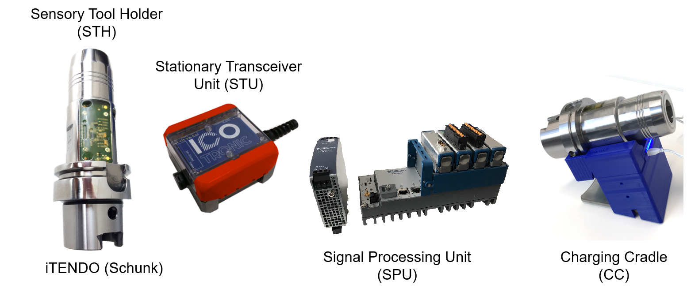

## Software- und Netzwerkeinstellungen des Computers 		

​						  				

​					

​					  			

Es wird ein Computer mit Windows Betriebssystem (Windows 7  Servicepack 1; Windows 8.1 Update 1; Windows 10) und  Administratorrechten benötigt. Auf diesem Computer muss „LabView  Runtime“ installiert sein. 
Download Link:

http://www.ni.com/download/labview-run-time-engine-2018/7383/en/

ACHTUNG: Es muss die 2020 SP1 (32-bit) Version gewählt werden !!!

Nicht jeder Browser unterstützt dieses Plugin. Microsoft Internet  Explorer (NICHT MICROSOFT EDGE) wurde getestet und funktioniert  einwandfrei.

Bevor der Computer mittels Ethernet Kabel mit der SPU verbunden wird, müssen die Netzwerkeinstellungen des Computers eingestellt werden.  Dafür muss die IP-Adresse des Computers, welcher mit der SPU verbunden  wird, folgendermaßen eingestellt werden.

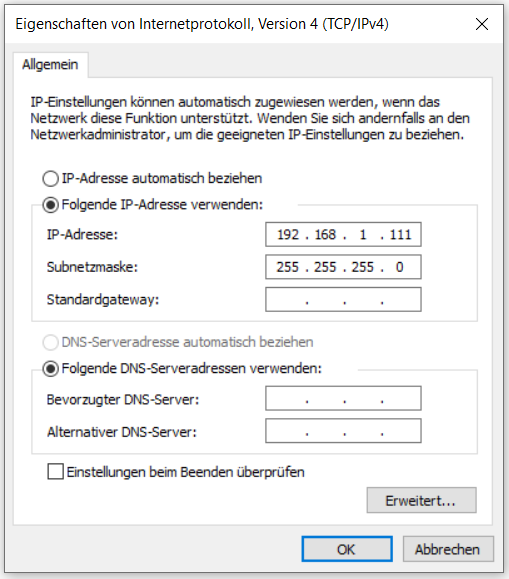

Anschließend, sofern notwendig, sollte der Computer neu gestartet werden.

## Echtzeit-Dashboard 					  			

Öffnen Sie den Microsoft Internet Explorer und geben sie folgende Adresse ein:

http://192.168.1.113:8000/ICOtronicSPU.html

Nun sollte sich das Echtzeit Dashboard auf Ihrem Computer öffnen.

Das Dashboard verfügt über 2 Reiter: **Stability** und **System**. Oberhalb der Reiter befindet sich, egal welcher Reiter gewählt ist,  eine Anzeige zum Verbindungsstatus des Systems und das ICOTronic-Logo.

Wenn das System mit einem sensorischen Werkzeughalter verbunden ist,  ändert sich die Farbe der Verbindungsanzeige zu Blau. Wenn die  Verbindung getrennt wird, ändert sich die Farbe wieder zu Weiß.

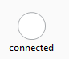   <------->   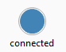

### System Reiter 		

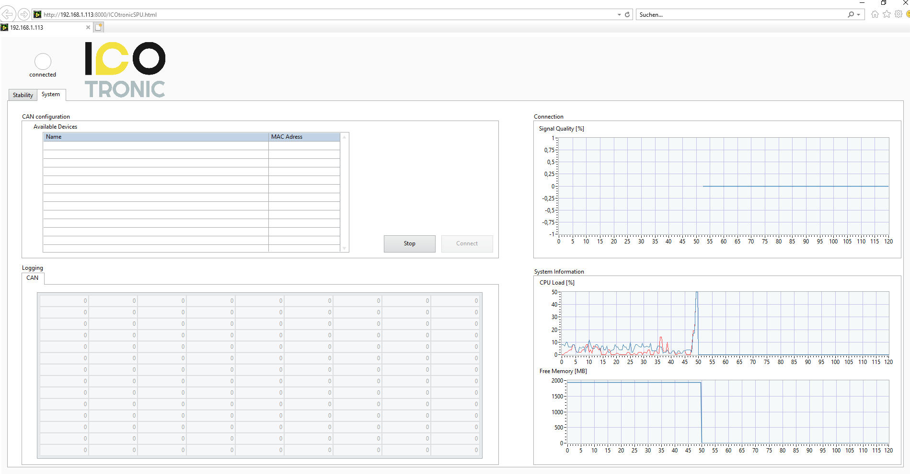

Im Untermenü „Can configuration“ des System Reiters, befindet sich  eine Liste aller sensorischen Werkzeughalter, die in der Umgebung des  Systems gefunden wurden, mit denen sich das System verbinden kann. Zu  sehen sind der Name und die Bluetooth Adresse dieser STHs. Um sich mit  einem Halter zu verbinden, muss der gewünschte Halter gewählt und danach der „Connect“ Button gedrückt werden. Mit dem „Stop“ Button kann die  Verbindung zum aktuell verbundenen Halter getrennt werden. Nach Trennen  einer Verbindung benötigt das Dashboard einige Sekunden, bevor es wieder nach Haltern sucht und diese listen.

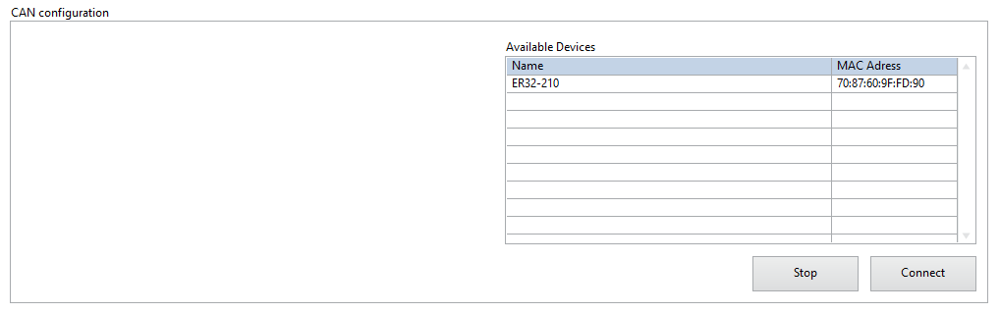

### Stability Reiter 		

Im Stability Reiter des Dashboards können die Parameter der Regelung  eingestellt, verschiedene Modi des Systems eingestellt und ein Graph der Echtzeitdaten eingesehen werden.

ACHTUNG: Die Reiter Stability und System sind nicht miteinander  verbunden. Sollten Einstellungen für die Regelung vorgenommen und das  System vom aktuellen Halter getrennt werden, behält das Dashboard seine  Einstellungen auch beim Verbinden eines neuen Halters. Die Einstellungen werden nur zurückgesetzt, wenn die SPU neu gestartet wird.

Oben links kann der aktuell ausgewählte Modus gesehen werden und  verändert werden (für eine genauere Beschreibung der verschiedenen Modi  siehe das Kapitel „Modi“).

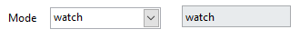

Unterhalb der Modusauswahl befinden sich die Parameter Einstellungen  (für eine genauere Beschreibung der verschiedenen Parameter siehe das  Kapitel “Parameter”).

Auf der rechten Seite befindet sich ein Live-Schrieb der Daten.  Ebenso befindet sich hier eine Einstellung für das angezeigte  Zeitfenster und eine Möglichkeit, den Schrieb zu stoppen.

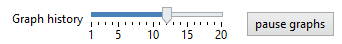

Der neueste Datenpunkt befindet sich auf der linken Seite des  Schriebs, der Älteste auf der rechten Seite. Die Zeitangabe auf der  Unterseite gibt an, wie lange der Datenpunkt zurückliegt. Wenn also zum  Beispiel 5s steht, bedeutet dies, dass der Datenpunkt vor 5 Sekunden  aufgetreten ist. Es gibt 3 verschiedene Graphen.

#### IFT-Wert 				  			

Der IFT-Wert ist ein Systemparameter, mit dessen Hilfe erkannt werden kann, ob das System stabil oder instabil ist. Wenn der Modus einer der  Regelungsmodi ist und der IFT-Wert über einen eingestellten Parameter  hinaussteigt, stellt das System anhand eingegebener Parameter neue Werte für Vorschub und Drehzahl Overrides ein, um das System wieder stabil zu bekommen.

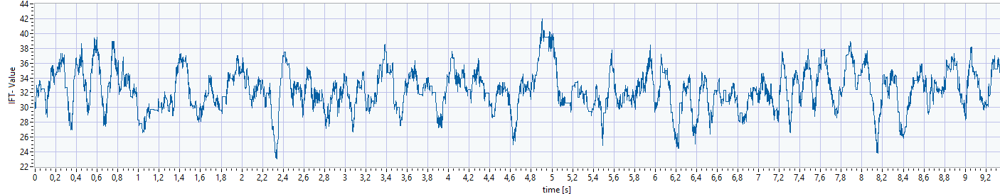

#### Overrides 				  			

Der Override Graph zeigt die momentan angelegten Vorschub und Drehzahl Overrides des Systems.

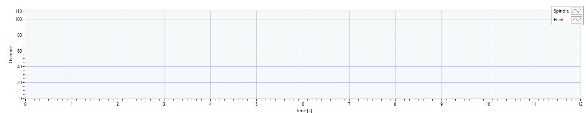

#### Kontrollindikatoren 			  			

Dieser Graph zeigt 2 Linien, Sens (Blau) und Active (Rot). Bei jenen  Werten handelt es sich um digitale Signale. Bei einem Wert von 1 ist das Signal aktiv, bei einem Wert von 0 inaktiv. Der Sens Indikator gibt an, ob von der Maschine ein Signal ankommt (der M-Befehl ist gesetzt), um  die Regelung des Systems einzuschalten und eine Regelung zu ermöglichen. Der Active Indikator gibt an, ob die IFT-Wert Schwelle überschritten  ist und das System die Override Werte der Maschine anpasst. Der Active  Indikator kann nur 1 werden wenn auch der Sens Indikator 1 ist.

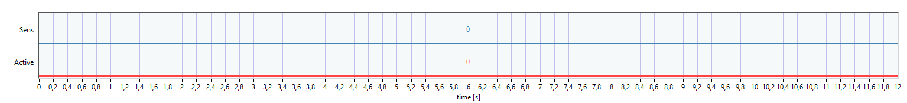

## Parameter 					  			

Je nachdem, welcher Modus gerade aktiv geschalten ist, können  unterschiedliche Parameter eingestellt werden. Um die neuen Werte der  Parameter zu übernehmen muss der „update“ Button gedrückt werden,  welcher sich unterhalb der Parameter befindet. Die einzige Ausnahme ist  die „Window length“ Einstellung, welche im „watch“ Modus auch ohne  Update in Echtzeit verändert werden kann.

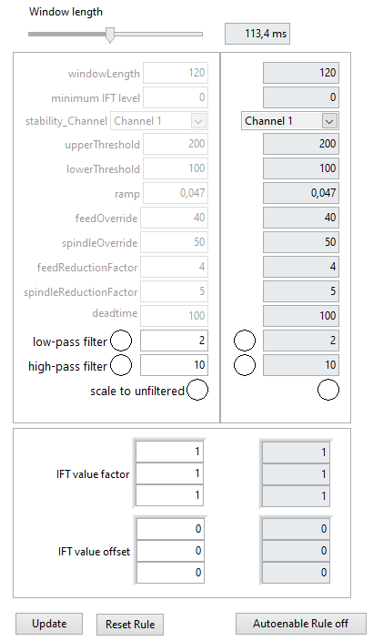

### Window length 			  			

{ms} Zeitfenster

Dieser Parameter gibt an, welches Zeitfenster für die Berechnung des  IFT-Wertes benutzt wird. Wenn ein großes Zeitfenster gewählt wird, so  reagiert das System träger auf Änderungen des Signals. Zum Beispiel  wirkt sich ein einmaliger Impuls weniger auf die IFT-Wert Berechnung  aus, wenn das Zeitfenster groß gewählt wird. Im „watch“ Modus kann  dieser Parameter in Echtzeit verändert werden. In allen anderen Modi  muss der „update“ Button geklickt werden, um Änderungen zu übernehmen.

### Upper threshold 		

{-} obere Schwelle

Sollte der IFT-Wert die obere Schwelle überschreiten, so werden die  zuvor eingestellten Overrides von der SPU angewandt. Je größer diese  Schwelle gewählt wird, umso instabiler darf das System werden, bevor die Regelung eingreift.

### Lower threshold 		 			

{-} untere Schwelle

Sollte der IFT-Wert die untere Schwelle unterschreiten, so regelt die SPU wieder auf 100% Vorschub und Drehzahl zurück. Dies geschieht in  Folge der eingestellten Rampe. Je kleiner diese Schwelle gewählt wird,  umso stabiler muss das System werden, bevor die Overrides zurückgesetzt  werden.

### Ramp 			  			

{%/ms} Rampe

Dieser Parameter bestimmt die Geschwindigkeit, mit der die Overrides  zurückgesetzt werden. Die Overrides werden nicht sprunghaft  zurückgesetzt, sondern verlaufen entlang einer Rampe zurück auf 100%. Je größer dieser Wert, umso steiler ist die Rampe und umso schneller setzt das System Vorschub und Drehzahl zurück auf 100%.

Beispiel:
Ein Wert von 0.01%/ms würde einer Erhöhung von Drehzahl und Vorschub um 10% innerhalb von 1 Sekunde.

### Feed override 					

{0-100%} Vorschub Soll-Wert

Dieser Parameter wird in den Modi „Stability 2 Level“ und „Direct  output“ verwendet. Dieser Wert bestimmt den Override, welcher vom System angewendet wird, sollte das ICOTronic System die Regelung des  Vorschubes aktivieren.

### Spindle override 		  			

{0-100%} Drehzahl Soll-Wert

Dieser Parameter wird in den Modi „Stability 2 Level“ und „Direct  output“ verwendet. Dieser Wert bestimmt den Override, welcher vom System angewendet wird, sollte das ICOTronic System die Regelung der Drehzahl  aktivieren.

### Feed override min 		  			

{0-100%} Minimaler Vorschub Soll-Wert

Dieser Parameter wird im „Stability reduction“ Modus verwendet.  Dieser Wert entspricht dem minimalen Vorschub Override, den das  ICOTronic System an die Maschine senden kann. Der Override kann nicht  unterhalb dieses Wertes fallen.

### Feed reduction factor 		  			

{0-100%} Vorschub Reduzierungsfaktor

Dieser Parameter wird im „Stability reduction“ Modus verwendet.  Dieser Wert beeinflusst die Schrittgröße, in welcher der Vorschub  Override gesetzt wird.

Beispiel:
Ein Wert von 5% als „Feed reduction factor“ erzeugt eine Senkung des Vorschub Overrides um 5% bei jedem Berechnungsfenster,  solange der IFT-Wert > Obere Schwelle ist.

Reduzierungsschritt 1: Reduktion von 100% auf 95%
Reduzierungsschritt 2: Reduktion von 95% auf 90%
… und so weiter.

### Spindle override min 		  			

{0-100%} Minimaler Drehzahl Soll-Wert

Dieser Parameter wird im „Stability reduction“ Modus verwendet.  Dieser Wert entspricht dem minimalen Drehzahl Override, den das  ICOTronic System an die Maschine senden kann. Der Override kann nicht  unterhalb dieses Wertes fallen.

### Spindle reduction factor 			

{0-100%} Drehzahl Reduzierungsfaktor

Dieser Parameter wird im „Stability reduction“ Modus verwendet.  Dieser Wert beeinflusst die Schrittgröße, in welcher der Drehzahl  Override gesetzt wird.

Beispiel:
Ein Wert von 5% als „Spindle reduction factor“ erzeugt  eine Senkung des Drehzahl Overrides um 5% bei jedem Berechnungsfenster,  solange der IFT-Wert > Obere Schwelle ist.

Reduzierungsschritt 1: Reduktion von 100% auf 95%
Reduzierungsschritt 2: Reduktion von 95% auf 90%
… und so weiter.  

### Deadtime 			  			

{ms} Totzeit

Dieser Parameter wird nur im „Stability reduction“ Modus verwendet.  Dieser Wert entspricht jener Zeit, die das System abwartet, bevor es  erneut überprüft, ob eine Reduktion der Overrides erforderlich ist. Je  kleiner dieser Wert, umso schneller reduziert das System den Vorschub  und die Drehzahl. Als Referenzwert für erste Versuche kann eine Totzeit  von 300ms gewählt werden. Dies bedeutet, dass alle 300ms der Vorschub  und die Drehzahl reduziert werden, solange sich der IFT-Wert oberhalb  der oberen Schwelle befindet.

Beispiele:

In den nachfolgenden Grafiken sind 2 verschiedene Totzeiten  eingestellt, mit der kürzeren Totzeit in der ersten Grafik. Es ist zu  bemerken, dass die minimalen Overrides bei kürzerer Totzeit schneller  erreicht werden.

Für beide Grafiken wurden dieselben Reduzierungsfaktoren und minimalen Overrides verwendet:

Feed reduction factor: 8%; Feed override min: 10%; Spindle reduction factor: 5%; Spindle override min: 20%

Deadtime: 100ms

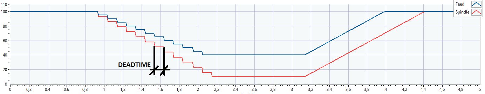

Deadtime: 300ms

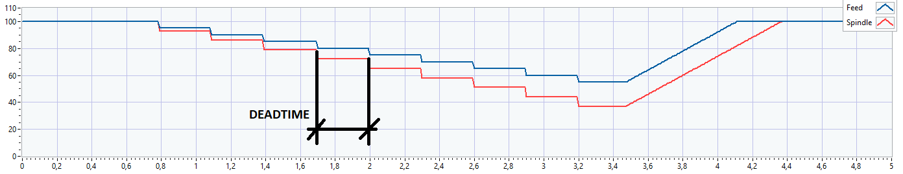

### IFT value factor 				

{-} IFT-Wert Faktor

Dies ist ein multiplikativer Faktor für den IFT-Wert in der  korrespondierenden Grafik und dem analogen Port 0 auf der SPU (NI 9263). Mit diesem Faktor kann das Signal auf einen gewünschten Wert  eingestellt werden.

### IFT value offset 			  			

{-} IFT-Wert Offset

Dies ist ein additiver Faktor für den IFT-Wert in der  korrespondierenden Grafik und dem analogen Port 0 auf der SPU (NI 9263). Mit diesem Faktor kann das Signal auf einen gewünschten Wert  eingestellt werden. 

## Modi 		

Die verschiedenen Modi sind folgende:

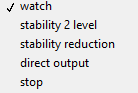

### WATCH 			  			

In diesem Modus sind STU und STH miteinander verbunden. Des Weiteren  wird der IFT-Wert in diesem Modus berechnet, damit das generierte Signal eines Schnittes eingesehen werden kann. Dieser Modus ist aber kein  Regelmodus und greift somit auch nicht in den Maschinenprozess ein.  Daher ist dieser Modus dafür geeignet, die Verbindung zwischen STH und  STU zu testen. In diesem Modus können der „IFT value factor“ und der  „IFT value offset“ verändert werden. Dies ist der einzige Modus, in dem  die „Window length“ geändert werden kann, ohne den „Update“ Button  klicken zu müssen.

### STABILITY 2 LEVEL 			  			

Dies ist einer der 2 Modi, welche zur Regelung des Maschinenprozesses genutzt werdern können. Die in diesem Modus benutzten Parameter sind  “Upper threshold”, “Lower threshold”, “Ramp”, “Feed override” und  “Spindle override”. Sollte der IFT-Wert in diesem Modus die „Upper  threshold“ überschreiten, so werden die Overrides direkt auf die zuvor  im Dashboard eingestellten Werte von „Feed override“ und „Spindle  override“ gesetzt. Sobald der IFT-Wert wieder unterhalb des „Lower  threshold“ fällt, beginnt das System den Vorschub und die Drehzahl  entlang einer Rampe wieder auf 100% zu erhöhen. Die Geschwindigkeit, mit der das System wieder auf 100% fährt, ist durch die Steilheit der Rampe gegeben. Diese ist über den Parameter „Ramp“ definiert.

### STABILITY REDUCTION 					

Dies ist einer der 2 Modi, welche zur Regelung des Maschinenprozesses genutzt werdern können. Die in diesem Modus benutzten Parameter sind  “Upper threshold”, “Lower threshold”, “Ramp”, “Feed override min”, „Feed reduction factor“, “Spindle override min”, „Spindle reduction factor“  und „Deadtime“. Sollte der IFT-Wert in diesem Modus die „Upper  threshold“ überschreiten, so reduziert das System den Vorschub und die  Drehzahl entsprechend der beiden Reduzierungsfaktoren. Nach einem  Reduzierungsschritt wartet das System die „Deadtime“ ab und überprüft  erneut, ob der IFT-Wert weiterhin oberhalb des „Upper threshold“ liegt.  Sollte er unterhalb liegen, so behält das System die aktuellen Werte  bei. Sollte der IFT-Wert weiterhin oberhalb des „Upper threshold“  liegen, so werden der Vorschub und die Drehzahl wieder um einen  Reduzierungsschritt gesenkt. Sollte durch die Reduzierung einer der  beiden Minimalwerte erreicht werden, so wird der Vorschub  beziehungsweise die Drehzahl nicht mehr reduziert. Sobald der IFT-Wert  wieder unterhalb des „Lower threshold“ fällt, beginnt das System den  Vorschub und die Drehzahl entlang einer Rampe wieder auf 100% zu  erhöhen. Die Geschwindigkeit, mit der das System wieder auf 100% fährt,  ist durch die Steilheit der Rampe gegeben. Diese ist über den Parameter  „Ramp“ definiert.

### DIRECT OUTPUT 				

Dieser Modus wird vorrangig bei der Installation des Systems benutzt. Neben dem „IFT value factor“ und dem „IFT value offset“ können in  diesem Modus „Feed override“ und „Spindle override“ eingestellt werden.  Die für den Vorschub und die Drehzahl eingestellten Overridewerte werden in diesem Modus unabhängig vom aktuellen IFT-Wert direkt an die  Maschine weitergegeben. Dadurch können definierte Overridewerte an die  Maschine gesendet werden, ohne aktive Sensorik oder ein  Aktivierungssignal der Maschine (M-Befehl). Dieser Modus sollte dafür  verwendet werden, um zu überprüfen, ob die Verbindung zwischen der SPU  und der Maschine ordnungsgemäß funktioniert.

## Anwendungsbeispiel 			  			

Öffnen Sie den Internet Explorer und verbinden Sie sich mit dem  Dashboard. Wenn die Seite fertig geladen ist, wechseln Sie zu dem  „System“ Reiter und waren Sie darauf, dass der Halter welcher gerade in  der Maschine eingespannt ist, in der Liste aufscheint. Drücken Sie nun  den „Connect“ Button und wechseln Sie zu dem „Stability“ Reiter. Die LED des Halters sollte nun anfangen zu blinken und die LEDs in den Ecken  der STU sollten von grünem Blinken auf grünes Dauerleuchten wechseln.  Nach einigen Sekunden sollte der IFT-Werte Graph Werte anzeigen, die  ungleich 0 sind. Wechseln Sie den Modus auf „Watch“ und stellen Sie für  einen ersten Test die „Window length“ auf etwa 70ms ein. Ändern Sie die  „Graph History“ auf einen gewünschten Wert (am besten stellen Sie eine  Zeit ein, welche etwas länger ist als der zu testende Schnittprozess).  Nun fahren Sie einen Schnittprozess mit ausgeschalteter Regelung des  Systems und betrachten Sie den IFT-Wert. Für eine bessere Begutachtung  des Signals ist es zu empfehlen, nach Abschluss des Prozesses den „pause graph“ Button zu drücken und das Signal zu stoppen. Zur Erinnerung: Die Sekundenangabe unterhalb des Graphen zeigt an, wie viel Zeit seit  diesem Datenpunkt verstrichen ist. Die nachfolgende Abbildung zeigt ein  Beispiel eines Schnittprozesses im Watch Modus.

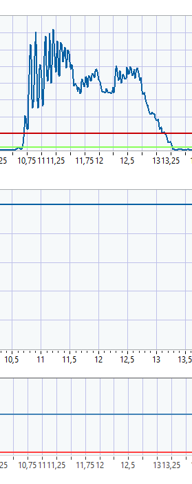

Nun ändern Sie den Modus auf einen der beiden Regelmodi und stellen  sie die Parameter von „Upper threshold“ und „Lower threshold“ auf  plausible Werte für eine adaptive Regelung. Wiederholen Sie nun den  Schnittprozess mit eingeschalteter Regelung des Systems.

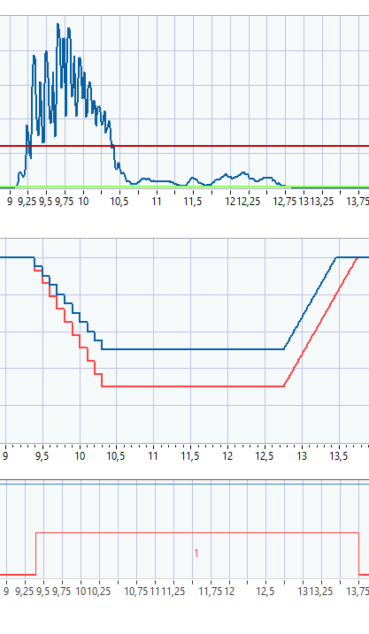

Sollten die Parameter noch nicht optimal eingestellt sein, so passen  Sie diese nun entsprechend an und wiederholen Sie den Schnittprozess.

Die benötigte Zeit, um die Einstellungen für einen gegebenen  Schnittprozess optimal einzustellen, kann variieren. Die benötigte Zeit  ist abhängig von der Intensität des Ratterns, der Schnittdauer, der  Erfahrung des Dashboard Bedieners bezüglich der Einstellungen und der  Erfahrung des Maschinenbedieners. Dieser Optimierungsprozess kann  durchaus länger als eine Stunde dauern.