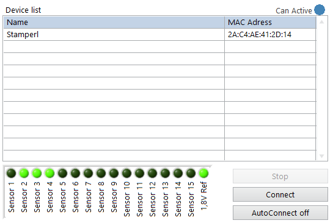
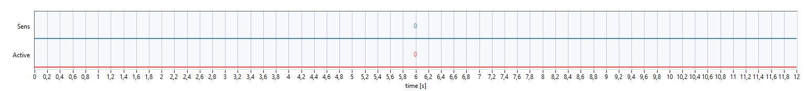

# C-RIO Dashboard en

User manual for the C-RIO Dashboard

## ICOtronic System components 		  			

The graphic below provides an overview about the ICOtronic system components. It consists of the following main parts:

- Sensory Tool Holder (STH)
- Signal Processing Unit (SPU)
- Stationary Transceiver Unit (STU)
- Charging Cradle (CC)

## Software and network Settings for your PC			  			

First, you need a Laptop running Windows and administrator  privileges. You need the “LabView Runtime” installed on the Laptop,  download link ->

http://www.ni.com/download/labview-run-time-engine-2018/7383/en/

CAUTION: it has to be the 2020 SP1 (32-bit) version !!!

Not all browsers can use this plugin, Microsoft Internet Explorer (NOT MICROSOFT EDGE) was tested and worked well.

Before connecting the Laptop via the Ethernet Cable to the SPU, the  correct network settings have to be configured. Therefore, set the  network configuration of the interface that is going to be used with the SPU as illustrated below.

 If required, please reboot your Laptop after changing the network settings.

## Real-Time-Dashboard 			  			

Open your Microsoft Internet explorer and go to:

http://192.168.1.113:8000/ICOtronicSPU.html

This should open the real-time-Dashboard on your PC.

The Dashboard contains at least two tabs: **Stability** and **System**. Newer versions can have additional tabs. The header of the Dashboard, which is active on all the mentioned tabs, has a Connection identifier and the ICOtronic-logo.

If the system is connected to a sensory tool holder, the identifier turns blue. After disconnection, it turns white again.

   <------->   

### System Tab 	
##### Old Interface

##### New Interface

In the section "Holder connection" of the system tab, all STHs are listed that are found by the system and are ready to connect. You can see the name and the Bluetooth address of the STHs. To establish a connection there are 3 different methods which can be used. The used method can be chosen with the "Connection type" drop-down menu and activated with the "Update" button. On the right side are some system informations. On the bottom left side are a few tabs for specific uses.

#### Logging

This tab is used for recording of a process. If the check-box is clicked the recording will start at connection to a holder. If not it can be started with the "Start Record" button. When the system is recording this button will become a button to stop the recording. The two identifier below are showing if a storage device like a USB is connected and if the system is recording at the moment. The two boxes at the bottom show how big the momentary recorded file is and the bottom most box shows how much space is left on the storage device.

#### Replay

This tab is used to replay a recorded process. If a storage device is mounted on the system the recoding files are shown here in form of a list. Then the file can be chosen and loaded with a press of the "Load File" button. To switch the system between the "Live mode" and a recording you just have to press the button on the left side.
The whole recording will be shown on the top above the tabs when the recording is loaded. The playback of the recording can be started by pressing the "Run" button.

#### FOCAS

**Attention: This connection is only possible on specific machines!**

This tab is used if you want to control the system with the FOCAS connection. For this control you have to give the system the NC line number of the start and the end of the process which should be controlled. And then start the connection with the "FOCAS Start" button. If you want to stop the control via FOCAS you have to press the "FOCAS Stop" button which is there instead of the "FOCAS Start" if the connection is active.

#### System

This tab shows information about the CAN messages send between the system and the dashboard.

#### Connection types

##### Dashboard / OPC UA

With this mode you can select the STH of your choice from the "Device list" and press “Connect”. With  “Stop”, you can disconnect from the STH. After disconnection the  Dashboard needs a few seconds before it starts searching for STHs again.

##### Static / DI

In this connection mode you can define one static MAC-Address. Every holder has his own unique address. This address is shown on the right side of the device list. If this mode is selected and the holder with the defined MAC-Address is in range the system will automatically connect to this holder.

In newer versions of the Dashboard it is possible to connect to up to 3 different static MAC-Addresses. Which of the 3 defined holders is to be connected can be chosen by using the digital input port 6&7 of the SPU.

##### First available /DI

In this mode the system will connect to the first holder it finds within its range. 

##### Recording of multiple channels

In newer versions of the Dashboard it is possible to record multiple channels simultaneously. (Given that the connected tool holder also is able to record multiple channels.) To choose between 1 and 3 channels use the radio button below the connection type drop down list.

#### Configuration of tools and processes

**<u>IN DEVELOPMENT!!!!</u>**

In the system tab you can see 2 additional tabs used to load preset configurations called "Rule Engine confis" and "Sensor configs". With a press of the "Load config from USB" you can load then configuration file from a connected USB-Stick or a Micro-SD Card (Formatting ext4) into the SPU Unit. The XML Files with a predefined structure can be used to configure the rule engine and/or the sensory tool holder. Pressing the "Load config" Button will load and apply the chosen configuration file. With this function you can predefine your parameters and load them via the press of a button. This has the advantage that you don't have to manually change all the parameters after a reset of the SPU or change of process.

A possible example looks like this:

A sensory tool holder with a defined MAC address, single channel measurement, and Connection Type 1 (Dashboard / OPC UA = 0, Static / DI = 1, First available / DI = 2), which corresponds to an automatic connection, is defined in the configuration file. Additionally, a stability Rule Engine with all parameters for the corresponding cutting process and the respective Rule config ID 5 is set for this tool holder. If this Rule Engine ID is also loaded, the values contained in it will be inserted in the stability tab.

**Currently, the feature is in the development phase**, so it is not yet possible to directly assign the respective sensory tools to assigned lines of tools for automatic tool selection based on digital inputs.

### Raw Data View Tab

If this tab is chosen it will show the raw data of the connected sensory tool holder, depending if 1 or 3 channels were chosen, This is used if you want to plot the raw not computed signals of the tool holder.

### Breakout detection Tab

**<u>IN DEVELOPMENT!!!!</u>**

This tab is used when you want to detect breakout of cutting edges. 

On the top left side are the parameters for the detection. On the top right side is the graph of the quality factor which indicates a breakout. On the bottom left side is a graph of the signal power. And on the bottom right is a graph of the frequency spectrum. In the frequency spectrum graph you can move the cursor to see the amplitude and frequency on this cursor position on the top left of the spectrum graph. If the parameters are set you can additionally see green vertical bars. These bars represent the areas used by the breakout detection algorithm based on the chosen parameters. When using a new cutting tool the multiples of the meshing frequency should be visible. On the right side you can change the zoom of the x-axis(frequency) and the y-axis(amplitude) of this graph.

#### Breakout parameters

These parameters are used to configure the breakout detection. To activate the new parameters the "Update" button has to be clicked.

##### Spindle speed

This parameter is the spindle speed which is used in the cutting process.

##### Order limit

This parameter is the number of orders of the tooth passing frequency which should be used to detect the breakouts.

##### Comb width

This parameter defines the comb width which is used to analyze the frequency spectrum to detect the breakouts. This is needed since the frequencies are not a peak with only 1 value but more like a plateau because we are in a real and not ideal situation.

##### Number of teeth

This parameter is the number of teeth the cutting tool posses.

##### Signal power limit

This value defines a signal power. Everything below this signal power will be ignored. This is needed so that the detection only works when the tool is cutting. Without the quality factor could be signaling a breakout even if the tool is not cutting at the moment.

### Stability tab 						  			

In the Stability tab, you can change the mode of the system, the  parameter of the in-process control and you can view the system’s live  data.

CAUTION: The tabs System and Stability tab are not connected.  Therefore, if you disconnect the STH, the mode and the parameter set up  in the Stability tab stay the same, even if you connect a new STH. These parameters only reset when the SPU got a reset.

In the upper left, you can change the active mode (For detailed descriptions of the modes, see chapter “Modes”).

Below the mode selection are the configuration parameters (For  detailed descriptions of the parameters, see chapter “Parameters”).

On the right-hand side you can see the live data of the system,  change the shown time window length (in seconds) and you can choose to  stop the data-print.

The newest data point is on the left-hand side. The oldest one to the right. The timeline on the bottom gives information on how many seconds ago a specific value occured. So to say, 5s means that this point is 5s in the past. The live data is categorized into three prints.

#### IFT-Value 		  			

The IFT-Value is the system's criteria to find out if the process is  stable or instable. If the value is above a chosen threshold and an  in-process control mode is selected, the system generates new setpoints  for the overrides feed rate and spindle speed in order to stabilize the  process again.

#### Overrides 		

The override graph shows the active override values of the system.

#### Control indicators 				  			

This graph shows the Sens and the Active lines. These are digital  information. If the values are 1 they are active and if the values are 0 they are inactive. Sens indicates that the M-command is set to activate the adaptive control loop. The Active signal shows if the IFT-Value is above the given threshold and the overrides are actively changed by the system. The Active value can only become 1 if the Sens value is 1 too.

## Stability-Parameters 					  			

Depending on which mode is set active, different parameters can be  changed. To change said parameters to new values, press the "update"  Button on the bottom (with "Window length" being the only exception in  "Watch" mode).

### Window length 			  			

{ms} window length

This parameter changes the time window for the calculation of the  IFT-Value. The larger the window, the more sluggish the system reacts to changes. For example, a single spike in the process is weighted less on the IFT-Value calculation in a larger window. In “Watch” mode this  parameter can be adjusted live. In all other modes, this can only be  done using the "update" button as mentioned before.

### Upper threshold 		

{-} upper threshold

If the IFT value exceeds the threshold, the overrides are set to the  defined values by the SPU. The bigger this value, the more “instable”  the process is allowed to become, before override adaptions are  activated.

### Lower threshold 			  			

{-} lower threshold

If the IFT-value falls below the lower threshold, the override values will start rising up towards 100% again, following a defined ramp. The  lower this value, the more “stable” the process has to become for the  overrides to be reset.

### Ramp 				

{%/ms} ramp

This parameter changes the speed of the override reset. The overrides are not reset instantly, as they follow a ramp to change back to 100%.  The bigger this value, the steeper the ramp and the faster the system  goes back to 100% spindle speed and feed rate.

A value of e.g. 0.01 %/ms would increase the feed rate and/or spindle speed to 10 % within 1 second.

### Feed override 			

{0-100%} Setpoint for feed rate

This parameter is used in the modes “Stability 2 Level” and “Direct  output”. This value defines the override applied to the machine tool  control system, the moment the ICOtronic system activates the feed rate  adaption of the machine.

### Spindle override 		  			

{0-100%} Setpoint for spindle speed

This parameter is used in “Stability 2 Level” and “Direct output”.  This value defines the override applied to the machine tool control  system, the moment the ICOtronic system activates the spindle speed  reduction of the machine.

### Feed override min 				

{0-100%} Setpoint for minimum feed rate

This parameter is used in the “Stability reduction” mode. This value  defines the minimal feed rate override, which is sent to the machine by  the ICOtronic system. The reduction cannot fall below this value.

### Feed reduction factor 					

{0-100%} Reduction factor

This parameter is used in the “Stability reduction” mode. This value  controls the intensity of the reduction steps of the feed rate.

As an example: A value of 5 % for "Feed reduction factor" results in continuous reduction of 5% of the override as long as the IFT-Value  is bigger than the upper threshold at each calculation interval.

Reduction step 1: Reduction from 100 % to 95 %
Reduction step 2: Reduction from 95 % to 90 %
…and so on.

### Spindle override min 			  			

{0-100%} Setpoint for minimum spindle speed

This parameter is used in the “Stability reduction” mode. This value  defines the minimal spindle speed override, which is sent to the machine by the ICOtronic system. The reduction cannot fall below this value.

### Spindle reduction factor 				

{0-100%} Reduction factor

This parameter is used in the “Stability reduction” mode. This value  controls the intensity of the reduction steps of the spindle speed.

As an example: A value of 5 % for "Spindle reduction factor" results in continuous reduction of 5% of the override as long as the IFT-Value  is bigger than the upper threshold at each calculation interval.

Reduction step 1: Reduction from 100 % to 95 %
Reduction step 2: Reduction from 95 % to 90 %
…and so on.

### Deadtime 					

{ms} deadtime

This parameter is only used in the “Stability reduction” mode. This  value equals the time in ms the system pauses before checking if it  should reduce the spindle speed and feed rate again. The smaller this  value, the quicker the ICOtronic system reduces the speed. As a  reference value for first tests 300 ms can be mentioned. This means,  each 300 ms feed rate and/or spindle speed are adapted as long as the  IFT value exceeds the threshold.

Examples:

In the pictures below, there are 2 different Deadtimes set. The first picture has a shorter Deadtime than the second one. It can be seen that the minimal Overrides are reached quicker with a lower Deadtime.

Feed reduction factor: 8%; Feed override min: 10%; Spindle reduction factor: 5%; Spindle override min: 20%

Deadtime: 100ms

Deadtime: 300ms

### IFT value factor 		  			

{-} IFT value factor

This is a multiplicative factor for the IFT-Value in the  corresponding diagram and for the analogue port number 0 of the SPU (NI  9263). With it, the signal can be set to a desired value.

### IFT value offset 					

{-} IFT value offset

This is an additive value, to the IFT-Value in the corresponding  diagram and for the analogue port number 0 of the SPU (NI9263). With it, the signal can be set to a desired offset. 

## Modes 					

The modes are:

### WATCH 				

The STH and the STU are connected in this mode. Moreover, the  IFT-Value will be evaluated in order to watch the signal generated in  cutting processes. However, this mode is not a control mode and thus not taking any actions in the machine control system. This mode is also  suitable for testing the connection between STH and STU. In this mode,  the “IFT value factor” and “IFT value offset” can be changed.  Furthermore, this is the only mode where you can instantly change the  "Window length" without having to use the "update" button.

### STABILITY 2 LEVEL 			  			

This is one of the two modes which can be used to control the  machining process. In this mode, the parameters used are the “Upper  threshold”, “Lower threshold”, “Ramp”, “Feed override” and “Spindle  override”. If the IFT value exceeds the “Upper threshold”, the system  will directly set the overrides to the values of “Feed override” and  “Spindle override” defined in the Dashboard. If the IFT value reduces  and falls below the “Lower threshold”, the system will start to increase Spindle speed and Feed rate back to 100% in form of a ramp. The speed  of this increase is defined by the “Ramp” parameter.

### STABILITY REDUCTION 				  			

This is one of the two modes which can be used to control the  machining process. In this mode, the parameters used are the “Upper  threshold”, “Lower threshold”, “Ramp”, “Feed override min”, “Feed  reduction factor”, “Spindle override min”, “Spindle reduction factor”  and “Deadtime”. If the IFT value exceeds the “Upper threshold”, the  system will reduce spindle speed and feed rate. The factors of how much  they are reduced are the two “override" factors. After a reduction step, the system waits the “Deadtime” to see if the IFT value is still above  the “Upper threshold”. If it is still above, the system will reduce the  overrides again. If the “override min” values are reached, the system  will no longer reduce the spindle speed and feed rate. If the IFT-Value  falls below the “Upper threshold”, the system holds the active overrides applied by the SPU. If the IFT-Value sinks below the “Lower threshold”, the system starts to increase spindle speed and feed rate. The speed of this increase is defined by the “Ramp” parameter.

### DIRECT OUTPUT 					  			

This mode is primary used while installing the system. Beside the  “IFT value factor” and the “IFT value offset”, the “Feed override” and  “Spindle override” can be changed. The values given for the overrides  will be directly sent to the output, independent from the IFT-Value.  Therefore, a specific spindle speed or feed rate can be applied without  any sensor-input or activation signal from the machine-control-system  (M-command). This mode should be used to check if the connection  between the SPU and the machine-control-system is working as designed. 

## Example use-case 			  			

Open the internet explorer and connect to the Dashboard. After the  page is loaded, go to the “System” tab and wait for the holder inside  the machine to be listed. Now press “Connect” and go to the “Stability”  tab. The STH’s LED should start blinking and the STU’s LEDs in the  corners should stop blinking and instead shine continuously. After a  short moment, the IFT-Value graph should start to display values  different from zero. Change the mode to “Watch” and choose a “Window  length” with about 70 ms as a first orientation. Change the “Graph  History” to a desired time window. Now, perform a cut in this watch mode with deactivated adaptive control and examine the IFT-Value. In order  to take look at the whole process, press the “pause graph” button after  the process. Remember that the seconds below the graphs show how many  seconds in the past this point was. The following figure represents an  example of cut in the watch mode.

Now change to on of the two control modes and set the parameters of  the “Upper threshold” and “Lower threshold” to plausible values, for the in-process parameter adaption. Repeat the cut, in which the override  adaption is now activated.

Look if the parameters are chosen appropriately in order to control the process. If not, change them in an adequate way.

The time required to optimize the system for the use case varies.  This depends on the intensity of chatter, the process time, the  experience for configuring the Dashboard and the experience of the  machine operator. This optimization procedure can take between one hour  and several hours.

## How to use the OPCUA-server of the SPU

### Connecting the OPCUA-Server

First, a OPC UA client is required on your PC. Please, find subsequently as a suggestion the download link of a UaExpert client (UaExpert v1.5.1). A user account is required.
Download link: https://www.unified-automation.com/downloads/opc-ua-clients.html  
Afterwards open the UaExpert client-program. When the program is open you have to click on “Server” at the top menu and then on “Add…”. This opens a window to search for and connect with the OPC UA-Server of the Signal Processing Unit (SPU) of the ICOtronic system.

 
In the new window you now have to go to the menu entry “Custom Discovery” and double click the sub menu entry „< Double click to Add Server… >“. Now a little new window will open. Here you have to input the following address:

opc.tcp://192.168.1.113:49580
 

Now the server should be found and you can open some sub menu entries. Double click the “None – None (uatcp-uasc-uabinary)”. Now the “OK” button should be usable and you can click it to exit this window.

After that, the server should be visible on the left side of the menu. Now you have to right-click the server and then click on “Connect”.
 

### Visualisation of the variables

After connecting to the OPCUA-Server you should now be able to see variables on the left side of the menu.

 

With a double click, these variables can be opened and shown on the upper right-hand side of the menu.

 

In this window, it is possible to read the different value parameters of the chosen element. For example, the actual value of the element or the timestamp of the last time, this element was updated. The menu entry “Value” shows the last read value of this element. If the element is editable for, example the minimal override of the spindle, you can change it by double clicking the value parameter. If the element is an output variable, for example the actual spindle override, you cannot change it.

In order to show an element permanently in the middle tab of the screen, you have to right click in this tab. Now a menu should open and you have to click on „Add custom node…“.

After that, you have to state the variable name of the element you want to show. Every element of the OPC UA-Server can be chosen via its identifier. If an element is selected, the identifier can be read out at the element parameters in the right upper tab. There, you can pick the entry “NodeId” and find the required information.

After inputting the NodeId you can press the “OK” button. Now the chosen element should be shown in the middle part of the program. If the chosen element is an editable variable you can change it with its “Value” element directly in this list, like you could change it in the upper right menu before. It is possible to show more than one element in the middle of the screen by repeating this process.

 