# (PART\*) [Deutsch] {-}

# Dashboard Benutzeranleitung {-}
Benutzeranleitung für das ICOtronic Dashboard.

# Version
Diese Benutzeranleitung wurde für die Dashboardversion v6.0.1.16 geschrieben. Für ältere Versionen den nachstehenden Link benutzen:

[ältere Version](https://github.com/MyTooliT/Dashboard/blob/main/Versions.md)

# ICOtronic System Komponenten 				  			

Die nachfolgende Grafik verleiht einen Überblick über die Komponenten des ICOtronic System. Die Hauptbestandteile sind:

- Sensory Tool Holder (STH)
- Signal Processing Unit (SPU)
- Stationary Transceiver Unit (STU)

# Software- und Netzwerkeinstellungen des Computers 						  			

Es wird ein Computer mit Windows Betriebssystem (Windows 7 Servicepack 1; Windows 8.1 Update 1; Windows 10; Windows 11) und Administratorrechten benötigt. Auf diesem Computer muss "LabView Runtime“ installiert sein. 
Download Link:

http://www.ni.com/download/labview-run-time-engine-2018/7383/en/

ACHTUNG: Es muss die 2021 SP1 (32-bit) Version gewählt werden !!!

Für die Verbindung zum Dashboard muss das ICOtronicRemotePanel Programm verwendet werden.

Bevor der Computer mittels Ethernet Kabel mit der SPU verbunden wird, müssen die Netzwerkeinstellungen des Computers eingestellt werden. Dafür muss die IP-Adresse des Computers, welcher mit der SPU verbunden wird, folgendermaßen eingestellt werden.

Anschließend, sofern notwendig, sollte der Computer neu gestartet werden.

# Echtzeit-Dashboard 					  			

Öffnen Sie das "ICOtronicRemotePanel" um eine Verbindung zum Dashboard herzustellen. Nun sollte sich das folgende Fenster öffnen und nach der IP-Adresse des Dashboards fragen. Hier muss folgende IP-Adresse angegeben werden:
**192.168.42.115**

Durch drücken von "connect to SPU" sollte das Dashboard geöffnet werden.

Nun sollte sich das Dashboard in einem neuen Fenster öffnen.
Das Dashboard verfügt über 6 Reiter. Egal welcher Reiter momentan geöffnet ist bleibt der Header immer gleich.

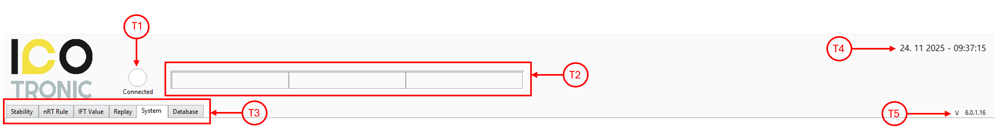

T1: Dieser Indicator gibt an ob momentan ein Halter verbunden ist oder nicht.
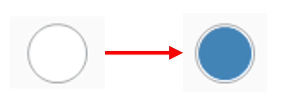
T2: In diesen Feldern werden, bei aktiver Verbindung zu einem Halter, Daten wie der Haltername und die MAC-Adresse des verbundenen Halter angezeigt. 
T3: Dies sind die verschiedenen Reiter welche unterschiedliche Anzeigen einblenden können.
T4: Dies ist das aktuelle Datum und die aktuelle Uhrzeit des c-Rio. Diese kann in einem Unterpunkt des "System"-Reiters verändert werden.
T5: Dies ist die Versionsnummer des Systems.

## System Reiter 		

Der System Reiter verfügt über 4 Untermodule:
S1: Verbindung Modul 
S2: Regel & Sensor Konfigurationen Modul
S3: Logging & Settings Modul
S4: Information Modul

### Verbindung Modul

Dieses Modul (S1) enthält Informationen über die Halter & Regelauswahl und dient im Fall der "Dashboard-Connection" als Einstellungstool. 
S47: Dieses Drop-Down Menü kann genutzt werden um die gewünschte Halterauswahlmethode zu wählen.
S48: Dieser Button schaltet beim Betätigen die gewählte Halterauswahlmethode aktiv.
S49: Dies ist die aktuell aktivierte Halterauswahlmethode.
S50: Diese Liste zeigt alle momentan über Bluetooth sichtbaren Halter an mit deren Rufnamen und MAC-Adresse.
S51: Dieser Identifikator zeigt an ob die CAN-Verbindung mit der STU aktiv ist.
S52: Diese Reiter zeigen Informationen zu den aktuell gewählten oder verbundenen Halter an.
S53: Dieser Button dient dazu über das "Dashboard" einen Verbindungsbefehl auszugeben. (Dieser Button funktioniert nur wenn die entsprechende Checkbox in S33 gesetzt wurde)

#### Connection-Auswahl Reiter

##### Active

Der Reiter "Active" in S52 gibt nähere Informationen zu dem aktuell Verbundenen Halter.

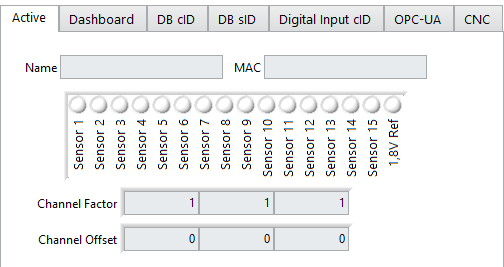

##### Dashboard

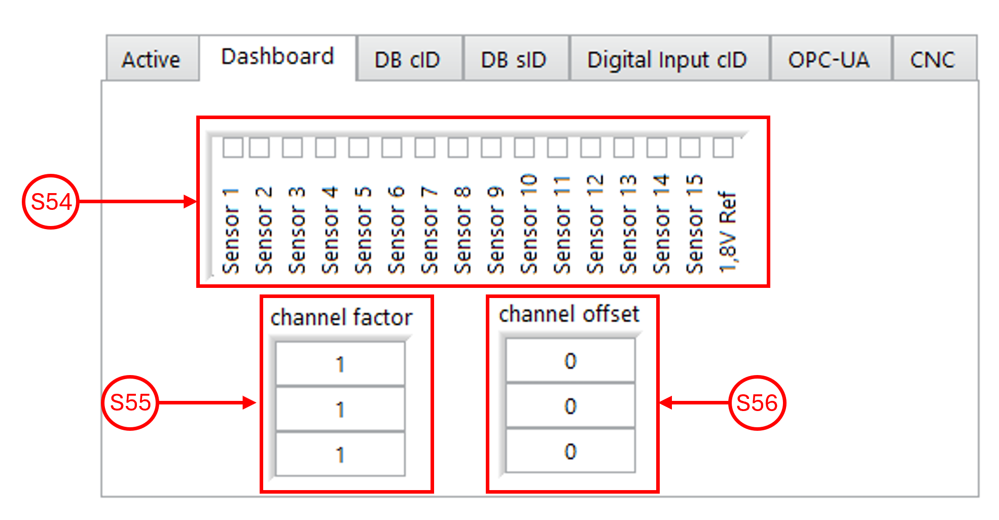

Der Reiter "Dashboard" wird benutzt um Einstellungen für die Halterverbindung mittels "Dashboard" vorzunehmen.
S54: Checkboxen um bis zu 3 Sensoren und die alternative Referenzspannung zu wählen.
S55: Hier können für die gewählten Sensoren k-Faktoren eingestellt werden.
S56: Dies sind einstellbare d-Faktoren für die gewählten Sensoren.

##### DB cID

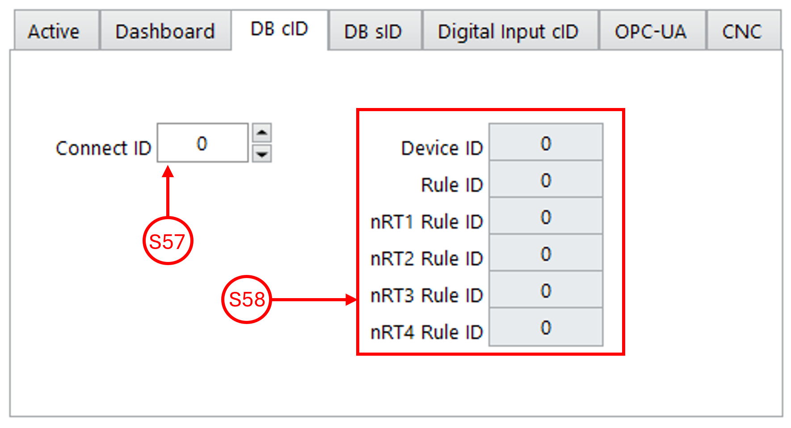

Der Reiter "DB cID" wird genutzt um bei der entsprechenden Verbindungsart Einstellungen vorzunehmen.
S57: Hier kann die gewünschte Connection-ID angegeben werden.
S58: Hier werden die zu der in S57 gewählten Connection ID gehörigen Device und Regel IDs angezeigt.

##### DB sID

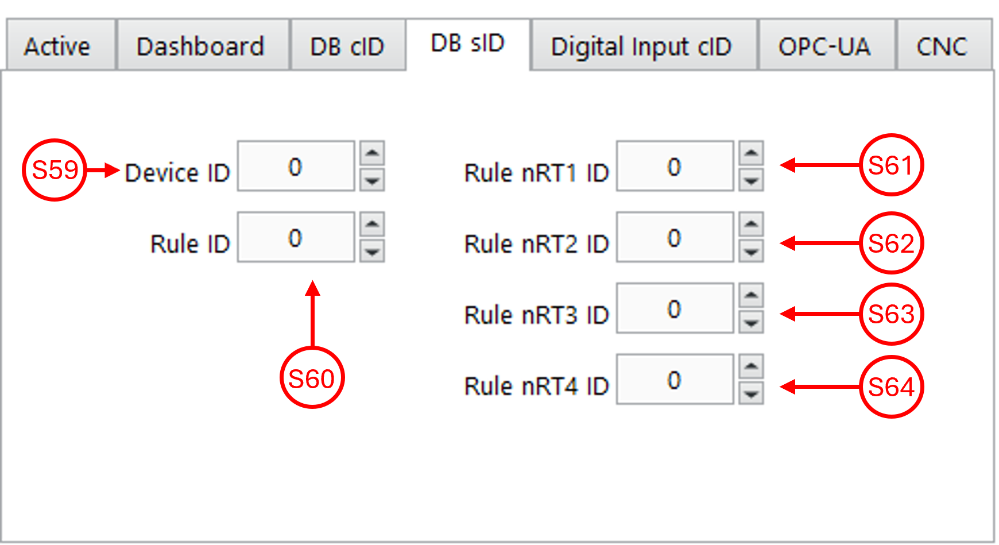

Der Reiter "DB sID" wird genutzt um bei der entsprechenden Verbindungsart Einstellungen vorzunehmen.
S59: Hier kann die gewünschte Device ID angegeben werden.
S60: Hier kann die gewünschte Main Rule angegeben werden.
S61-S64: Hier können bis zu 4 gewünschte neben Regeln angegeben werden.

##### Digital Input cID

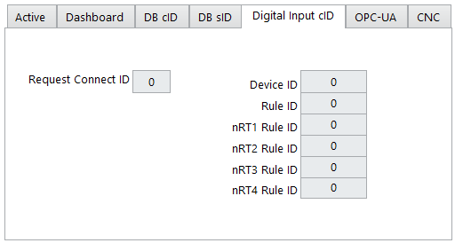

Dieser Reiter enthält Informationen über die aktuellen Einstellungen, welche mittels digitaler Eingänge, in der dazugehörigen Verbindungsart aktuell angewendet werden.

##### OPC-UA

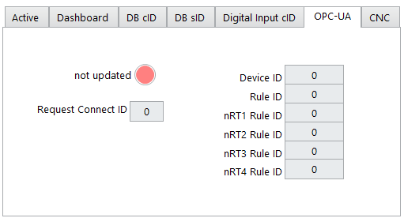

Dieser Reiter enthält Informationen über die aktuellen Einstellungen, welche mittels OPC-UA, in der dazugehörigen Verbindungsart aktuell angewendet werden.

##### CNC

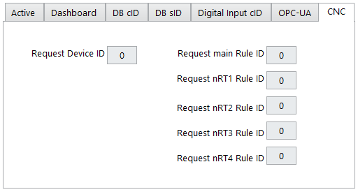

Dieser Reiter enthält Informationen über die aktuellen Einstellungen, welche mittels einer CNC-Schnittstelle, in der dazugehörigen Verbindungsart aktuell angewendet werden.

### Regel & Sensor Konfigurationen Modul

Dieses Untermodul verfügt über 3 Reiter

#### Rule Engine configs

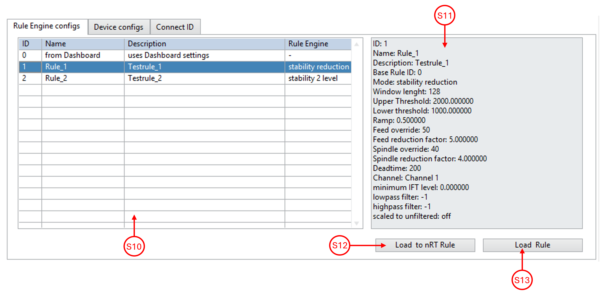

Hier können die aktuellen Regeln eingesehen und geladen werden.
S10: Dies ist eine Liste aller aktuellen Regeln.
S11: Hier werden die Details zu der aktuell in S10 ausgewählten Regeln angezeigt
S12: Mit diesem Button kann die aktuell in S10 ausgewählte Regel in die momentan im Dashboard eingestellten nRT Rules geladen werden.
S13: Mit diesem Button kann die aktuell in S10 ausgewählte Regel in die momentan im Dashboard eingestellte main Rule geladen werden.

#### Device configs

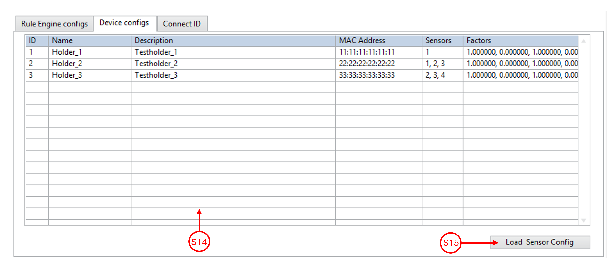

Hier können die aktuellen geladenen Halter und deren Einstellungen eingesehen werden und in die Dashboard-Verbindung geladen werden.
S14: Liste aller geladenen Halter Einstellungen
S15: Dieser Button lädt die in S14 ausgwählten Haltereinstellungen in die Verbindungseinstellungen der "Dashboard" Verbinudungsart.

#### Connect ID

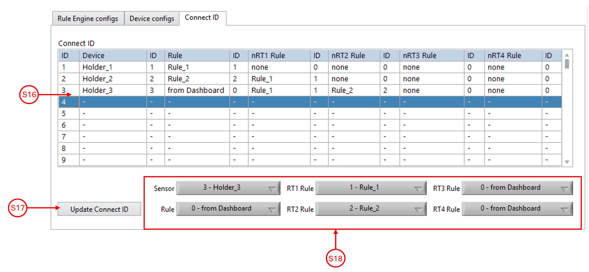

In diesem Reiter werden alle eingestellten Connection IDs und deren dazugehörigen Device und Rule IDs angezeigt und können hier ebenfalls geändert werden.
S16: Diese Liste zeigt alle aktuell eingestellten Connection IDs und deren dazugehörigen Device und Rule IDs an.
S17: Dieser Button lädt die in S18 eingestellten IDs in die momentan in S16 ausgewählte Connection ID.
S18: Diese Drop-Down Listen werden benutzt um die IDs einzustellen welche mittels dem Button S17 in die Liste S16 aufgenommen werden. Sollte bei "Sensor" die Option "delete" verwendet werden wird bei Betätigung von S17 die markierte ID aus der Liste S16 gelöscht.

### Logging & Settings Modul

Dieses Modul verfügt über 3 Reiter

#### Logging

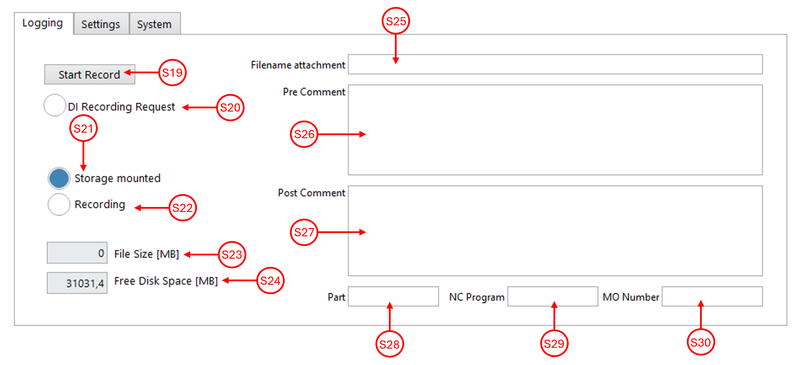

In diesem Reiter können Einstellungen bezüglich der Datenaufnahme vorgenommen werden.
S19: Dieser Button kann benutzt werden um eine Datenaufnahme zu starten oder zu stoppen.
S20: Dieser Identifikator zeigt an ob über die digitalen IOs eine Datenaufnahme gewünscht wird.
S21: Dieser Identifikator zeigt an ob ein USB-Stick für die Datenaufnahme angeschlossen ist. **Achtung: Das System funktioniert nur mit USB-Geräten, die im FAT32-Format formatiert sind!!!**
S22: Dieser Identifikator zeigt an ob gerade eine Datenaufnahme stattfindet.
S23: Hier wird bei einer aktiven Datenaufnahme die momentane Größe der Aufnahme angezeigt.
S24: Hier wird der auf dem verbundenen USB-Stick verfügbare Speicherplatz angezeigt.
S25: Hier kann eine zusätzlich gewünschter Dateiname gewählt werden, welcher nach dem Zeitstempel der Aufnahme in den Dateinamen angehängt wird.
S26: Hier kann ein Kommentar eingefügt werden, welcher vor Beginn der Aufnahme in die Datei eingefügt wird.
S27: Hier kann ein Kommentar eingefügt werden, welcher am Ende der Aufnahme in die Datei eingefügt wird.
S28: Hier kann eine Teile-Nummer eingefügt werden, welche in die Datei mit eingefügt wird.
S29: Hier kann eine NC-Programm-Nummer eingefügt werden, welche in die Datei mit eingefügt wird.
S30: Hier kann eine Mitarbeiter-Nummer eingefügt werden, welche in die Datei mit eingefügt wird.

#### Settings

In diesem Reiter können einige Einstellungen vorgenommen werden. Unter anderem über welche Methoden eine Verbindung eingeleitet werden darf.
S31: Mit dieser Einstellung kann die Datenrate der OPC-UA Verbindung eingestellt werden.
S32: Diese Anzeige gibt Informationen über die zuletzt vorgenommenen Lade- beziehungsweise Schreibprozesse
S33: Diese Checkboxen werden verwendet um die angegebenen Quellen als Auslöser für eine Verbindung zuzulassen. Hierbei kann eine Verbindung von allen ausgewählten Methoden erfolgen. Solange 1 der Methoden eine Verbindung wollen bleibt die Verbindung erhalten. Nur wenn alle gewählten Methoden einen Disconnect wollen wird die Verbindung zum Halter unterbrochen. Wenn "AutoConnect" aktiviert ist dann wird sobald der gewählte Halter in Reichweite ist eine Verbindung ausgelöst. Wenn "AutoRecord" aktiviert ist dann wird automatisch bei Verbindung mit einem Halter die Datenaufnahme gestartet. Wenn "Autoenable Rule" aktiviert ist dann sind alle Regeln automatisch bei Verbindung aktiviert.
S34: Hier kann der Speicherplatz für das Speichern und Laden von Konfigurationseinstellungen zwischen c-Rio(local) und USB gewählt werden.
S35: Mit diesem Button werden die aktuellen Connection-Liste, Halterauswahl-Einstellungen, Verbindungsquellen und weitere Einstellungen abgespeichert.
S36: Mit diesem Button werden die vorhandenen Einstellungen mit denen aus der abgespeicherten Konfigurationsdatei überschrieben.
S37: Mit diesem Button kann ein Reset der STU ausgelöst werden.

#### System

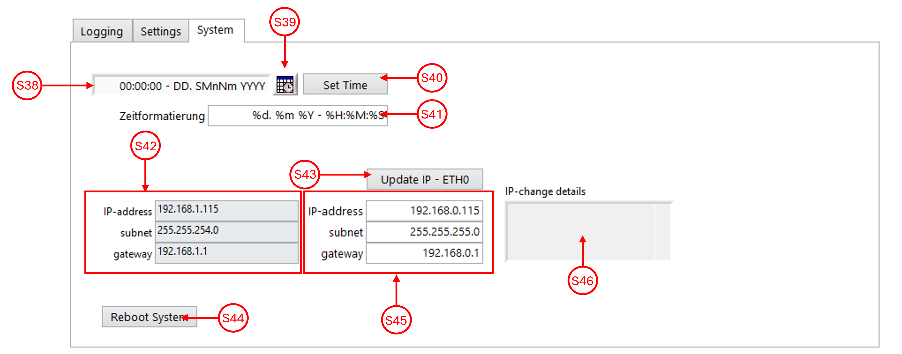

In diesem Reiter können Uhrzeit und IP-Einstellungen vorgenommen werden.
S38: Hier kann ein neues Systemdatum und Uhrzeit angegeben werden, welche mit S40 geladen werden kann.
S39: Mit diesem Button kann ein Kalender geöffnet werden, welcher zum ausfüllen von S38 verwendet werden kann.

S40: Dieser Button überschreibt das aktuelle Systemdatum und die Uhrzeit mit den in S38 angegebenen Daten.
S41: Hier kann die verwendete Zeitformatierung umgeändert werden.
S42: Hier können die aktuellen IP-Einstellungen der linken (SYNC 0) LAN-Buchse ausgelesen werden.
S43: Mit diesem Button können die aktuellen IP-Einstellungen der linken (SYNC 0) LAN-Buchse(S42) mit den Daten aus S45 überschrieben werden. Hierbei kann es dazu kommen, das die Verbindung abreist oder der c-Rio einen Reboot durchführt.
S44: Mit diesem Button kann ein Reboot des c-Rio ausgelöst werden.
S45: Hier können IP-Einstellungen angegeben werden, welche mit S43 auf die linke LAN-Buchse (SYNC 0) angewendet werden sollen.
S46: Hier werden Informationen zu der Änderung der IP-Adresse angezeigt.

### Information Modul

Dieses Modul verfügt über 2 Reiter

#### Signal Quality

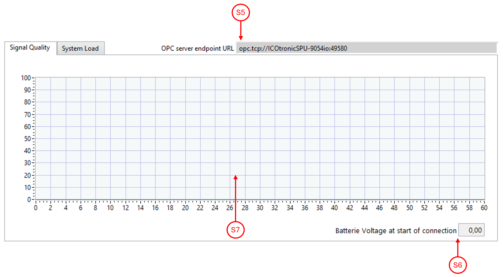

S5: Hier wird die Adresse des OPC-UA Server des c-Rio angezeigt.
S6: Hier kann bei einer aktiven Verbindung mit einem Halter die Akkuspannung des Halters, zum Zeitpunkt des Verbindungaufbaus, abgelesen werden.
S7: Hier wird bei einer aktiven Verbindung mit einem Halter ein Graph über die Signalqualität angezeigt.

#### System Load

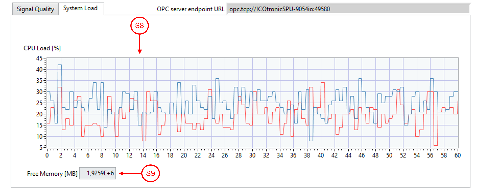

S8: Hier ist ein Graph der CPU Auslastung des c-Rio zu sehen.
S9: Hier kann die Größe des verfügbaren Speichers des c-Rio abgelesen werden.

### Halterauswahl Methoden

Es gibt verschiedene Arten über die der gewünschte Halter mit den gewünschten Einstellungen ausgewählt werden kann. Die aktive Art kann mittels S47 und S48 ausgewählt werden und bei S49 abgelesen werden. Wenn mittels S48 die aktive Halterauswahl Methode gewechselt wird, ändert sich der offene Reiter S52 auf den Reiter der gewählten Methode.

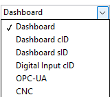

#### Dashboard

Hierbei werden der gewählte Halter und die gewählten Sensoren mittels des Dashboards, des Reiters S52 und der Liste der verfügbaren Halter S50 ausgewählt. Die angewandten Regeln werden direkt in den Einstellungen C6 im Reiter "Stability" eingestellt und ausgelesen.

#### Dashboard cID

Hierbei werden der gewünschte Halter und Regeln mittels ihrer Connection ID aus der Liste S16 ausgewählt.

#### Dashboard sID

Hierbei werden der gewünschte Halter und die gewünschten Regeln mittels der Device ID aus der Liste S14 und den Regel IDs aus der Liste S10 ausgewählt.

#### Digital Input cID

Hierbei werden der gewünschte Halter und die gewünschten Regeln mittels der digitalen IOs aus der Liste S16 ausgewählt.

#### OPC-UA

Hierbei erfolgen Halter- und Regelauswahl durch eingestellte Parameter der OPC-UA Verbindung.

#### CNC

Hierbei erfolgen Halter- und Regelauswahl durch eine CNC-Schnittstelle.

## Database

Dieser Reiter wird verwendet, um die Konfiguration von Regeln und Sensoren zu laden und zu speichern. Er kann in 3 Module unterteilt werden. 
D1: Das System Modul dient dazu die eingestellten Daten zu laden und speichern.
D2: Hier kann ein Verlauf der durchgeführten Tätigkeiten in diesem Reiter nachgelesen werden.
D3: Das Sensor Modul wird dazu verwendet die gewünschten Halter mit deren Sensorenauswahl zu erfassen.
D4: Das Regel Modul wird dazu verwendet die gewünschten Regeln zu erfassen.
D5: Mit diesem Button kann die History in D2 gelöscht werden.

### System-Modul

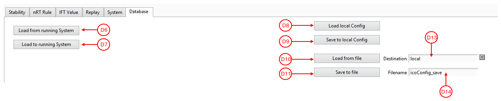

Dieses Modul dient dazu die Listen zu laden und zu speichern.
D6: Lädt die aktuell auf dem c-Rio angewendeten Listen.
D7: Lädt die Listen in den c-Rio damit diese aktiv genutzt werden.
D8: Lädt die auf dem c-Rio lokal gespeicherten Listen aus.
D9: Speichert die Listen lokal auf dem c-Rio.
D10: Lädt die Listen aus dem der in D13 gewählten Quelle mit dem in D14 gewählten Dateinamen aus.
D11: Speichert die Listen in der in D14 gewählten Datei auf dem in D13 gewählten Medium.
D13: Hier kann das Medium gewählt werden auf welchem die Listen mit D10 und D11 gelesen oder geschrieben werden.
D14: Hier kann der gewünschte Dateiname für das Lesen und Schreiben mit D10 und D11 gewählt werden.

### Sensor-Modul

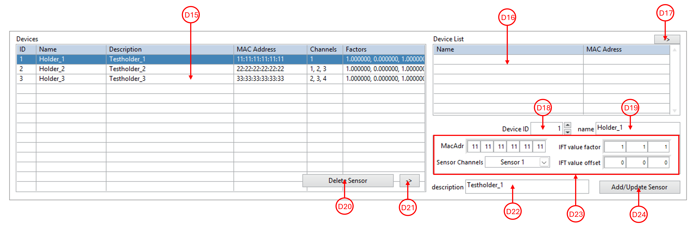

D15: Hier wird die aktuell geladene Liste der Devices mit deren Einstellungen angezeigt.
D16: In dieser Liste werden alle aktuell in der Umgebung gefundenen Halter angezeigt.
D17: Mit diesem Button kann die MAC-Adresse des momentan in D16 gewählten Halters in das Einstellungsfeld D23 geladen werden.
D18: Hier kann die ID eingestellt werden welche für das Speichern der Einstellungen von D23 nach D15 verwendet wird.
D19: Hier kann der Name der Einstellung angegeben werden welcher in der Liste D15 angezeigt wird.
D20: Mit diesem Button kann das aktuell in D15 markierte Element aus der Liste gelöscht werden.
D21: Mit diesem Button können die Einstellungen des aktuell in D15 ausgewählten Elements in die Einstellungen D23 geladen werden.
D22: Hier kann eine Beschreibung angegeben werden, welche in der Liste D15 angezeigt wird.
D23: Hier können die Einstellungen eingetragen werden, welche durch D24 dann in die Liste D15 übertragen werden.
Das Drop-Down Menü "Sensor Channels" wird verwendet, um festzulegen, welche Kanäle der ausgewählte Halter in diesem Sensoreintrag verwendet. 

Hier gibt es bereits ein paar vordefinierte Auswahlen. Wenn eine andere Sensoreinstellung gewünscht ist kann diese mittels "Andere ..." eingetragen werden. Nun wird eine 16-bit binäre Eingabe für die Sensorauswahl benötigt. Alle "0" vor der ersten benötigten "1" können weggelassen werden. Sensor 1 ist hierbei das LSB bit. Wenn zum Beispiel Sensoren 1,5 und 10 gewählt werden sollen muss hierfür "1000010001" eingegeben werden. Das MSB definiert hierbei die Referenzspannung. Wenn an der MSB Stelle eine "1" eingetragen wird, dann wird die 1,8V Referenzspannung verwendet.
D24: Dieser Button überträgt die aktuell in D19, D22 und D23 eingetragenen Werte in die Liste D15 wobei die ID aus D18 herangezogen wird.

### Regel-Modul

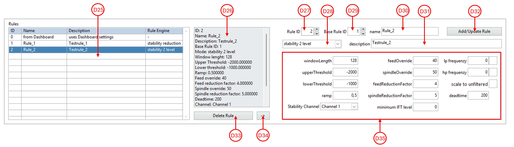

In diesem Modul können die angewandten Regeln eingestellt werden.

D25: Dies ist eine Liste aller aktuell eingestellten Regeln.
D26: Hier werden die Details der momentan in D25 markierten Regel angezeigt.
D27: Hier kann die Rule ID eingestellt werden unter der die Einstellungen mit D32 abgespeichert werden sollen.
D28: Hier kann die Art der Regel ausgewählt werden.
D29: Hier kann die Base Rule ausgewählt werden. Wenn Sie eine andere Regel als "0" wählen, werden alle Parameter, die wie folgt in D35 angegeben sind, die Parameter der gewählten "Base Rule" laden:

- mode: "from Baserule" option
- window length: 0
- upper/lower Threshold: <0
- ramp: 0
- stability Channel: "from Baserule" option
- minimum IFT level: <0
- deadtime: 0
- feed/spindle Override: >125
- feed/spindle Reduction Factor: >125
- low/high-pass filter: <0

Dies kann verwendet werden, wenn Sie denselben Parameter aus einem vordefinierten Satz verwenden möchten und nur diese Regel ändern müssen, um automatisch mehrere Regeln zu ändern. 

D30: Hier kann der Name der Regel eingestellt werden, welcher in die Liste D25 übernommen wird.
D31: Hier kann eine Beschreibung der Regel angegeben werden, welche in die Liste D25 übernommen wird.
D32: Dieser Button überträgt die Daten aus D28-D31 und D35 in die Liste D25 ein.
D33: Dieser Button löscht das aktuelle markierte Element aus der Liste D25.
D34: Dieser Button lädt die Einstellungen des aktuell markierten Element aus der Liste D25 in die Felder D27-D31 und D35.
D35: Hier können die Parameter der Regel eingestellt werden.
Eine Beschreibung dieser Parameter finden Sie in diesem Handbuch im Kapitel "Stability Reiter"

## Replay Reiter

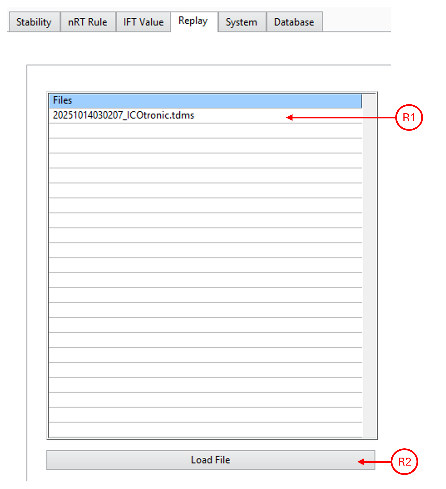

Dieser Reiter wird verwendet um aufgenommene Daten auf dem momentan angeschlossenen USB-Stick einsehen zu können.

R1: Hier wird eine Liste aller auf dem USB-Stick gefundenen aufgenommen Daten angezeigt.
R2: Mit diesem Button wird die Aufnahme des aktuell in R1 markierten Elements geöffnet.

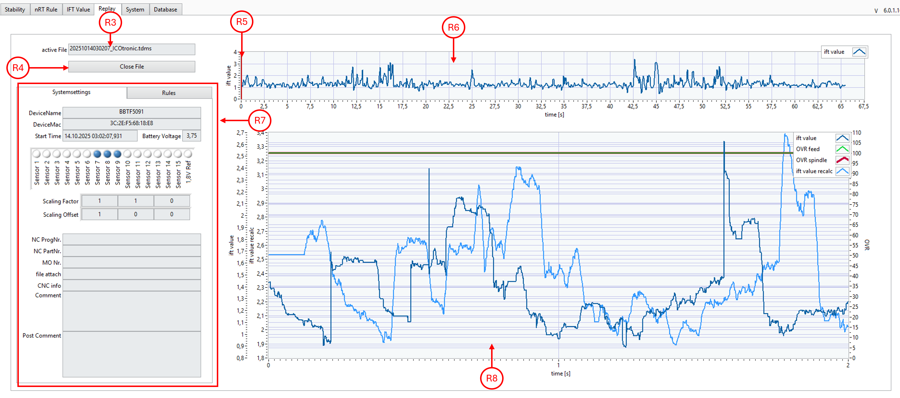

R3: Hier wird der Dateiname der aktuell geöffneten Aufzeichnung angezeigt.
R4: Mit diesem Button kann die aktuell geöffnete Datei wieder geschlossen werden. **Achtung: Wenn der USB-Stick entfernt wird während eine Datei geöffnet ist, wird der USB-Anschluss unterbrochen und der c-Rio muss neu gestartet werden, damit dieser wieder aktiviert wird!!!**
R5: Dieser Marker gibt den Startpunkt der in R8 angezeigten Daten an.
R6: Dies ist ein Graph der den Verlauf der IFT-Wertes in der geöffneten Datei anzeigt.
R7: Hier können die in der Datei eingetragenen Informationen zu der Aufnahme ausgelesen werden. Es gibt 2 Reiter, "Systemsettings" und Rules
R8: Hier werden bis zu 2 Sekunden der Daten im Detail angezeigt. Der Startpunkt der Anzeige wird mittels R5 ausgewählt und mittels R17 geladen.

### Systemsettings Reiter

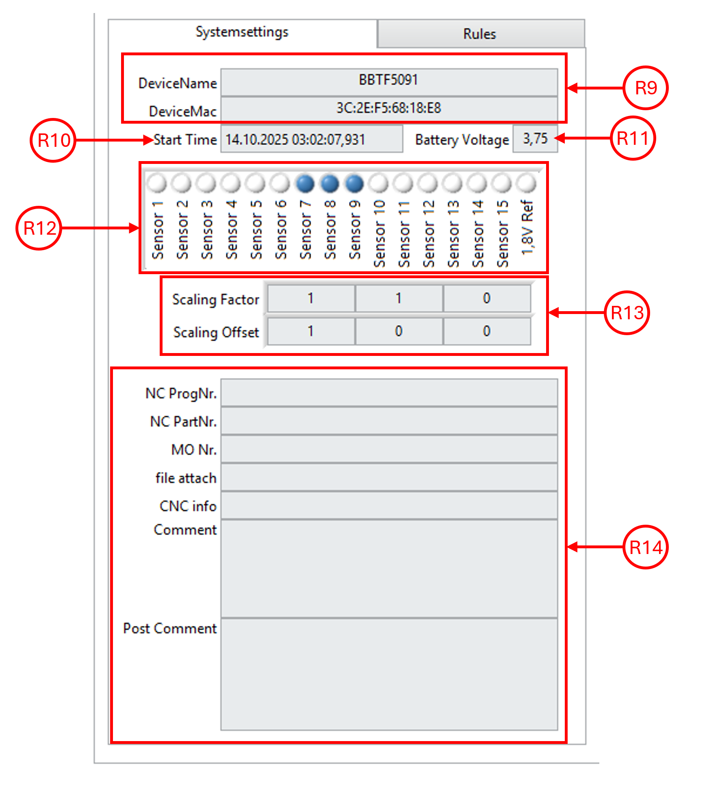

R9: Hier können der Name und die MAC-Adresse des verwendeten Halters ausgelesen werden.
R10: Hier kann die Startzeit der Aufnahme abgelesen werden.
R11: Hier kann der Akkustand welcher zum Start der Aufnahme vorhanden war ausgelesen werden.
R12: Hier können die in der Aufnahme verwendeten Sensoren und Referenzspannung abgelesen werden.
R13: Hier können die für die 3 Kanäle gewählten k und d Faktoren ausgelesen werden.
R14: Hier können die vom Benutzer in die Aufnahmen hinzugefügten Informationen ausgelesen werden.

### Rules Reiter

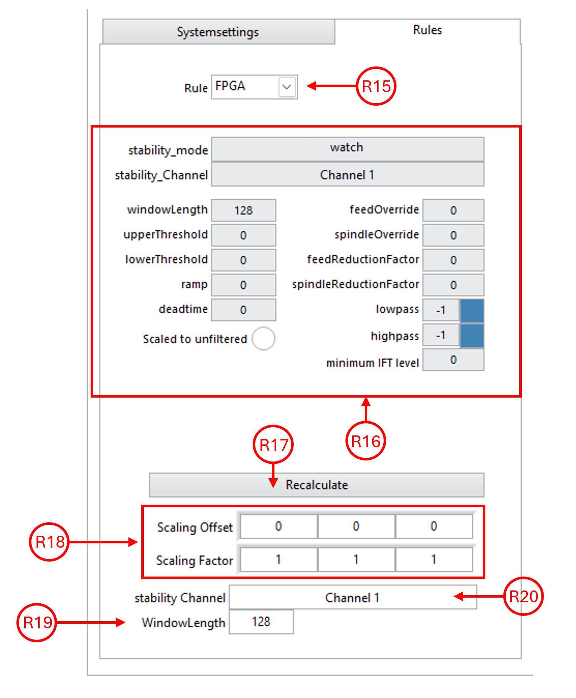

R15: Hier kann ausgewählt werden, welche Regeleinstellungen in den Daten R16 ausgelesen werden sollen.
R16: Hier werden die Regeleinstellungen der in R15 ausgewählten Regel angezeigt.
R17: Mit diesem Button können die IFT-Werte in R8 neu berechnet werden mit dem Startpunkt R5, den k und d Faktoren R18, der Windowlength R19 und dem Channel R20.
R18: Hier können neue k und d Faktoren für die Neuberechnung mit R17 eingestellt werden.
R19: Hier kann eine neue Fensterbreite zum Neuberechnen der Daten mit R17 ausgewählt werden.
R20: Hier kann der Channel, für die Neuberechnung der IFT-Werte in R8 herangezogen wird, eingestellt werden.

## IFT Value Reiter

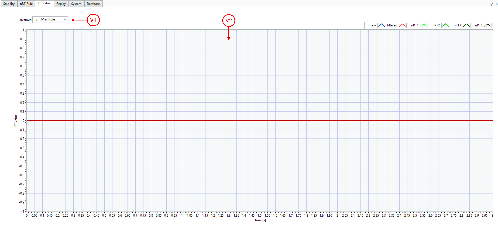

In diesem Reiter kann der aktuelle Verlauf des IFT-Wertes für die verschiedenen eingestellten Regeln bei einer aktiven Verbindung angezeigt werden.
V1: Hier kann ausgewählt werden aus welcher der Regeln die Thresholds in V2 angezeigt werden sollen.
V2: Hier werden die Verläufe der IFT-Werte der Regeln und die Thresholds der in V1 eingestellten Regel angezeigt.

## nRT Rule Reiter

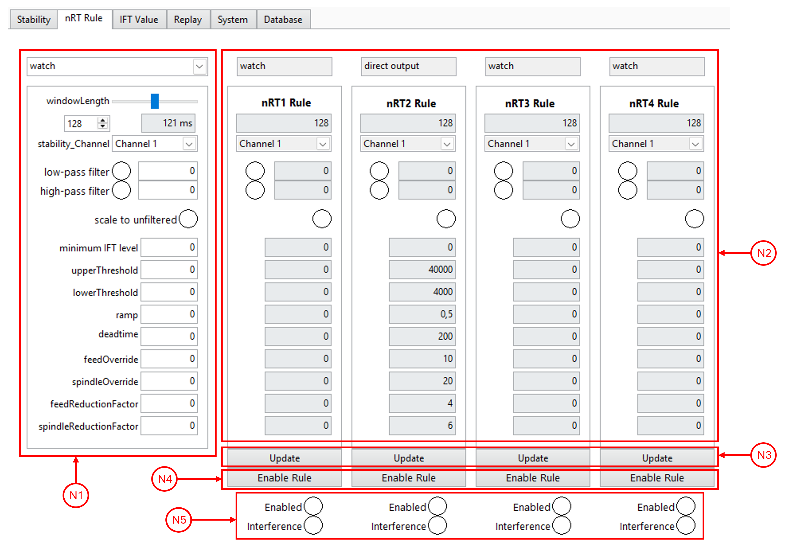

In diesem Reiter können die nRT Regeln ausgelesen werden und im Fall der "Dashboard" Halterauswahl auch adaptiert werden.
N1: Die hier eingestellten Parameter können mittels der Buttons N3 in die dazugehörigen Regeln geladen werden.
N2: Hier können die Einstellungen der momentan aktiven nRT Regeln ausgelesen werden.
N3: Diese Buttons laden bei Betätigung die Daten aus N1 in die dazugehörige Regel in N2.
N4: Diese Buttons können benutzt werden um die dazugehörigen Regeln zu aktivieren.
N5: Mit diesen Identifikatoren kann erkannt werden welche nRT Regeln gerade aktiviert sind und welche Regeln gerade einen "Eingriff" auslösen.

## Stability Reiter 		

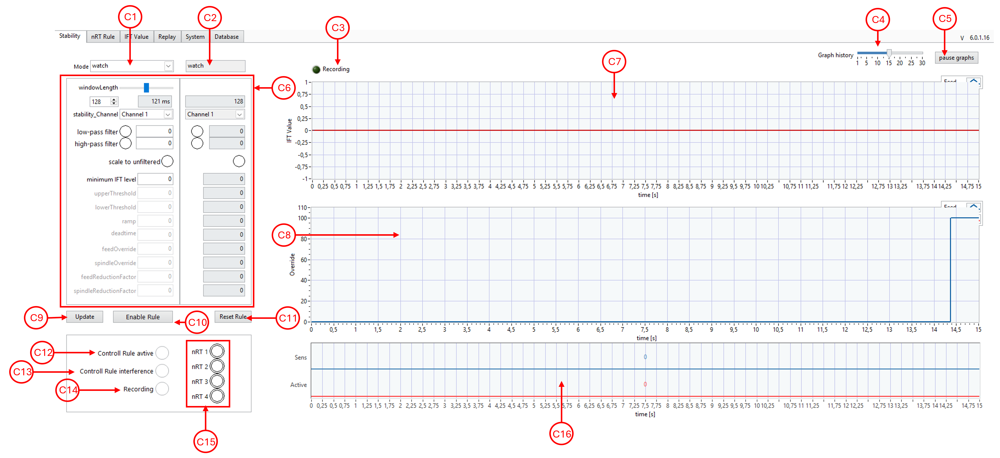

Im Stability Reiter des Dashboards können die Parameter der Regelung für die Dashboard Halterauswahl eingestellt werden, die aktuellen Regeln ausgelesen werden und ein Graph der Echtzeitdaten der Main-Rule eingesehen werden.

C1: Hier kann der gewünschte Regelalgorithmus ausgewählt werden.
C2: Hier wird der von der Main-Rule aktuell verwendete Regelalgorithmus angezeigt.
C3: Dieser Identifikator zeigt an ob gerade eine Datenaufnahme stattfindet.
C4: Mit diesem Schieberegler kann die in C7, C8 und C16 angezeigte Zeit eingestellt werden.
C5: Mit diesem Button können die Graphen C7, C8 und C16 pausiert werden oder die Pausierung quittiert werden.
C6: Hier können die Regelparameter der Main-Rule eingestellt werden und die aktuellen Parameter ausgelesen werden.
C7: Dieser Graph zeigt die Echtzeitdaten des IFT-Wertes und die eingestellten Thresholds.
C8: Dieser Graph zeigt die Echtzeitdaten der momentan vom c-Rio geregelten Overrides.
C9: Dieser Button lädt die in C6 eingetragenen Parameter der Main-Rule in die aktivierten Parameter.
C10: Dieser Button aktiviert und deaktiviert die Main-Rule bei den "Dashboard" Verbindungsarten.
C11: Dieser Button ermöglicht das Rücksetzen einer ausgelösten Regel, sollte diese durch ihren Algorithmus eine manuelle Quittierung erfordern.
C12: Dieser Identifikator zeigt an ob die Main-Rule gerade aktiviert ist.
C13: Dieser Identifikator zeigt an ob die Main-Rule gerade auslöst und die Overrides adaptiert.
C14: Dieser Identifikator zeigt an ob die Daten aktuell aufgenommen werden.
C15: Diese Identifikatoren zeigen an welche nRT-Regeln gerade aktiviert sind und welche auslösen. Hierbei wird der innere Kreis eingefärbt wenn die Regel aktiviert ist und der äußere Ring wird eingefärbt wenn die Regel eingreift.
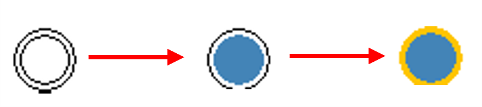
C16: In diesem Graph wird der Zeitliche Verlauf der Aktivierung und des Eingreifens der Main-Rule angezeigt.

### Parameter 					  			

Je nachdem, welcher Algorithmus gerade aktiv geschalten ist, können unterschiedliche Parameter eingestellt werden. Um die neuen Werte der Parameter zu übernehmen muss der "update“ Button gedrückt werden, welcher sich unterhalb der Parameter befindet. Die einzige Ausnahme ist die "Window length“ Einstellung, welche im "watch“ Modus auch ohne Update in Echtzeit verändert werden kann.

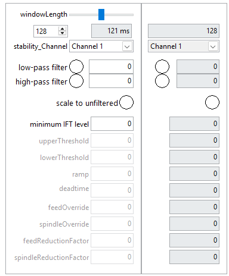

#### Window length 			  			

{ms} Zeitfenster

Dieser Parameter gibt an, welches Zeitfenster für die Berechnung des IFT-Wertes benutzt wird. Wenn ein großes Zeitfenster gewählt wird, so reagiert das System träger auf Änderungen des Signals. Zum Beispiel wirkt sich ein einmaliger Impuls weniger auf die IFT-Wert Berechnung aus, wenn das Zeitfenster groß gewählt wird. Im "watch“ Modus kann dieser Parameter in Echtzeit verändert werden. In allen anderen Modi muss der "update“ Button geklickt werden, um Änderungen zu übernehmen.

#### Minimum IFT Level

{-} IFT Wert Niveau

Dieser Parameter legt den minimal verwendeten Wert für die Regel fest. Alle Werte unterhalb dieses Schwellenwerts werden ignoriert. Dies ist beispielsweise notwendig, wenn Sie die Filteroptionen verwenden und diese auf die ungefilterten Werte skalieren. Wenn das Werkzeug sich schnell innerhalb der Maschine bewegt, könnten hochfrequente Signalanteile auftreten, die das System stören. Mit diesem Parameter können Sie verhindern, dass das System reagiert, während es sich nur um Bewegungen handelt, ohne dass relevante Messwerte erfasst werden.

#### Stability_Channel

{-} channels

Mit diesem Drop-Down Menü kann der Kanal gewechselt werden, mit welchem der IFT-Wert berechnet wird, sollte das System mit einem 3 Kanal fähigen Halter verbunden sein. Es kann ein einzelner Kanal gewählt werden oder mehrere Kanäle gleichzeitig. Wenn ein Halter mit 1 Kanal verbunden wurde wird dieses Menü vom System ignoriert und die IFT-Wert Berechnung erfolgt mit dem einen zur Verfügung stehenden Kanal.

#### Upper threshold 		

{-} obere Schwelle

Sollte der IFT-Wert die obere Schwelle überschreiten, so werden die zuvor eingestellten Overrides von der SPU angewandt. Je größer diese Schwelle gewählt wird, umso instabiler darf das System werden, bevor die Regelung eingreift.

#### Lower threshold 		 			

{-} untere Schwelle

Sollte der IFT-Wert die untere Schwelle unterschreiten, so regelt die SPU wieder auf 100% Vorschub und Drehzahl zurück. Dies geschieht in Folge der eingestellten Rampe. Je kleiner diese Schwelle gewählt wird, umso stabiler muss das System werden, bevor die Overrides zurückgesetzt werden.

#### Ramp 			  			

{%/ms} Rampe

Dieser Parameter bestimmt die Geschwindigkeit, mit der die Overrides zurückgesetzt werden. Die Overrides werden nicht sprunghaft zurückgesetzt, sondern verlaufen entlang einer Rampe zurück auf 100%. Je größer dieser Wert, umso steiler ist die Rampe und umso schneller setzt das System Vorschub und Drehzahl zurück auf 100%.

Beispiel:
Ein Wert von 0.01%/ms würde einer Erhöhung von Drehzahl und Vorschub um 10% innerhalb von 1 Sekunde.

#### Feed override 					

{0-100%} Vorschub Soll-Wert

Dieser Parameter wird in den Modi "Stop", "Stability reduction”, "Stability 2 Level“ und "Direct output“ verwendet. In den Modi "Stop", "Stability 2 Level" und "Direct output" bestimmt dieser Wert den Override, welcher vom System angewendet wird, sollte das ICOTronic System die Regelung des Vorschubes aktivieren.
Im Modus "Stability reduction" bestimmt dieser Wert den minimalen Wert den der Override des Vorschubs annehmen darf. Der Override kann nicht unter diesen Wert fallen.

#### Spindle override 		  			

{0-100%} Drehzahl Soll-Wert

Dieser Parameter wird in den Modi "Stop", "Stability reduction”, "Stability 2 Level“ und "Direct output“ verwendet. Dieser Wert bestimmt den Override, welcher vom System angewendet wird, sollte das ICOTronic System die Regelung der Drehzahl aktivieren.
Im Modus "Stability reduction" bestimmt dieser Wert den minimalen Wert den der Override der Drehzahl annehmen darf. Der Override kann nicht unter diesen Wert fallen.

#### Feed reduction factor 		  			

{0-100%} Vorschub Reduzierungsfaktor

Dieser Parameter wird im "Stability reduction“ Modus verwendet. Dieser Wert beeinflusst die Schrittgröße, in welcher der Vorschub Override gesetzt wird.

Beispiel:
Ein Wert von 5% als "Feed reduction factor“ erzeugt eine Senkung des Vorschub Overrides um 5% bei jedem Berechnungsfenster, solange der IFT-Wert > Obere Schwelle ist.

Reduzierungsschritt 1: Reduktion von 100% auf 95%
Reduzierungsschritt 2: Reduktion von 95% auf 90%
… und so weiter.

#### Spindle reduction factor 			

{0-100%} Drehzahl Reduzierungsfaktor

Dieser Parameter wird im "Stability reduction“ Modus verwendet. Dieser Wert beeinflusst die Schrittgröße, in welcher der Drehzahl Override gesetzt wird.

Beispiel:
Ein Wert von 5% als "Spindle reduction factor“ erzeugt eine Senkung des Drehzahl Overrides um 5% bei jedem Berechnungsfenster, solange der IFT-Wert > Obere Schwelle ist.

Reduzierungsschritt 1: Reduktion von 100% auf 95%
Reduzierungsschritt 2: Reduktion von 95% auf 90%
… und so weiter. 

#### Deadtime 			  			

{ms} Totzeit

Dieser Parameter wird nur im "Stability reduction“ Modus verwendet. Dieser Wert entspricht jener Zeit, die das System abwartet, bevor es erneut überprüft, ob eine Reduktion der Overrides erforderlich ist. Je kleiner dieser Wert, umso schneller reduziert das System den Vorschub und die Drehzahl. Als Referenzwert für erste Versuche kann eine Totzeit von 300ms gewählt werden. Dies bedeutet, dass alle 300ms der Vorschub und die Drehzahl reduziert werden, solange sich der IFT-Wert oberhalb der oberen Schwelle befindet.

Beispiele:

In den nachfolgenden Grafiken sind 2 verschiedene Totzeiten eingestellt, mit der kürzeren Totzeit in der ersten Grafik. Es ist zu bemerken, dass die minimalen Overrides bei kürzerer Totzeit schneller erreicht werden.

Für beide Grafiken wurden dieselben Reduzierungsfaktoren und minimalen Overrides verwendet:

Feed reduction factor: 8%; Feed override min: 10%; Spindle reduction factor: 5%; Spindle override min: 20%

Deadtime: 100ms

Deadtime: 300ms

#### Low-Pass-Filter

{Hz} Grenzfrequenz  
{-} aktiv/inaktiv

Dieser Parameter dient zur Einstellung der Grenzfrequenz des Tiefpassfilters bei der Berechnung der IFT-Werte. Das Textfeld wird verwendet, um die Grenzfrequenz anzugeben, und der Kreis ist ein Button, um den Tiefpassfilter zu aktivieren. Der Button leuchtet blau, wenn der Filter aktiv ist.

#### High-Pass-Filter

{Hz} Grenzfrequenz  
{-} aktiv/inaktiv

Dieser Parameter dient zur Einstellung der Grenzfrequenz des Hochpassfilters bei der Berechnung der IFT-Werte. Das Textfeld wird verwendet, um die Grenzfrequenz anzugeben, und der Kreis ist ein Button, um den Hochpassfilter zu aktivieren. Der Button leuchtet blau, wenn der Filter aktiv ist.

#### Scale to unfiltered

{-} aktiv/inaktiv

Dieser kreisförmige Button leuchtet blau, wenn die Funktion aktiviert ist. Das gefilterte Signal (mit Hoch- und Tiefpassfilter) wird im Verhältnis zum ungefilterten Signal gesetzt, wenn diese Funktion aktiviert ist. Ist die Funktion aktiv, kann der IFT-Wert maximal "1" betragen. **Wenn sowohl der Tiefpass- als auch der Hochpassfilter deaktiviert sind, beträgt der Signalwert immer "1".**

### Regelalgorithmen 		

Die verschiedenen Modi sind folgende:

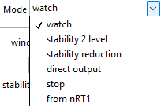

#### WATCH 			  			

In diesem Modus sind STU und STH miteinander verbunden. Des Weiteren wird der IFT-Wert in diesem Modus berechnet, damit das generierte Signal eines Schnittes eingesehen werden kann. Dieser Modus ist aber kein Regelmodus und greift somit auch nicht in den Maschinenprozess ein. Daher ist dieser Modus dafür geeignet, die Verbindung zwischen STH und STU zu testen. Dies ist der einzige Modus, in dem die "Window length“ geändert werden kann, ohne den "Update“ Button klicken zu müssen.

#### STABILITY 2 LEVEL 			  			

Dies ist einer der 2 Modi, welche zur Regelung des Maschinenprozesses genutzt werdern können. Die in diesem Modus benutzten Parameter sind “Upper threshold”, “Lower threshold”, “Ramp”, “Feed override” und “Spindle override”. Sollte der IFT-Wert in diesem Modus die "Upper threshold“ überschreiten, so werden die Overrides direkt auf die zuvor im Dashboard eingestellten Werte von "Feed override“ und "Spindle override“ gesetzt. Sobald der IFT-Wert wieder unterhalb des "Lower threshold“ fällt, beginnt das System den Vorschub und die Drehzahl entlang einer Rampe wieder auf 100% zu erhöhen. Die Geschwindigkeit, mit der das System wieder auf 100% fährt, ist durch die Steilheit der Rampe gegeben. Diese ist über den Parameter "Ramp“ definiert.

#### STABILITY REDUCTION 					

Dies ist einer der 2 Modi, welche zur Regelung des Maschinenprozesses genutzt werdern können. Die in diesem Modus benutzten Parameter sind “Upper threshold”, “Lower threshold”, “Ramp”, “Feed override min”, "Feed reduction factor“, “Spindle override min”, "Spindle reduction factor“ und "Deadtime“. Sollte der IFT-Wert in diesem Modus die "Upper threshold“ überschreiten, so reduziert das System den Vorschub und die Drehzahl entsprechend der beiden Reduzierungsfaktoren. Nach einem Reduzierungsschritt wartet das System die "Deadtime“ ab und überprüft erneut, ob der IFT-Wert weiterhin oberhalb des "Upper threshold“ liegt. Sollte er unterhalb liegen, so behält das System die aktuellen Werte bei. Sollte der IFT-Wert weiterhin oberhalb des "Upper threshold“ liegen, so werden der Vorschub und die Drehzahl wieder um einen Reduzierungsschritt gesenkt. Sollte durch die Reduzierung einer der beiden Minimalwerte erreicht werden, so wird der Vorschub beziehungsweise die Drehzahl nicht mehr reduziert. Sobald der IFT-Wert wieder unterhalb des "Lower threshold“ fällt, beginnt das System den Vorschub und die Drehzahl entlang einer Rampe wieder auf 100% zu erhöhen. Die Geschwindigkeit, mit der das System wieder auf 100% fährt, ist durch die Steilheit der Rampe gegeben. Diese ist über den Parameter "Ramp“ definiert.

#### DIRECT OUTPUT 				

Dieser Modus wird vorrangig bei der Installation des Systems benutzt. Neben dem "IFT value factor“ und dem "IFT value offset“ können in diesem Modus "Feed override“ und "Spindle override“ eingestellt werden. Die für den Vorschub und die Drehzahl eingestellten Overridewerte werden in diesem Modus unabhängig vom aktuellen IFT-Wert direkt an die Maschine weitergegeben. Dadurch können definierte Overridewerte an die Maschine gesendet werden, ohne aktive Sensorik oder ein Aktivierungssignal der Maschine (M-Befehl). Dieser Modus sollte dafür verwendet werden, um zu überprüfen, ob die Verbindung zwischen der SPU und der Maschine ordnungsgemäß funktioniert.

#### STOP

Dieser Modus ist nahezu ident zu "stability 2 level". Der einzige Unterschied besteht darin, dass dieser Modus keinen "lower threshold" benutzt. Wenn das System die Overrides verändert, bleiben diese Overrides aktiv bis entweder der digitale Eingang für die Regelung auf "0" zurück gesetzt wird oder der "Reset Regler" Button gedrückt wird.

#### FROM nRT1

Dieser Modus nutzt anstelle der Main-Rule die Einstellungen der nRT1 Rule für die Regelung der Overrides.

## Anwendungsbeispiel 			  			

Öffnen Sie den Internet Explorer und verbinden Sie sich mit dem Dashboard. Wenn die Seite fertig geladen ist, wechseln Sie zu dem "System“ Reiter und waren Sie darauf, dass der Halter welcher gerade in der Maschine eingespannt ist, in der Liste aufscheint. Drücken Sie nun den "Connect“ Button und wechseln Sie zu dem "Stability“ Reiter. Die LED des Halters sollte nun anfangen zu blinken und die LEDs in den Ecken der STU sollten von grünem Blinken auf grünes Dauerleuchten wechseln. Nach einigen Sekunden sollte der IFT-Werte Graph Werte anzeigen, die ungleich 0 sind. Wechseln Sie den Modus auf "Watch“ und stellen Sie für einen ersten Test die "Window length“ auf etwa 70ms ein. Ändern Sie die "Graph History“ auf einen gewünschten Wert (am besten stellen Sie eine Zeit ein, welche etwas länger ist als der zu testende Schnittprozess). Nun fahren Sie einen Schnittprozess mit ausgeschalteter Regelung des Systems und betrachten Sie den IFT-Wert. Für eine bessere Begutachtung des Signals ist es zu empfehlen, nach Abschluss des Prozesses den "pause graph“ Button zu drücken und das Signal zu stoppen. Zur Erinnerung: Die Sekundenangabe unterhalb des Graphen zeigt an, wie viel Zeit seit diesem Datenpunkt verstrichen ist. Die nachfolgende Abbildung zeigt ein Beispiel eines Schnittprozesses im Watch Modus.

Nun ändern Sie den Modus auf einen der beiden Regelmodi und stellen sie die Parameter von "Upper threshold“ und "Lower threshold“ auf plausible Werte für eine adaptive Regelung. Wiederholen Sie nun den Schnittprozess mit eingeschalteter Regelung des Systems.

Sollten die Parameter noch nicht optimal eingestellt sein, so passen Sie diese nun entsprechend an und wiederholen Sie den Schnittprozess.

Die benötigte Zeit, um die Einstellungen für einen gegebenen Schnittprozess optimal einzustellen, kann variieren. Die benötigte Zeit ist abhängig von der Intensität des Ratterns, der Schnittdauer, der Erfahrung des Dashboard Bedieners bezüglich der Einstellungen und der Erfahrung des Maschinenbedieners. Dieser Optimierungsprozess kann durchaus länger als eine Stunde dauern.

# Nutzen des OPCUA-Server der SPU

## Verbinden mit dem OPCUA-Server

Um den OPCUA-Server nutzen zu können wird als erstes ein OPCUA-Client benötigt. Hierzu muss einer auf dem Computer installiert werden. Wir empfehlen UaExpert und haben auch alle Bilder dieser Anleitung mit UaExpert erstellt. Der Client(UaExpert v1.5.1) kann unter nachstehendem Link gedownloadet werden. Zu beachten ist das ein User-Account benötigt wird.
Download link: https://www.unified-automation.com/downloads/opc-ua-clients.html  
Nach erfolgreicher Installation muss der Client gestartet werden indem das Programm geöffnet wird.Wenn das Programm geöffnet ist muss man im Menü auf "Server“ und "Add…“ gehen um den SPU-OPCUA-Server zu suchen und sich mit diesem verbinden zu können.

 
 
Hier nun im Menüpunkt "Custom Discovery“ auf den Unterpunkt "< Double click to Add Server… >“ doppelklicken und in dem Fenster welches sich nun öffnet die Adresse eingeben, welche im Dashboard der SPU abgelesen werden kann:

Nun sollte der Server gefunden werden und ein paar Unterpunkte aufklappen, wenn dieser ausgewählt wird. Wenn dies der Fall ist auf "OK“ drücken.

Nun sollte der Server auf der linken Seite im Menüreiter aufscheinen. Diesen nun mit einem Rechtsklick auswählen und auf "Connect“ drücken.

## Variablen anzeigen lassen

Nun sollte im unteren linken Reiter mehrere Variablem des Servers aufgelistet sein.

Die Variablen können in 3 Gruppen unterteilt werden: "command", "data" und "param".
In "command" befinden sich bool variablen. Wenn diese auf "true" gesetzt werden führen sie das entsprechende Kommando aus. Zum Beispiel trennt "disconnectHolder" die Verbindung zum aktuell verbundenen Halter.
In "data" befinden sich die Daten die vom System berechnet/gemessen werden. Zum Beispiel kann in "iftValue" der momentane IFT-Wert ausgelesen werden.
Die Kategorie "param" kann wiederum in 2 Kategorien aufgeteilt werden. In "active" befinden sich die aktuellen eingestellten Parameter der Regelung. In "set" befinden sich Variablen die genutzt werden können um die Parameter zu verändern. 

Nun kann durch Auswahl eines dieser Elemente (Doppelklick), dieses Element im oberen rechten Reiter geöffnet werden.

In diesem Reiter können nun die Parameter des jeweiligen Elementes ausgelesen werden wie zum Beispiel der aktuelle Wert, der Variablen Identifier oder der Zeitstempel des letzten gemessenen Datenwertes. Unter "Value“ befindet sich auch der aktuelle Wert, dieses Elementes, der zuletzt eingelesen wurde.
Um einen Parameter dauerhaft in dem großen mittleren Reiter anzuzeigen kann dieser links unten ausgewählt und dann per Drag&Drop in das große Fenster gezogen werden.
Alternativ kann dieser Reiter rechtsgeklickt werden. Im folgenden Menü nun auf "Add custom node…“ klicken.

Danach muss der Variablenname des Elementes angegeben werden. Jedes Element des OPCUA-Servers ist über seinen Identifier definiert und auslesebar. Dieser kann wenn das Element vorher ausgewählt wurde im rechten oberen Reiter bei den Element Parametern ausgelesen werden. Die benötigten Daten befinden sich unter dem Menüpunkt "NodeId“.

Danach auf "OK“ drücken. Nun sollte das gewählte Element in der Mitte angezeigt werden. Es ist auch möglich mehrere Variablen in diesem Reiter zeitgleich anzuzeigen indem diese Schritte wiederholt werden.

## Ändern von Variablen

Um eine Variable zu verändern, z.B. die "windowLength" muss die dazugehörige Variable aus "param" und "set" gewählt werden. Nun kann man den "Value" verändern. Wenn der dazugehörige "active" Parameter auch angezeigt wird kann gesehen werden, dass der Wert noch nicht verändert wurde. 

Die Änderungen werden erst übernommen wenn aus "command" das Kommando "setStabilityParam" ein "true" bekommt. Anschließend kann beobachtet werden das der "active" Parameter sich nun verändert hat.
Zu beachten ist, dass das "setStabilityParam" Kommando alle gesetzten Parameter in die aktiven Parameter schreibt.

## Aufnahmen von Variablen erstellen

In UaExpert können Variablen auch aufgenommen und in ".csv" Files abgespeichert werden. Hierfür muss unter "Documents -> Add Document" der Typ "Data Logger View" ausgewählt werden.

Nun sollte sich der "Data Logger View" öffnen.

Hier können genau wie zuvor beim "Data Access View" die Variablen in das Fenster geladen werden. Rechts befinden sich diverse Einstellungen um die Abtastung anzupassen.

Unterhalb befinden sich die Einstellungen für die Ausgabe. Hier können der Dateipfad, die maximalen Zeilen die geschrieben werden eingestellt werden und wie viele Files in die Vergangenheit behalten werden sollen.

**ACHTUNG:** Wenn eine neue Aufnahme gestartet werden dann werden alle alten Aufnahmen im Namen mit einer Zahl am Ende inkrementiert. Daher sollte sehr aufgepasst werden beim Aufnehmen, damit die Daten im Nachhinein noch zuordenbar sind zu den Versuchen.

Direkt darunter befinden sich der "Start" und "Stop" Button und eine Anzeige darüber wie viele Daten aktuell geschrieben worden sind.

