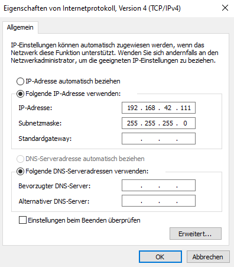
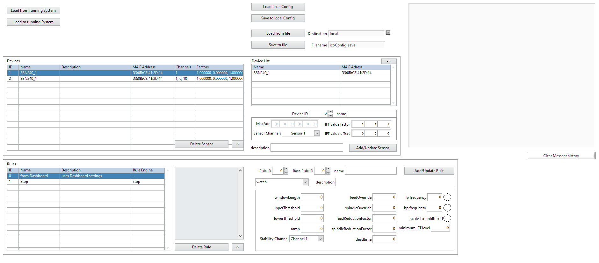
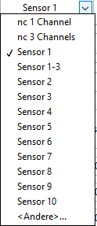
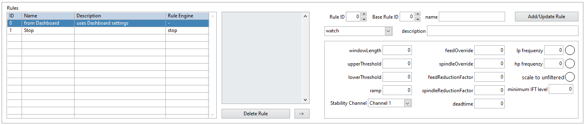
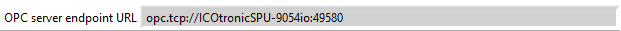
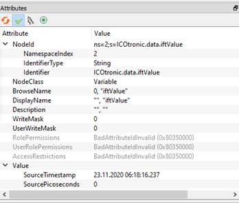

# (PART\*) [Deutsch] {-}

# Dashboard Benutzeranleitung {-}
Benutzeranleitung für das ICOtronic Dashboard.

# Version
Diese Benutzeranleitung wurde für die Dashboardversion v5.3.2.16 geschrieben. Für ältere Versionen den nachstehenden Link benutzen:

[ältere Version](https://github.com/MyTooliT/Dashboard/blob/07021f2d55188e47bdf2cb417bd4a4016ef03118/C-RIO_Dashboard_de.md)

# ICOtronic System Komponenten 				  			

Die nachfolgende Grafik verleiht einen Überblick über die Komponenten des ICOtronic System. Die Hauptbestandteile sind:

- Sensory Tool Holder (STH)
- Signal Processing Unit (SPU)
- Stationary Transceiver Unit (STU)

# Software- und Netzwerkeinstellungen des Computers 						  			

Es wird ein Computer mit Windows Betriebssystem (Windows 7 Servicepack 1; Windows 8.1 Update 1; Windows 10) und Administratorrechten benötigt. Auf diesem Computer muss "LabView Runtime“ installiert sein. 
Download Link:

http://www.ni.com/download/labview-run-time-engine-2018/7383/en/

ACHTUNG: Es muss die 2021 SP1 (32-bit) Version gewählt werden !!!

Für die Verbindung zum Dashboard muss das ICOtronicRemotePanel Programm verwendet werden.

Bevor der Computer mittels Ethernet Kabel mit der SPU verbunden wird, müssen die Netzwerkeinstellungen des Computers eingestellt werden. Dafür muss die IP-Adresse des Computers, welcher mit der SPU verbunden wird, folgendermaßen eingestellt werden.

Anschließend, sofern notwendig, sollte der Computer neu gestartet werden.

# Echtzeit-Dashboard 					  			

Öffnen Sie das "ICOtronicRemotePanel" um eine Verbindung zum Dashboard herzustellen. Nun sollte sich das folgende Fenster öffnen und nach der IP-Adresse des Dashboards fragen. Hier muss folgende IP-Adresse angegeben werden:
**192.168.1.115**

Durch drücken von "connect to SPU" sollte das Dashboard geöffnet werden.

Durch drücken des "Sync Time" Buttons kann die aktuelle PC Zeit als die aktuelle Systemzeit der SPU gesetzt werden.

Das Dashboard verfügt über 4 Reiter: **Stability**, **Breakout detection**, **Raw data view** und **System**. Oberhalb der Reiter befindet sich, egal welcher Reiter gewählt ist, eine Anzeige zum Verbindungsstatus des Systems und das ICOTronic-Logo.

Wenn das System mit einem sensorischen Werkzeughalter verbunden ist, ändert sich die Farbe der Verbindungsanzeige zu Blau. Wenn die Verbindung getrennt wird, ändert sich die Farbe wieder zu Weiß.

   <------->   

## System Reiter 		

Der System Reiter beinhaltet 4 Untermodule. Das Modul in der unteren rechten Ecke beinhaltet Informationen über die Signalqualität und die CPU Auslastung.

### Verbindung Untermodul

In der oberen linken Ecke befinden sich die Funktionen für die Halterverbindung. Oberhalb gibt es ein Dropdown-Menü, um den gewünschten Verbindungstyp auszuwählen. Mit dem "->" Button kann dieser aktiviert werden. Rechts neben dem "->" Button befindet sich der momentan aktive Verbindungstyp. Der ganz rechte Button "AutoConnect Aus/Ein" kann verwendet werden, um die Notwendigkeit zu aktivieren/deaktivieren, ein TRUE-Signal an den digitalen Verbindungspin zu senden, um sich im "Static DI" Modus zu verbinden. Wenn "AutoConnect Ein" eingestellt ist, verbindet sich das System mit einem Halter, ohne dass ein TRUE-Signal am Verbindungspin anliegt. **Achtung: Die Halter-ID-Pins müssen innerhalb eines Zeitrahmens von 10 ms gesetzt werden, beginnend mit dem ersten TRUE-Signal eines Halterpins!!!**
Die linke Liste enthält alle momentan definierten "Static DI" Sensor- und Regelkonfigurationen. Unter dieser Liste sieht man die momentan für die Digital IN ausgewählte ID.

Mit dem "Delete Connect ID" Button kann die momentan hervorgehobene ID gelöscht werden. In der rechten Liste sind alle STHs aufgeführt, die vom System gefunden wurden und bereit zum Verbinden sind. Sie können den Namen und die Bluetooth-Adresse der STHs sehen. Die "STOP"- und "CONNECT"-Buttons werden verwendet, um das System im "Dashboard"-Verbindungsmodus zu verbinden/trennen. Die grünen Radio-Buttons werden verwendet, um die gewählten Sensoren auszuwählen, wenn das System im "Dashboard"-Verbindungsmodus verwendet wird.

### Regel & Sensor Konfigurationen Modul

Auf der oberen rechten Seite befinden sich 2 Reiter. Diese sind "Rule Engine configs" und "Sensor configs". In diesen beiden Tabs können Sie die momentan geladenen Konfigurationen für "Static DI" im System sehen. Zusätzlich können Sie im Tab "Sensor configs" einen Halter durch Anklicken hervorheben und unten im Dropdown-Menü eine Regel auswählen sowie eine Verbindungs-ID festlegen, die Sie setzen möchten. Durch Drücken des Buttons "Load Sensor" können Sie die Sensor- und Regelkonfiguration in die Liste der geladenen Verbindungsoptionen oben links laden. Neben den beiden Tabs sehen Sie die OPC-Server-URL, die benötigt wird, wenn Sie das System über OPCUA verbinden oder steuern möchten.

### Logging & Settings Modul

Auf der unteren linken Seite finden Sie den Reiter "Logging". Dieser Tab wird zur Aufzeichnung eines Prozesses verwendet und zeigt den Status der digitalen Eingänge an. Wenn der Button "Record at connect" angeklickt wird, startet die Aufzeichnung, sobald eine Verbindung zu einem Halter hergestellt wird. Andernfalls kann die Aufzeichnung mit dem Button "Start Record" gestartet werden. Wenn das System aufzeichnet, wird dieser Button zu einem Button, um die Aufzeichnung zu stoppen. Die Statusanzeige "Storage mounted" leuchtet blau, wenn ein USB-Gerät angeschlossen ist. Darunter zeigt die Statusanzeige "Recording" rot an, wenn momentan eine Aufzeichnung gemacht wird. Darunter können Sie die Größe der aktuellen Aufzeichnung und den freien Speicherplatz des angeschlossenen USB-Geräts sehen.

**Achtung: Das System funktioniert nur mit USB-Geräten, die im FAT32-Format formatiert sind!!!**

Die rechte Statusanzeige zeigt an, ob der digitale Eingang für die Aufzeichnung von der Hardware gesetzt ist. (Der digitale Eingang für die Aufzeichnung kann verwendet werden, um Aufzeichnungen außerhalb des Dashboards zu starten und zu stoppen). Die drei ganz rechten Statusanzeigen zeigen an, ob der DI für die Aktivierung der momentan verwendeten Regel gesetzt ist, ob es der Regel erlaubt ist, Parameter zu ändern (was bedeutet, dass die Regel aktiv gesetzt ist), und die letzte zeigt an, ob das System momentan die Overrides aufgrund der definierten Regeln ändert.

Der Reiter "Settings" wird verwendet, um das System neu zu starten und die Systemzeit zu ändern. Unten sehen Sie den Button "Reboot System". Wenn dieser Button gedrückt wird, initialisiert die SPU einen Neustart des Systems. Der Button "Reboot STU" kann benutzt werden um einen Reset der angeschlossenen STU zu erwirken. Die "Average data OPC-SErver [ms]" Einstellung kann genutzt werden um die Datenrate bei aktiver OPCUA Verbindung einzustellen. Oben sehen Sie zwei Textfelder. Das obere dient zur Definition der neuen Systemzeit, und das untere zur Festlegung des Formats der Zeit, die im rechten oberen Bereich des Dashboards angezeigt wird. Der Button "Set Time" wird verwendet, um die im Textfeld angegebene Zeit als Systemzeit festzulegen. Der Button mit dem Kalender und der Uhr kann verwendet werden, um ein neues Fenster mit einem Kalender und einer Uhr zu öffnen und die Zeit einzustellen.

In diesem neuen Fenster können Sie den Button "Aktuelle Zeit verwenden" verwenden, um Datum und Uhrzeit auf die momentane Systemzeit einzustellen. Mit einem Druck auf den "OK"-Button wird die ausgewählte Zeit in das Textfeld übernommen.

### Verbindungsarten
Auf der linken Seite kann mittels Drop-Down Liste die gewünschte Verbindungsart ausgewählt werden. Auf der rechten Seite wird die momentane Verbindungsart angezeigt. Durch das Drücken des "->" Buttons kann die ausgewählte Verbindungsart auf die aktive Verbindungsart geschrieben werden.

Sie können wählen, welche Sensoren des ausgewählten Halters Sie verwenden wollen durch die Radiobuttons unter der Liste der gefundenen Halter. Eine Ausnahme ist der "Static / DI"-Modus. Ausgewählte Sensoren sind grün markiert. Beachten Sie, dass wenn Sie mehr als einen Sensor verwenden wenn der gewählte Halter nur einen Sensor hat, die anderen beiden Kanäle nutzlose Signale von nicht angeschlossenen PINs im Halter empfangen. Das System wird im 1-Kanal-Modus verbinden, wenn nur ein Sensor ausgewählt ist. Wenn mehr als ein Sensor ausgewählt ist, wird das System im 3-Kanal-Modus verbinden. Wenn Sie mehr als 3 Sensoren auswählen, wird das System nur die ersten 3 ausgewählten Sensoren verwenden. Die Kanäle werden immer so zugewiesen, dass der Sensor mit der niedrigsten Nummer Kanal 1 ist und der Sensor mit der höchsten Nummer Kanal 3.

Wenn der "1,8V Ref" Radiobutton aktiv ist, benutzt der verbundene Halter anstelle der internen Versorgung (3,3V), als Referenzspannung des ADCs, eine Spannung von 1,8V. Dies wird von manchen Sensoren wie zum Beispiel vom +-40g 3-Achsen Beschleunigungssensor benötigt.
**Achtung: Es kann immer nur 1 Referenz benutzt werden. Das bedeutet wenn mehrere Sensoren benutzt werden und diese unterschiedliche Spannungen als Referenz benutzen wird immer mindestens 1 Signal fehlerhaft sein!!!**

#### Dashboard / OPC UA

Um sich mit einem Halter zu verbinden, muss der gewünschte Halter aus der "Device list" gewählt werden und danach der "Connect“ Button gedrückt werden. Mit dem "Stop“ Button kann die Verbindung zum aktuell verbundenen Halter getrennt werden. Nach Trennen einer Verbindung benötigt das Dashboard einige Sekunden, bevor es wieder nach Haltern sucht und diese listen.

#### Static / DI

In diesem Verbindungsmodus können Sie die vordefinierte Verbindungsliste (zu sehen im "System"-Reiter) und die digitalen Eingänge des Systems verwenden, um die Verbindung und die Parameter des Systems zu steuern. (Wie man eine Regel- & Sensorkombination zur Verbindungsliste hinzufügt, siehe Kapitel "Rule & Sensor config Modul" im "System"-Reiter-Kapitel). Die ID der Verbindungsliste entspricht den digitalen Haltereingängen des Systems in einem Binärformat. (Beispiel: ID 3 repräsentiert einen Eingang von 00000011 an den 8 Eingabepins). Um eine Verbindung zu starten, müssen Sie den digitalen Eingang für die Verbindung auf "High" setzen. In diesem Moment wird das System eine Verbindung zu dem Element der Liste herstellen, das durch die digitalen Eingänge ausgewählt wurde. Der momentan gewählte Eingang ist unter der Verbindungsliste zu sehen.

Wenn der "AutoConnect Off/On"-Button auf "ON" gesetzt ist, wird das System eine Verbindung herstellen, ohne dass der Verbindungspin auf "High" gesetzt werden muss, sobald die ID-Pins auf TRUE gesetzt sind. (Achten Sie darauf, dass die Verbindungs-ID-Pins innerhalb von 10 ms gesetzt werden müssen.)

**Achtung: Ändern Sie niemals die vorgegebene ID, während das System mit einem Halter verbunden ist. Trennen Sie zuerst das System, ändern Sie dann die ID und starten Sie danach eine neue Verbindung!!!**

#### First available /DI

Bei dieser Verbindungsart verbindet sich das System automatisch mit dem erstbesten Halter der in die Reichweite des Systems kommt. 

## Database

Dieser Reiter wird verwendet, um die Konfiguration von Regeln und Sensoren zu laden und zu speichern. Er kann in vier Bereiche unterteilt werden. Der erste Bereich befindet sich oben und enthält die Systemsteuerungen. Der mittlere Bereich dient zur Konfiguration der Sensoren. Der unterste Bereich unten wird zur Konfiguration der Regeln verwendet. Der ganz rechte Bereich dieses Reiters ist der Nachrichtenbildschirm. Dort werden die letzten Aktionen angezeigt, die im "Database"-Reiter ausgeführt wurden. Mit einem Klick auf den Button "Clear Messagehistory" kann der Nachrichtenverlauf gelöscht werden.

### System-Modul

Die linken Buttons dienen dazu, die momentan erkannten Sensor- und Regel-Listen in das laufende System zu laden oder die momentan verwendeten Listen aus dem laufenden System zurück in die Listen unten zu laden. Die Listen können auch im lokalen Speicher des Systems oder auf einem USB-Stick gespeichert werden. Die Buttons "Load/Save to local Config" können verwendet werden, um eine Konfiguration auf dem lokalen System zu laden/zu speichern. Mit "Load/Save from/to file" wird nicht die lokale Konfigurationsdatei verwendet, sondern die Parameter auf der rechten Seite dieser beiden Buttons. Das Dropdown-Menü "Speicherort" kann verwendet werden, um zwischen lokalem System und USB zu wechseln. Das Textfeld "file" kann verwendet werden, um der Konfiguration einen Namen zu geben oder die zu ladende Datei zu benennen.

### Sensor-Modul

In diesem Modul können Sie die definierten Sensoren der Sensorliste anzeigen und ändern. Die Liste auf der linken Seite zeigt die definierten Sensoren. Sie können einen Sensor durch Anklicken hervorheben. Mit dem Button "Delete Sensor" können Sie den ausgewählten Sensor aus der Liste löschen. Wenn Sie den Button "Sensor ->" drücken, werden die Werte des ausgewählten Sensors aus der linken Liste in die Konfigurationsfelder auf der rechten Seite geladen. Die Liste auf der rechten Seite zeigt alle Halter, die momentan vom System in der Nähe erkannt wurden. Durch Klicken auf einen Halter wird dieser hervorgehoben. Wenn Sie den "->" Button drücken, werden die Werte des ausgewählten Halters in die Konfigurationsfelder unten geladen. In den Feldern unten finden Sie die Konfigurationen des Halters für die Sensorliste. Sie können die IFT-Wert-Offsets/Faktoren des Halters in den Feldern ganz rechts ändern. Die "Sensor ID" ist jene ID, die Sie der Halterkonfiguration in der Sensorliste zuweisen möchten. Wenn diese ID bereits definiert ist, wird sie beim Speichern überschrieben. Die "MacAdr" ist die MAC-Adresse des Halters und definiert, welcher Halter verbunden wird. Der "Name" ist ein frei wählbarer Name, der auf dem "Stability"-Reiter angezeigt wird, wenn der Sensor verbunden ist. Das Feld "Description" kann beispielsweise mit Informationen über diesen Sensor gefüllt werden. Das Drop-Down Menü "Channels" wird verwendet, um festzulegen, welche Kanäle der ausgewählte Halter in diesem Sensoreintrag verwendet. 

Hier gibt es bereits ein paar vordefinierte Auswahlen. Wenn eine andere Sensoreinstellung gewünscht ist kann diese mittels "<Andere ...>" eingetragen werden. Nun wird eine 16-bit binäre Eingabe für die Sensorauswahl benötigt. Alle "0" vor der ersten benötigten "1" können weggelassen werden. Sensor 1 ist hierbei das LSB bit. Wenn zum Beispiel Sensoren 1,5 und 10 gewählt werden sollen muss hierfür "1000010001" eingegeben werden. Das MSB definiert hierbei die Referenzspannung. Wenn an der MSB Stelle eine "1" eingetragen wird, dann wird die 1,8V Referenzspannung verwendet.
Mit dem Button "Add/Update Sensor" können die Parameter in die Sensorliste auf der linken Seite geschrieben werden.

### Regel-Modul

Dieses Modul enthält eine Liste aller definierten Regeln auf der linken Seite. Die Regel "0" ist immer vorhanden, kann nicht gelöscht werden und verwendet die aktuellen Parameter des Dashboards anstelle von vordefinierten Parametern. Das Feld "Parameters" zeigt eine Liste aller Parameter der ausgewählten Regel. Mit dem Button "Delete Rule" wird die hervorgehobene Regel gelöscht. Wenn Sie den Button "Rule ->" drücken, werden die Parameter der ausgewählten Regel in die Konfigurationsfelder auf der rechten Seite geladen. In den Feldern auf der rechten Seite können Sie eine "Rule ID" auswählen und ihr einen Namen geben. In den Feldern darunter können Sie die Parameter für den "Stability"-Reiter festlegen. Eine Beschreibung dieser Parameter finden Sie in diesem Handbuch im Kapitel "Stability Reiter". Zusätzlich können Sie hier eine "Base Rule ID" auswählen. Wenn Sie eine andere Regel als "0" wählen, werden alle Parameter, die wie folgt angegeben sind, die Parameter der gewählten "Base Rule" laden:

- mode: "from Baserule" option
- window length: 0
- upper/lower Threshold: <0
- ramp: 0
- stability Channel: "from Baserule" option
- minimum IFT level: <0
- deadtime: 0
- feed/spindle Override: >125
- feed/spindle Reduction Factor: >125
- low/high-pass filter: <0

Dies kann verwendet werden, wenn Sie denselben Parameter aus einem vordefinierten Satz verwenden möchten und nur diese Regel ändern müssen, um automatisch mehrere Regeln zu ändern. Im Feld "Description" kann der Regel eine Beschreibung gegeben werden. Mit dem Button "Add/Update Rule" kann die Konfiguration in die Liste geschrieben werden. Wenn eine Regel mit der gewählten "Rule ID" bereits existiert, wird sie mit den neuen Werten überschrieben.

## Replay Reiter

In diesem Reiter werden alle alte aufgezeichnete Dateien vom angeschlossenen USB-Gerät angezeigt. Außerdem ermöglicht er die Neuberechnung des IFT-Werts  für die gespeicherten Dateien.

Sie sehen eine Liste aller Aufzeichnungen, die auf dem verbundenen USB-Gerät gespeichert sind. Wählen Sie die gewünschte Aufzeichnung aus, markieren Sie sie durch Anklicken und drücken Sie anschließend den Button "Load File", um die Wiedergabe zu starten. Die ausgewählte Datei wird nun geladen.

Oben sehen Sie die Informationen zur ausgewählten Aufzeichnung (wie die Startzeit der Aufzeichnung, Dateiname, Gerätename usw.). Mit dem Button "Close File" können Sie die Aufzeichnung schließen und zur Liste der Aufzeichnungen zurückkehren. Auf der linken Seite werden die Parameter angezeigt, die aktiv waren, als die Aufzeichnung gemacht wurde.

Darunter befindet sich ein Feld, in dem Sie den "IFT value factor", "IFT value offset", den "Stability Channel" und die "WindowLength" ändern können. Wenn Sie diese Parameter ändern und den Button "Recalculate" drücken, berechnet das System einen neuen IFT-Wert für die gesamte Datei und zeigt diesen zusammen mit der ursprünglichen Aufzeichnung an.

Auf der rechten Seite befinden sich zwei Grafiken. Die obere zeigt die Zeitleiste. Die rote Linie kann per Drag & Drop verschoben werden und symbolisiert den Startpunkt des "Zooms" unten. Die untere Grafik zeigt den IFT-Wert vom gewählten Startpunkt bis 20 Sekunden danach. Nachdem Sie den Startpunkt geändert haben, müssen Sie den Button "Recalculate" drücken, um die Grafik für den ausgewählten Zeitraum neu zu laden.

## Stability Reiter 		

Im Stability Reiter des Dashboards können die Parameter der Regelung eingestellt, verschiedene Modi des Systems eingestellt und ein Graph der Echtzeitdaten eingesehen werden.

ACHTUNG: Die Reiter Stability und System sind nicht miteinander verbunden. Sollten Einstellungen für die Regelung vorgenommen und das System vom aktuellen Halter getrennt werden, behält das Dashboard seine Einstellungen auch beim Verbinden eines neuen Halters (nur im Modus "Dashboard Connection", im "Static DI" Modus werden die in den Regeln definierten Parameter übernommen). Die Einstellungen werden nur zurückgesetzt, wenn die SPU neu gestartet wird.

Oben wird eine Grafik angezeigt, die die Signalqualität darstellt. Dieser Prozentwert zeigt an, wie viele Datenpakete erfolgreich empfangen werden. Wenn die Verbindung schlecht ist und es zu Paketverlusten kommt, sinkt dieser Wert unter die 100%-Marke. Rechts neben der Grafik befinden sich fünf Felder. "STH Name" zeigt den Namen des verbundenen Halters an. "STH Rule" zeigt die Nummer und den Namen der gewählten Regel an. "MO Number", "NC Program Number" und "Part Number" werden in der Aufzeichnungsdatei gespeichert, falls sie ausgefüllt werden.

Links können Sie den aktiven Modus ändern (Für detaillierte Beschreibungen der Modi siehe Kapitel "Modi").

Unterhalb der Modusauswahl befinden sich die Parameter Einstellungen (für eine genauere Beschreibung der verschiedenen Parameter siehe das Kapitel “Parameter”).

Auf der rechten Seite sehen Sie die Live-Daten des Systems und können die angezeigte Zeitfensterlänge (in Sekunden) ändern. Sie können auch die Datenanzeige stoppen. Es gibt außerdem einen Indikator, der anzeigt, ob das System gerade aufzeichnet. Wenn das System aufzeichnet, wird der Indikator blau.

 <-------> 

Der neueste Datenpunkt befindet sich auf der rechten Seite des Schriebs, der Älteste auf der linken Seite. 

### IFT-Wert 				  			

Der IFT-Wert ist ein Systemparameter, mit dessen Hilfe erkannt werden kann, ob das System stabil oder instabil ist. Wenn der Modus einer der Regelungsmodi ist und der IFT-Wert über einen eingestellten Parameter hinaussteigt, stellt das System anhand eingegebener Parameter neue Werte für Vorschub und Drehzahl Overrides ein, um das System wieder stabil zu bekommen.

### Overrides 				  			

Der Override Graph zeigt die momentan angelegten Vorschub und Drehzahl Overrides des Systems.

### Kontrollindikatoren 			  			

Dieser Graph zeigt 2 Linien, Sens (Blau) und Active (Rot). Bei jenen Werten handelt es sich um digitale Signale. Bei einem Wert von 1 ist das Signal aktiv, bei einem Wert von 0 inaktiv. Der Sens Indikator gibt an, ob von der Maschine ein Signal ankommt (der M-Befehl ist gesetzt), um die Regelung des Systems einzuschalten und eine Regelung zu ermöglichen. Der Active Indikator gibt an, ob die IFT-Wert Schwelle überschritten ist und das System die Override Werte der Maschine anpasst. Der Active Indikator kann nur 1 werden wenn auch der Sens Indikator 1 ist.

### Controls for the rule

Am unteren Bildschirmrand befinden sich zwei Buttons. Der "Update"-Button lädt die Parameter von der linken Seite in die laufenden Werte auf der rechten Seite. Der "Rule Reset"-Button kann im "Stop"-Modus verwendet werden, um die Overrides wieder auf 0 % Reduktion zurückzusetzen.

### Stabilitäts-Parameter 					  			

Je nachdem, welcher Modus gerade aktiv geschalten ist, können unterschiedliche Parameter eingestellt werden. Um die neuen Werte der Parameter zu übernehmen muss der "update“ Button gedrückt werden, welcher sich unterhalb der Parameter befindet. Die einzige Ausnahme ist die "Window length“ Einstellung, welche im "watch“ Modus auch ohne Update in Echtzeit verändert werden kann.

#### Window length 			  			

{ms} Zeitfenster

Dieser Parameter gibt an, welches Zeitfenster für die Berechnung des IFT-Wertes benutzt wird. Wenn ein großes Zeitfenster gewählt wird, so reagiert das System träger auf Änderungen des Signals. Zum Beispiel wirkt sich ein einmaliger Impuls weniger auf die IFT-Wert Berechnung aus, wenn das Zeitfenster groß gewählt wird. Im "watch“ Modus kann dieser Parameter in Echtzeit verändert werden. In allen anderen Modi muss der "update“ Button geklickt werden, um Änderungen zu übernehmen.

#### Minimum IFT Level

{-} IFT Wert Niveau

Dieser Parameter legt den minimal verwendeten Wert für die Regel fest. Alle Werte unterhalb dieses Schwellenwerts werden ignoriert. Dies ist beispielsweise notwendig, wenn Sie die Filteroptionen verwenden und diese auf die ungefilterten Werte skalieren. Wenn das Werkzeug sich schnell innerhalb der Maschine bewegt, könnten hochfrequente Signalanteile auftreten, die das System stören. Mit diesem Parameter können Sie verhindern, dass das System reagiert, während es sich nur um Bewegungen handelt, ohne dass relevante Messwerte erfasst werden.

#### Stability_Channel

{-} channels

Mit diesem Drop-Down Menü kann der Kanal gewechselt werden, mit welchem der IFT-Wert berechnet wird, sollte das System mit einem 3 Kanal fähigen Halter verbunden sein. Es kann ein einzelner Kanal gewählt werden oder mehrere Kanäle gleichzeitig. Wenn ein Halter mit 1 Kanal verbunden wurde wird dieses Menü vom System ignoriert und die IFT-Wert Berechnung erfolgt mit dem einen zur Verfügung stehenden Kanal.

#### Upper threshold 		

{-} obere Schwelle

Sollte der IFT-Wert die obere Schwelle überschreiten, so werden die zuvor eingestellten Overrides von der SPU angewandt. Je größer diese Schwelle gewählt wird, umso instabiler darf das System werden, bevor die Regelung eingreift.

#### Lower threshold 		 			

{-} untere Schwelle

Sollte der IFT-Wert die untere Schwelle unterschreiten, so regelt die SPU wieder auf 100% Vorschub und Drehzahl zurück. Dies geschieht in Folge der eingestellten Rampe. Je kleiner diese Schwelle gewählt wird, umso stabiler muss das System werden, bevor die Overrides zurückgesetzt werden.

#### Ramp 			  			

{%/ms} Rampe

Dieser Parameter bestimmt die Geschwindigkeit, mit der die Overrides zurückgesetzt werden. Die Overrides werden nicht sprunghaft zurückgesetzt, sondern verlaufen entlang einer Rampe zurück auf 100%. Je größer dieser Wert, umso steiler ist die Rampe und umso schneller setzt das System Vorschub und Drehzahl zurück auf 100%.

Beispiel:
Ein Wert von 0.01%/ms würde einer Erhöhung von Drehzahl und Vorschub um 10% innerhalb von 1 Sekunde.

#### Feed override 					

{0-100%} Vorschub Soll-Wert

Dieser Parameter wird in den Modi "Stop", "Stability reduction”, "Stability 2 Level“ und "Direct output“ verwendet. In den Modi "Stop", "Stability 2 Level" und "Direct output" bestimmt dieser Wert den Override, welcher vom System angewendet wird, sollte das ICOTronic System die Regelung des Vorschubes aktivieren.
Im Modus "Stability reduction" bestimmt dieser Wert den minimalen Wert den der Override des Vorschubs annehmen darf. Der Override kann nicht unter diesen Wert fallen.

#### Spindle override 		  			

{0-100%} Drehzahl Soll-Wert

Dieser Parameter wird in den Modi "Stop", "Stability reduction”, "Stability 2 Level“ und "Direct output“ verwendet. Dieser Wert bestimmt den Override, welcher vom System angewendet wird, sollte das ICOTronic System die Regelung der Drehzahl aktivieren.
Im Modus "Stability reduction" bestimmt dieser Wert den minimalen Wert den der Override der Drehzahl annehmen darf. Der Override kann nicht unter diesen Wert fallen.

#### Feed reduction factor 		  			

{0-100%} Vorschub Reduzierungsfaktor

Dieser Parameter wird im "Stability reduction“ Modus verwendet. Dieser Wert beeinflusst die Schrittgröße, in welcher der Vorschub Override gesetzt wird.

Beispiel:
Ein Wert von 5% als "Feed reduction factor“ erzeugt eine Senkung des Vorschub Overrides um 5% bei jedem Berechnungsfenster, solange der IFT-Wert > Obere Schwelle ist.

Reduzierungsschritt 1: Reduktion von 100% auf 95%
Reduzierungsschritt 2: Reduktion von 95% auf 90%
… und so weiter.

#### Spindle reduction factor 			

{0-100%} Drehzahl Reduzierungsfaktor

Dieser Parameter wird im "Stability reduction“ Modus verwendet. Dieser Wert beeinflusst die Schrittgröße, in welcher der Drehzahl Override gesetzt wird.

Beispiel:
Ein Wert von 5% als "Spindle reduction factor“ erzeugt eine Senkung des Drehzahl Overrides um 5% bei jedem Berechnungsfenster, solange der IFT-Wert > Obere Schwelle ist.

Reduzierungsschritt 1: Reduktion von 100% auf 95%
Reduzierungsschritt 2: Reduktion von 95% auf 90%
… und so weiter. 

#### Deadtime 			  			

{ms} Totzeit

Dieser Parameter wird nur im "Stability reduction“ Modus verwendet. Dieser Wert entspricht jener Zeit, die das System abwartet, bevor es erneut überprüft, ob eine Reduktion der Overrides erforderlich ist. Je kleiner dieser Wert, umso schneller reduziert das System den Vorschub und die Drehzahl. Als Referenzwert für erste Versuche kann eine Totzeit von 300ms gewählt werden. Dies bedeutet, dass alle 300ms der Vorschub und die Drehzahl reduziert werden, solange sich der IFT-Wert oberhalb der oberen Schwelle befindet.

Beispiele:

In den nachfolgenden Grafiken sind 2 verschiedene Totzeiten eingestellt, mit der kürzeren Totzeit in der ersten Grafik. Es ist zu bemerken, dass die minimalen Overrides bei kürzerer Totzeit schneller erreicht werden.

Für beide Grafiken wurden dieselben Reduzierungsfaktoren und minimalen Overrides verwendet:

Feed reduction factor: 8%; Feed override min: 10%; Spindle reduction factor: 5%; Spindle override min: 20%

Deadtime: 100ms

Deadtime: 300ms

#### Low-Pass-Filter

{Hz} Grenzfrequenz  
{-} aktiv/inaktiv

Dieser Parameter dient zur Einstellung der Grenzfrequenz des Tiefpassfilters bei der Berechnung der IFT-Werte. Das Textfeld wird verwendet, um die Grenzfrequenz anzugeben, und der Kreis ist ein Button, um den Tiefpassfilter zu aktivieren. Der Button leuchtet blau, wenn der Filter aktiv ist.

#### High-Pass-Filter

{Hz} Grenzfrequenz  
{-} aktiv/inaktiv

Dieser Parameter dient zur Einstellung der Grenzfrequenz des Hochpassfilters bei der Berechnung der IFT-Werte. Das Textfeld wird verwendet, um die Grenzfrequenz anzugeben, und der Kreis ist ein Button, um den Hochpassfilter zu aktivieren. Der Button leuchtet blau, wenn der Filter aktiv ist.

#### Auf ungefiltert skalieren

{-} aktiv/inaktiv

Dieser kreisförmige Button leuchtet blau, wenn die Funktion aktiviert ist. Das gefilterte Signal (mit Hoch- und Tiefpassfilter) wird im Verhältnis zum ungefilterten Signal gesetzt, wenn diese Funktion aktiviert ist. Ist die Funktion aktiv, kann der IFT-Wert maximal "1" betragen. **Wenn sowohl der Tiefpass- als auch der Hochpassfilter deaktiviert sind, beträgt der Signalwert immer "1".**

#### IFT value factor 				

{-} IFT-Wert Faktor

Dies ist ein multiplikativer Faktor für den IFT-Wert in der korrespondierenden Grafik und dem analogen Port 0 auf der SPU (NI 9263). Mit diesem Faktor kann das Signal auf einen gewünschten Wert eingestellt werden. Die Werte für die verschiedenen Kanäle können einzeln eingestellt werden.

#### IFT value offset 			  			

{-} IFT-Wert Offset

Dies ist ein additiver Faktor für den IFT-Wert in der korrespondierenden Grafik und dem analogen Port 0 auf der SPU (NI 9263). Mit diesem Faktor kann das Signal auf einen gewünschten Wert eingestellt werden. Die Werte für die verschiedenen Kanäle können einzeln eingestellt werden.

### Modi 		

Die verschiedenen Modi sind folgende:

#### WATCH 			  			

In diesem Modus sind STU und STH miteinander verbunden. Des Weiteren wird der IFT-Wert in diesem Modus berechnet, damit das generierte Signal eines Schnittes eingesehen werden kann. Dieser Modus ist aber kein Regelmodus und greift somit auch nicht in den Maschinenprozess ein. Daher ist dieser Modus dafür geeignet, die Verbindung zwischen STH und STU zu testen. In diesem Modus können der "IFT value factor“ und der "IFT value offset“ verändert werden. Dies ist der einzige Modus, in dem die "Window length“ geändert werden kann, ohne den "Update“ Button klicken zu müssen.

#### STABILITY 2 LEVEL 			  			

Dies ist einer der 2 Modi, welche zur Regelung des Maschinenprozesses genutzt werdern können. Die in diesem Modus benutzten Parameter sind “Upper threshold”, “Lower threshold”, “Ramp”, “Feed override” und “Spindle override”. Sollte der IFT-Wert in diesem Modus die "Upper threshold“ überschreiten, so werden die Overrides direkt auf die zuvor im Dashboard eingestellten Werte von "Feed override“ und "Spindle override“ gesetzt. Sobald der IFT-Wert wieder unterhalb des "Lower threshold“ fällt, beginnt das System den Vorschub und die Drehzahl entlang einer Rampe wieder auf 100% zu erhöhen. Die Geschwindigkeit, mit der das System wieder auf 100% fährt, ist durch die Steilheit der Rampe gegeben. Diese ist über den Parameter "Ramp“ definiert.

#### STABILITY REDUCTION 					

Dies ist einer der 2 Modi, welche zur Regelung des Maschinenprozesses genutzt werdern können. Die in diesem Modus benutzten Parameter sind “Upper threshold”, “Lower threshold”, “Ramp”, “Feed override min”, "Feed reduction factor“, “Spindle override min”, "Spindle reduction factor“ und "Deadtime“. Sollte der IFT-Wert in diesem Modus die "Upper threshold“ überschreiten, so reduziert das System den Vorschub und die Drehzahl entsprechend der beiden Reduzierungsfaktoren. Nach einem Reduzierungsschritt wartet das System die "Deadtime“ ab und überprüft erneut, ob der IFT-Wert weiterhin oberhalb des "Upper threshold“ liegt. Sollte er unterhalb liegen, so behält das System die aktuellen Werte bei. Sollte der IFT-Wert weiterhin oberhalb des "Upper threshold“ liegen, so werden der Vorschub und die Drehzahl wieder um einen Reduzierungsschritt gesenkt. Sollte durch die Reduzierung einer der beiden Minimalwerte erreicht werden, so wird der Vorschub beziehungsweise die Drehzahl nicht mehr reduziert. Sobald der IFT-Wert wieder unterhalb des "Lower threshold“ fällt, beginnt das System den Vorschub und die Drehzahl entlang einer Rampe wieder auf 100% zu erhöhen. Die Geschwindigkeit, mit der das System wieder auf 100% fährt, ist durch die Steilheit der Rampe gegeben. Diese ist über den Parameter "Ramp“ definiert.

#### DIRECT OUTPUT 				

Dieser Modus wird vorrangig bei der Installation des Systems benutzt. Neben dem "IFT value factor“ und dem "IFT value offset“ können in diesem Modus "Feed override“ und "Spindle override“ eingestellt werden. Die für den Vorschub und die Drehzahl eingestellten Overridewerte werden in diesem Modus unabhängig vom aktuellen IFT-Wert direkt an die Maschine weitergegeben. Dadurch können definierte Overridewerte an die Maschine gesendet werden, ohne aktive Sensorik oder ein Aktivierungssignal der Maschine (M-Befehl). Dieser Modus sollte dafür verwendet werden, um zu überprüfen, ob die Verbindung zwischen der SPU und der Maschine ordnungsgemäß funktioniert.

#### STOP

Dieser Modus ist nahezu ident zu "stability 2 level". Der einzige Unterschied besteht darin, dass dieser Modus keinen "lower threshold" benutzt. Wenn das System die Overrides verändert, bleiben diese Overrides aktiv bis entweder der digitale Eingang für die Regelung auf "0" zurück gesetzt wird oder der "Reset Regler" Button gedrückt wird.

## Anwendungsbeispiel 			  			

Öffnen Sie den Internet Explorer und verbinden Sie sich mit dem Dashboard. Wenn die Seite fertig geladen ist, wechseln Sie zu dem "System“ Reiter und waren Sie darauf, dass der Halter welcher gerade in der Maschine eingespannt ist, in der Liste aufscheint. Drücken Sie nun den "Connect“ Button und wechseln Sie zu dem "Stability“ Reiter. Die LED des Halters sollte nun anfangen zu blinken und die LEDs in den Ecken der STU sollten von grünem Blinken auf grünes Dauerleuchten wechseln. Nach einigen Sekunden sollte der IFT-Werte Graph Werte anzeigen, die ungleich 0 sind. Wechseln Sie den Modus auf "Watch“ und stellen Sie für einen ersten Test die "Window length“ auf etwa 70ms ein. Ändern Sie die "Graph History“ auf einen gewünschten Wert (am besten stellen Sie eine Zeit ein, welche etwas länger ist als der zu testende Schnittprozess). Nun fahren Sie einen Schnittprozess mit ausgeschalteter Regelung des Systems und betrachten Sie den IFT-Wert. Für eine bessere Begutachtung des Signals ist es zu empfehlen, nach Abschluss des Prozesses den "pause graph“ Button zu drücken und das Signal zu stoppen. Zur Erinnerung: Die Sekundenangabe unterhalb des Graphen zeigt an, wie viel Zeit seit diesem Datenpunkt verstrichen ist. Die nachfolgende Abbildung zeigt ein Beispiel eines Schnittprozesses im Watch Modus.

Nun ändern Sie den Modus auf einen der beiden Regelmodi und stellen sie die Parameter von "Upper threshold“ und "Lower threshold“ auf plausible Werte für eine adaptive Regelung. Wiederholen Sie nun den Schnittprozess mit eingeschalteter Regelung des Systems.

Sollten die Parameter noch nicht optimal eingestellt sein, so passen Sie diese nun entsprechend an und wiederholen Sie den Schnittprozess.

Die benötigte Zeit, um die Einstellungen für einen gegebenen Schnittprozess optimal einzustellen, kann variieren. Die benötigte Zeit ist abhängig von der Intensität des Ratterns, der Schnittdauer, der Erfahrung des Dashboard Bedieners bezüglich der Einstellungen und der Erfahrung des Maschinenbedieners. Dieser Optimierungsprozess kann durchaus länger als eine Stunde dauern.

# Nutzen des OPCUA-Server der SPU

## Verbinden mit dem OPCUA-Server

Um den OPCUA-Server nutzen zu können wird als erstes ein OPCUA-Client benötigt. Hierzu muss einer auf dem Computer installiert werden. Wir empfehlen UaExpert und haben auch alle Bilder dieser Anleitung mit UaExpert erstellt. Der Client(UaExpert v1.5.1) kann unter nachstehendem Link gedownloadet werden. Zu beachten ist das ein User-Account benötigt wird.
Download link: https://www.unified-automation.com/downloads/opc-ua-clients.html  
Nach erfolgreicher Installation muss der Client gestartet werden indem das Programm geöffnet wird.Wenn das Programm geöffnet ist muss man im Menü auf "Server“ und "Add…“ gehen um den SPU-OPCUA-Server zu suchen und sich mit diesem verbinden zu können.

 
 
Hier nun im Menüpunkt "Custom Discovery“ auf den Unterpunkt "< Double click to Add Server… >“ doppelklicken und in dem Fenster welches sich nun öffnet die Adresse eingeben, welche im Dashboard der SPU abgelesen werden kann:

Nun sollte der Server gefunden werden und ein paar Unterpunkte aufklappen, wenn dieser ausgewählt wird. Wenn dies der Fall ist auf "OK“ drücken.

Nun sollte der Server auf der linken Seite im Menüreiter aufscheinen. Diesen nun mit einem Rechtsklick auswählen und auf "Connect“ drücken.

## Variablen anzeigen lassen

Nun sollte im unteren linken Reiter mehrere Variablem des Servers aufgelistet sein.

Die Variablen können in 3 Gruppen unterteilt werden: "command", "data" und "param".
In "command" befinden sich bool variablen. Wenn diese auf "true" gesetzt werden führen sie das entsprechende Kommando aus. Zum Beispiel trennt "disconnectHolder" die Verbindung zum aktuell verbundenen Halter.
In "data" befinden sich die Daten die vom System berechnet/gemessen werden. Zum Beispiel kann in "iftValue" der momentane IFT-Wert ausgelesen werden.
Die Kategorie "param" kann wiederum in 2 Kategorien aufgeteilt werden. In "active" befinden sich die aktuellen eingestellten Parameter der Regelung. In "set" befinden sich Variablen die genutzt werden können um die Parameter zu verändern. 

Nun kann durch Auswahl eines dieser Elemente (Doppelklick), dieses Element im oberen rechten Reiter geöffnet werden.

In diesem Reiter können nun die Parameter des jeweiligen Elementes ausgelesen werden wie zum Beispiel der aktuelle Wert, der Variablen Identifier oder der Zeitstempel des letzten gemessenen Datenwertes. Unter "Value“ befindet sich auch der aktuelle Wert, dieses Elementes, der zuletzt eingelesen wurde.
Um einen Parameter dauerhaft in dem großen mittleren Reiter anzuzeigen kann dieser links unten ausgewählt und dann per Drag&Drop in das große Fenster gezogen werden.
Alternativ kann dieser Reiter rechtsgeklickt werden. Im folgenden Menü nun auf "Add custom node…“ klicken.

Danach muss der Variablenname des Elementes angegeben werden. Jedes Element des OPCUA-Servers ist über seinen Identifier definiert und auslesebar. Dieser kann wenn das Element vorher ausgewählt wurde im rechten oberen Reiter bei den Element Parametern ausgelesen werden. Die benötigten Daten befinden sich unter dem Menüpunkt "NodeId“.

Danach auf "OK“ drücken. Nun sollte das gewählte Element in der Mitte angezeigt werden. Es ist auch möglich mehrere Variablen in diesem Reiter zeitgleich anzuzeigen indem diese Schritte wiederholt werden.

## Ändern von Variablen

Um eine Variable zu verändern, z.B. die "windowLength" muss die dazugehörige Variable aus "param" und "set" gewählt werden. Nun kann man den "Value" verändern. Wenn der dazugehörige "active" Parameter auch angezeigt wird kann gesehen werden, dass der Wert noch nicht verändert wurde. 

Die Änderungen werden erst übernommen wenn aus "command" das Kommando "setStabilityParam" ein "true" bekommt. Anschließend kann beobachtet werden das der "active" Parameter sich nun verändert hat.
Zu beachten ist, dass das "setStabilityParam" Kommando alle gesetzten Parameter in die aktiven Parameter schreibt.

## Aufnahmen von Variablen erstellen

In UaExpert können Variablen auch aufgenommen und in ".csv" Files abgespeichert werden. Hierfür muss unter "Documents -> Add Document" der Typ "Data Logger View" ausgewählt werden.

Nun sollte sich der "Data Logger View" öffnen.

Hier können genau wie zuvor beim "Data Access View" die Variablen in das Fenster geladen werden. Rechts befinden sich diverse Einstellungen um die Abtastung anzupassen.

Unterhalb befinden sich die Einstellungen für die Ausgabe. Hier können der Dateipfad, die maximalen Zeilen die geschrieben werden eingestellt werden und wie viele Files in die Vergangenheit behalten werden sollen.

**ACHTUNG:** Wenn eine neue Aufnahme gestartet werden dann werden alle alten Aufnahmen im Namen mit einer Zahl am Ende inkrementiert. Daher sollte sehr aufgepasst werden beim Aufnehmen, damit die Daten im Nachhinein noch zuordenbar sind zu den Versuchen.

Direkt darunter befinden sich der "Start" und "Stop" Button und eine Anzeige darüber wie viele Daten aktuell geschrieben worden sind.

