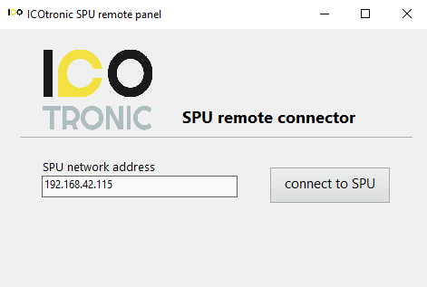
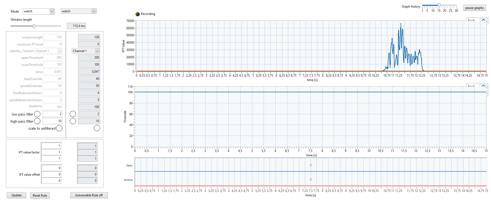
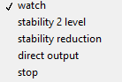
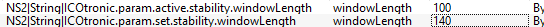

# (PART\*) Dashboard Benutzeranleitung [Deutsch] {-}

Benutzeranleitung für ICOcrt Dashboard

# Version
Diese Benutzeranleitung wurde für die Dashboardversion v4.0.1.4 geschrieben. Für ältere Versionen den nachstehenden Link benutzen:
https://github.com/MyTooliT/Dashboard/blob/older_than_4_0_1_4/C-RIO%20Dashboard%20de.md

## ICOtronic System Komponenten 				  			

Die nachfolgende Grafik verleiht einen Überblick über die Komponenten des ICOtronic System. Die Hauptbestandteile sind:

- Sensory Tool Holder (STH)
- Signal Processing Unit (SPU)
- Stationary Transceiver Unit (STU)
- Charging Cradle (CC)

## Software- und Netzwerkeinstellungen des Computers 						  			

Es wird ein Computer mit Windows Betriebssystem (Windows 7  Servicepack 1; Windows 8.1 Update 1; Windows 10) und  Administratorrechten benötigt. Auf diesem Computer muss "LabView  Runtime“ installiert sein. 
Download Link:

http://www.ni.com/download/labview-run-time-engine-2018/7383/en/

ACHTUNG: Es muss die 2020 SP1 (32-bit) Version gewählt werden !!!

Nicht jeder Browser unterstützt dieses Plugin. Microsoft Edge funktioniert, solange die Dashboard Seite im "Internet Explorer Modus" geöffnet wird.
Alternativ kann auch das ICOtronicRemotePanel Programm verwendet werden.

Bevor der Computer mittels Ethernet Kabel mit der SPU verbunden wird, müssen die Netzwerkeinstellungen des Computers eingestellt werden.  Dafür muss die IP-Adresse des Computers, welcher mit der SPU verbunden  wird, folgendermaßen eingestellt werden.

Anschließend, sofern notwendig, sollte der Computer neu gestartet werden.

## Echtzeit-Dashboard 					  			

Öffnen Sie den Microsoft Edge und geben sie folgende Adresse ein:
http://192.168.1.115:8000/ICOtronicSPU.html
Sollte sich das Dashboard nicht öffnen überprüfen sie ob die Seite im "Internet Explorer Modus" geöffnet wurde.
Nun sollte sich das Echtzeit Dashboard auf Ihrem Computer öffnen.

Wenn das "ICOtronicRemotePanel" verwendet wird, öffnen sie das Programm. Nun sollte sich das folgende Fenster öffnen und nach der IP-Adresse des Dashboards fragen. Hier muss folgende IP-Adresse angegeben werden:
**192.168.1.115**

Durch drücken von "connect to SPU" sollte das Dashboard geöffnet werden.

Das Dashboard verfügt über 4 Reiter: **Stability**, **Breakout detection**, **Raw data view** und **System**. Oberhalb der Reiter befindet sich, egal welcher Reiter gewählt ist, eine Anzeige zum Verbindungsstatus des Systems, ein Feld in dem der name und die MAC-Adresse des momentan verbundenen Werkzeughalters angezeigt wird und das ICOTronic-Logo.

Wenn das System mit einem sensorischen Werkzeughalter verbunden ist,  ändert sich die Farbe der Verbindungsanzeige zu Blau. Wenn die  Verbindung getrennt wird, ändert sich die Farbe wieder zu Weiß.

   <------->   

Wenn kein Werkzeughalter verbunden ist sind die Felder für Rufname und MAC-Adresse leer. Bei Verbindung mit einem Werkzeughalter wird der Rufname und die MAC-Adresse angezeigt bis die Verbindung zum Werkzeughalter wieder getrennt wird.

   <------->   

### System Reiter 		

Im Untermenü "Holder connection" des System Reiters befindet sich eine Liste aller sensorischen Werkzeughalter, die in der Umgebung des Systems gefunden wurden, mit denen sich das System verbinden kann. Zu sehen sind der Name und die Bluetooth Adresse dieser STHs. Es gibt 3 Möglichkeiten einen Halter mit dem System zu verbinden. Die benutzte Methode kann im Untermenü "Connection type" mittels Drop-Down Auswahl gewählt werden und mittels des "->" Buttons aktiviert werden. Auf der rechten Seite befinden sich ein paar Graphen mit System Informationen. Unten links befindet sich ein Untermenü mit 2 Reitern welche benutzt werden um vordefinierte Regelparameter und Sensoreinstellungen zu benutzen. Unten rechts befindet sich ein Untermenü mit mehreren Reitern für spezielle Anwendungen.

#### Logging

Dieser Reiter kann benutzt werden um einen Prozess aufzuzeichnen. Wenn Record at connect" Button markiert ist startet die Aufnahme in dem Moment wenn sich das System mit einem Halter verbindet. Wenn nicht kann die Aufnahme durch Drücken des "Start Recording" Buttons gestartet werden. Dieser Button wird während einer Aufnahme zu einem "Stop Recording" Button mit dem die Aufnahme beendet werden kann. Der Identifikator darunter leuchtet grün wenn ein Speichergerät wie z.B. ein USB-Stick verbunden ist. Die beiden Anzeigen am darunter zeigen an, wie Groß die aktuelle Aufnahme Datei ist und wie viel freier Speicher auf dem angeschlossenen Speichermedium zur Verfügung steht.

**Achtung: Es können nur USB-Sticks mit FAT32 Formatierung verwendet werden!!!**

Die 2 Identifikatoren unterhalb zeigen an ob mittels digitalem Eingang der Hardware momentan eine Datenaufnahme beziehungsweise ein Eingriff der Regelung erwünscht ist. (Der digitale Eingriff für das Recording kann genutzt werden um außerhalb des Dashboards eine Aufnahme zu starten und zu stoppen). 
Die drei Indikatoren ganz unten zeigen an ob momentan Aufgenommen wird, die Regelung momentan eingeschalten ist und ob die Regelung momentan einen Eingriff vornimmt. 

#### FOCAS

**Achtung: Diese Art der Verbindung ist nur auf spezifischen Maschinen möglich!**

Dieser Reiter kann benutzt werden um das System mittels der FOCAS Schnittstelle zu steuern. Für diese Art der Kontrolle muss dem System die NC-Startzeile und die NC-Endzeile des zu regelnden Prozesses gegeben werden. Um die Kontrolle über FOCAS einzuschalten muss diese nach Eingabe der NC-Zeilen mittels eines Drucks des "FOCAS Start" Buttons aktiviert werden. Um die Kontrolle über FOCAS wieder zu deaktivieren muss der "FOCAS Stop" Button gedrückt werden welcher den "FOCAS Start" bei aktiver Kontrolle ersetzt.

#### CAN Monitor

Dieser Reiter zeigt Informationen über die empfangenen CAN-Nachrichten des Systems an. Mit dem Button "Reboot System" kann ein Software seitiger Reset der SPU ausgelöst werden.

#### Verbindungsarten
Auf der linken Seite kann mittels Drop-Down Liste die gewünschte Verbindungsart ausgewählt werden. Auf der rechten Seite wird die momentane Verbindungsart angezeigt. Durch das Drücken des "->" Buttons kann die ausgewählte Verbindungsart auf die aktive Verbindungsart geschrieben werden.

Mittels der Radiobuttons unterhalb der Liste von gefundenen Haltern kann zwischen 1 und 3 Kanälen umgestellt werden, mit der Ausnahme von "Static / DI" Verbindung bei welcher diese Auswahl an einer anderen Stelle getroffen wird. Zu beachten ist, dass wenn 3 Kanäle ausgewählt werden obwohl der verbundene Halter nur 1 Kanal besitz die beiden anderen Kanäle unbrauchbare Daten liefern, da die zwei PINs in solchen Haltern nicht verbunden sind. Links neben den Radiobuttons kann abgelesen werden ob momentan durch die digitalen Eingänge eine Verbindungsanfrage besteht und wenn ja welche Halter ID gesetzt wurde.

##### Dashboard / OPC UA

Um sich mit  einem Halter zu verbinden, muss der gewünschte Halter aus der "Device list" gewählt werden und danach der "Connect“ Button gedrückt werden. Mit dem "Stop“ Button kann die Verbindung zum aktuell verbundenen Halter getrennt werden. Nach Trennen einer Verbindung benötigt das Dashboard einige Sekunden, bevor es wieder nach Haltern sucht und diese listen.

##### Static / DI

Bei dieser Verbindungsart kann eine statische MAC-Adresse angegeben werden. Jeder sensorische Halter besitzt eine eindeutig, einmalige MAC-Adresse. Die MAC-Adresse eines Halters kann rechts in der Halterliste eingesehen werden. Wenn diese Verbindungsart gewählt ist und der Halter mit der eingestellten MAC-Adresse in Reichweite des Systems kommt, während das digitale Eingangssignal für diesen Halter auf "1" gesetzt ist, verbindet sich dieses automatisch mit dem Halter. 
Bis zu 3 verschiedene Halter können mittels der digitalen Eingänge gewählt werden. Die Felder für die Einstellungen der statischen Verbindung befinden sich unterhalb der Auswahl der Verbindungsarten.

Es existieren 3 Reiter mit denen jeweils 1 Halter, für die statische Verbindung, konfiguriert werden kann. Die oberen Felder können genutzt werden um die Parameter zu ändern. Die unteren (mit grauem Hintergrund) zeigen die momentan aktiven Parameter an. Um die in den oberen Feldern eingetragenen Parameter aktiv zu schalten muss der "Update" Button oben rechts gedrückt werden.
Das Feld "MacAdr" ist die MAC-Adresse des gewählten Halters. Die Adresse kann z.B. aus der rechten Spalte der Halterliste ausgelesen werden. Mittels "Channels" kann eingestellt werden wie viele Kanäle der zu verbindende Halter besitzt. Wenn etwas anderes als "1" eingegeben wird dann wendet das System alles an als ob 3 Kanäle verfügbar sind. Mit einer "1" verbindet sich die SPU mit dem Halter mit nur 1 Kanal. Das "Rule config ID" Feld kann benutzt werden um im vorhinein definierte Regelparameter für diesen Halter auszuwählen. Die Regeleinstellung "0" wird hierbei verwendet um die momentan eingestellten Parameter im "Stability" Reiter zu benutzen. Mittels "IFT value factor" und "IFT value offset" können die berechneten IFT Werte mittels eines Faktors und eines Offset angepasst werden.

##### First available /DI

Bei dieser Verbindungsart verbindet sich das System automatisch mit dem erstbesten Halter der in die Reichweite des Systems kommt. 

#### Konfigurationen für Werkzeug und Prozesse

Im "System" Reiter befinden sich 2 weitere Reiter, "Rule Engine configs" und "Sensor configs", mit denen im vorhinein erstellte Regel- und Sensoreinstellungen geladen werden können. Mit einem Druck auf den "Load Rule" Button können die ausgewählten Einstellungen übernommen werden. Mittels dieser Funktion können zuvor getätigte Einstellungen durch den Druck eines Buttons direkt geladen werden. Dies hat den Vorteil das nicht alle Einstellungen immer durch Hand getätigt werden müssen und man für unterschiedliche Halter und unterschiedliche Prozesse unterschiedliche Einstellungen leicht verwenden kann.

**<u>In Entwicklung</u>**
Die Regel- und Sensoreinstellungen können mittels folgendem Link eingestellt werden:
http://192.168.1.115:8000/MainConfig.html
Diese Konfigurationsseite funktioniert, aber das Design und die Bedienfreundlichkeit sind noch **<u>in Entwicklung!</u>**

#### OPC-UA Server Adresse

Rechts neben den Regel- und Sensoreinstellungen kann die OPCUA-Adresse der SPU gefunden werden, die für eine Verbindung mittels OPCUA Client benötigt wird.

### Raw Data View Reiter

Wird dieser Reiter ausgewählt, werden die Rohdaten des Sensorischen Werkzeughalters, abhängig davon ob nur ein oder drei Channels ausgewählt wurden, angezeigt. Dieser dient dazu, die unverrechneten Werte der jeweiligen Eingangskanäle darzustellen. 

### Breakout detection Reiter

**<u>IN ENTWICKLUNG!!!!</u>**

Dieser Reiter wird benutzt, wenn man Schneidenausbrüche detektieren will.

In der oberen, linken Ecke können die Parameter für die Detektion eingestellt werden. Oben, rechts befindet sich ein Graph der den Qualitätsfaktor anzeigt welcher genutzt wird um einen Schneidenausbruch zu detektieren. In der unteren, linken Ecke befindet sich ein Graph mit Informationen über die Signalenergie. Untern, rechts befindet sich noch ein Graph welcher das Frequenzspektrum anzeigt. In diesem Frequenzspektrum kann mittels der Maus die rote Linie verschoben werden. Oberhalb des Frequenzspektrums befindet sich einer Anzeige über Frequenz und Amplitude an der gewählten Stelle. Ebenso werden im Frequenzspektrum, sofern die jeweiligen Parameter eingestellt wurden (siehe nächster Absatz), grüne vertikale Balken dargestellt. Diese Balken repräsentieren die in den Parametern definierten Bereiche, welche für die Berechnung des Schneidenausbruchs-Algorithmus verwendet werden. Darin sollten sich bei einem neuen Werkzeug die Vielfachen der Zahneingriffsfrequenzen, gemessen mit dem mitrotierenden Beschleunigungssensor, abbilden. Auf der rechten Seite befinden sich 2 Schieberegler mit denen der Zoom der X-Achse(Frequenz) und der Y-Achse(Amplitude) eingestellt werden können.

#### Schneidenausbruchs Parameter

Diese Parameter werden dazu genutzt die Detektion von Schneidenausbrüchen einstellen zu können. Um die neu eingestellten Parameter zu aktivieren muss der "Update" Button gedrückt werden.

##### Spindle speed

Dieser Parameter ist die eingestellte Drehzahl des Prozesses.

##### Order limit

Dieser Parameter ist die Ordnung der Schneideneingriffsfrequenz die für die Berechnung herangezogen wird.

##### Comb width

Dieser Parameter gibt die Kammbreite an mit welcher das Frequenzspektrum analysiert wird. Diese ist notwendig da Frequenzen nicht nur als 1 eindeutiger Wert auftreten sondern eher in Form eines Plateaus auftreten da es sich um einen realen und keinen idealen Prozess handelt.

##### Number of teeth

Dieser Parameter ist die Anzahl der Zähne die das benutzte Werkzeug besitzt.

##### Signal power limit

Dieser Parameter definiert eine Signalenergie. Alles unterhalb dieses Wertes wird ignoriert. Diese Einstellung ist nötig damit das System nur dann Werte berechnet wenn das Werkzeug benutzt wird und nicht wenn es gerade nicht im Schnitt ist. Ohne diesen Wert könnte der Qualitätsfaktor einen Schneidenausbruch anzeigen selbst wenn das Werkzeug sich gerade nicht in Verwendung befindet.

### Stability Reiter 		

Im Stability Reiter des Dashboards können die Parameter der Regelung eingestellt, verschiedene Modi des Systems eingestellt und ein Graph der Echtzeitdaten eingesehen werden.

ACHTUNG: Die Reiter Stability und System sind nicht miteinander verbunden. Sollten Einstellungen für die Regelung vorgenommen und das System vom aktuellen Halter getrennt werden, behält das Dashboard seine Einstellungen auch beim Verbinden eines neuen Halters. Die Einstellungen werden nur zurückgesetzt, wenn die SPU neu gestartet wird.

Oben links kann der aktuell ausgewählte Modus gesehen werden und verändert werden (für eine genauere Beschreibung der verschiedenen Modi siehe das Kapitel "Modi“).

Unterhalb der Modusauswahl befinden sich die Parameter Einstellungen (für eine genauere Beschreibung der verschiedenen Parameter siehe das  Kapitel “Parameter”).

Rechts neben der Modusauswahl befindet sich ein Indikator welcher anzeigt ob das System gerade die Daten aufzeichnet. Wenn die Aufnahme gerade eingeschalten ist, dann färbt sich der Indikator hell grün.

 <-------> 

Auf der rechten Seite befindet sich ein Live-Schrieb der Daten. Ebenso befindet sich hier eine Einstellung für das angezeigte Zeitfenster und eine Möglichkeit, den Schrieb zu stoppen.

Der neueste Datenpunkt befindet sich auf der rechten Seite des Schriebs, der Älteste auf der linken Seite. 

#### IFT-Wert 				  			

Der IFT-Wert ist ein Systemparameter, mit dessen Hilfe erkannt werden kann, ob das System stabil oder instabil ist. Wenn der Modus einer der Regelungsmodi ist und der IFT-Wert über einen eingestellten Parameter hinaussteigt, stellt das System anhand eingegebener Parameter neue Werte für Vorschub und Drehzahl Overrides ein, um das System wieder stabil zu bekommen.

#### Overrides 				  			

Der Override Graph zeigt die momentan angelegten Vorschub und Drehzahl Overrides des Systems.

#### Kontrollindikatoren 			  			

Dieser Graph zeigt 2 Linien, Sens (Blau) und Active (Rot). Bei jenen  Werten handelt es sich um digitale Signale. Bei einem Wert von 1 ist das Signal aktiv, bei einem Wert von 0 inaktiv. Der Sens Indikator gibt an, ob von der Maschine ein Signal ankommt (der M-Befehl ist gesetzt), um die Regelung des Systems einzuschalten und eine Regelung zu ermöglichen. Der Active Indikator gibt an, ob die IFT-Wert Schwelle überschritten ist und das System die Override Werte der Maschine anpasst. Der Active Indikator kann nur 1 werden wenn auch der Sens Indikator 1 ist.

#### Controls for the rule
Am unteren Ende des Fensters existieren 2 Buttons. Der Button "freigabe Regler" kann benutzt werden wie der digitale Eingang um die Regelung zu aktivieren. Wenn der Button gedrückt wird ändert er seinen Namen zu "Regler freigegeben" und der "Sens" Graph wird zu "1". Wenn der Button nun erneut gedrückt wird, wechselt er seinen Namen wieder zurück und der "Sens" Graph wird wieder "0". Der Button "Reset Regler" wird nur benötigt wenn sich das System im "stop" Modus befindet.

#### Stabilitäts-Parameter 					  			

Je nachdem, welcher Modus gerade aktiv geschalten ist, können  unterschiedliche Parameter eingestellt werden. Um die neuen Werte der  Parameter zu übernehmen muss der "update“ Button gedrückt werden, welcher sich unterhalb der Parameter befindet. Die einzige Ausnahme ist  die "Window length“ Einstellung, welche im "watch“ Modus auch ohne Update in Echtzeit verändert werden kann.

##### Window length 			  			

{ms} Zeitfenster

Dieser Parameter gibt an, welches Zeitfenster für die Berechnung des  IFT-Wertes benutzt wird. Wenn ein großes Zeitfenster gewählt wird, so  reagiert das System träger auf Änderungen des Signals. Zum Beispiel  wirkt sich ein einmaliger Impuls weniger auf die IFT-Wert Berechnung  aus, wenn das Zeitfenster groß gewählt wird. Im "watch“ Modus kann  dieser Parameter in Echtzeit verändert werden. In allen anderen Modi  muss der "update“ Button geklickt werden, um Änderungen zu übernehmen.

##### Upper threshold 		

{-} obere Schwelle

Sollte der IFT-Wert die obere Schwelle überschreiten, so werden die  zuvor eingestellten Overrides von der SPU angewandt. Je größer diese  Schwelle gewählt wird, umso instabiler darf das System werden, bevor die Regelung eingreift.

##### Lower threshold 		 			

{-} untere Schwelle

Sollte der IFT-Wert die untere Schwelle unterschreiten, so regelt die SPU wieder auf 100% Vorschub und Drehzahl zurück. Dies geschieht in  Folge der eingestellten Rampe. Je kleiner diese Schwelle gewählt wird,  umso stabiler muss das System werden, bevor die Overrides zurückgesetzt  werden.

##### Ramp 			  			

{%/ms} Rampe

Dieser Parameter bestimmt die Geschwindigkeit, mit der die Overrides  zurückgesetzt werden. Die Overrides werden nicht sprunghaft  zurückgesetzt, sondern verlaufen entlang einer Rampe zurück auf 100%. Je größer dieser Wert, umso steiler ist die Rampe und umso schneller setzt das System Vorschub und Drehzahl zurück auf 100%.

Beispiel:
Ein Wert von 0.01%/ms würde einer Erhöhung von Drehzahl und Vorschub um 10% innerhalb von 1 Sekunde.

##### Feed override 					

{0-100%} Vorschub Soll-Wert

Dieser Parameter wird in den Modi "Stop", "Stability reduction”, "Stability 2 Level“ und "Direct  output“ verwendet. In den Modi "Stop", "Stability 2 Level" und "Direct output" bestimmt dieser Wert den Override, welcher vom System angewendet wird, sollte das ICOTronic System die Regelung des Vorschubes aktivieren.
Im Modus "Stability reduction" bestimmt dieser Wert den minimalen Wert den der Override des Vorschubs annehmen darf. Der Override kann nicht unter diesen Wert fallen.

##### Spindle override 		  			

{0-100%} Drehzahl Soll-Wert

Dieser Parameter wird in den Modi "Stop", "Stability reduction”, "Stability 2 Level“ und "Direct output“ verwendet. Dieser Wert bestimmt den Override, welcher vom System angewendet wird, sollte das ICOTronic System die Regelung der Drehzahl  aktivieren.
Im Modus "Stability reduction" bestimmt dieser Wert den minimalen Wert den der Override der Drehzahl annehmen darf. Der Override kann nicht unter diesen Wert fallen.

##### Feed reduction factor 		  			

{0-100%} Vorschub Reduzierungsfaktor

Dieser Parameter wird im "Stability reduction“ Modus verwendet.  Dieser Wert beeinflusst die Schrittgröße, in welcher der Vorschub  Override gesetzt wird.

Beispiel:
Ein Wert von 5% als "Feed reduction factor“ erzeugt eine Senkung des Vorschub Overrides um 5% bei jedem Berechnungsfenster,  solange der IFT-Wert > Obere Schwelle ist.

Reduzierungsschritt 1: Reduktion von 100% auf 95%
Reduzierungsschritt 2: Reduktion von 95% auf 90%
… und so weiter.

##### Spindle reduction factor 			

{0-100%} Drehzahl Reduzierungsfaktor

Dieser Parameter wird im "Stability reduction“ Modus verwendet.  Dieser Wert beeinflusst die Schrittgröße, in welcher der Drehzahl  Override gesetzt wird.

Beispiel:
Ein Wert von 5% als "Spindle reduction factor“ erzeugt  eine Senkung des Drehzahl Overrides um 5% bei jedem Berechnungsfenster,  solange der IFT-Wert > Obere Schwelle ist.

Reduzierungsschritt 1: Reduktion von 100% auf 95%
Reduzierungsschritt 2: Reduktion von 95% auf 90%
… und so weiter.  

##### Deadtime 			  			

{ms} Totzeit

Dieser Parameter wird nur im "Stability reduction“ Modus verwendet.  Dieser Wert entspricht jener Zeit, die das System abwartet, bevor es  erneut überprüft, ob eine Reduktion der Overrides erforderlich ist. Je  kleiner dieser Wert, umso schneller reduziert das System den Vorschub  und die Drehzahl. Als Referenzwert für erste Versuche kann eine Totzeit  von 300ms gewählt werden. Dies bedeutet, dass alle 300ms der Vorschub  und die Drehzahl reduziert werden, solange sich der IFT-Wert oberhalb  der oberen Schwelle befindet.

Beispiele:

In den nachfolgenden Grafiken sind 2 verschiedene Totzeiten  eingestellt, mit der kürzeren Totzeit in der ersten Grafik. Es ist zu  bemerken, dass die minimalen Overrides bei kürzerer Totzeit schneller  erreicht werden.

Für beide Grafiken wurden dieselben Reduzierungsfaktoren und minimalen Overrides verwendet:

Feed reduction factor: 8%; Feed override min: 10%; Spindle reduction factor: 5%; Spindle override min: 20%

Deadtime: 100ms

Deadtime: 300ms

##### Channels

{-} channels

Mit diesem Drop-Down Menü kann der Kanal gewechselt werden, mit welchem der IFT-Wert berechnet wird, sollte das System mit einem 3 Kanal fähigen Halter verbunden sein. Es kann ein einzelner Kanal gewählt werden oder mehrere Kanäle gleichzeitig. Wenn ein Halter mit 1 Kanal verbunden wurde wird dieses Menü vom System ignoriert und die IFT-Wert Berechnung erfolgt mit dem einen zur Verfügung stehenden Kanal.

##### IFT value factor 				

{-} IFT-Wert Faktor

Dies ist ein multiplikativer Faktor für den IFT-Wert in der korrespondierenden Grafik und dem analogen Port 0 auf der SPU (NI 9263). Mit diesem Faktor kann das Signal auf einen gewünschten Wert eingestellt werden. Die Werte für die verschiedenen Kanäle können einzeln eingestellt werden.

##### IFT value offset 			  			

{-} IFT-Wert Offset

Dies ist ein additiver Faktor für den IFT-Wert in der korrespondierenden Grafik und dem analogen Port 0 auf der SPU (NI 9263). Mit diesem Faktor kann das Signal auf einen gewünschten Wert eingestellt werden. Die Werte für die verschiedenen Kanäle können einzeln eingestellt werden.

#### Modi 		

Die verschiedenen Modi sind folgende:

##### WATCH 			  			

In diesem Modus sind STU und STH miteinander verbunden. Des Weiteren  wird der IFT-Wert in diesem Modus berechnet, damit das generierte Signal eines Schnittes eingesehen werden kann. Dieser Modus ist aber kein  Regelmodus und greift somit auch nicht in den Maschinenprozess ein.  Daher ist dieser Modus dafür geeignet, die Verbindung zwischen STH und  STU zu testen. In diesem Modus können der "IFT value factor“ und der  "IFT value offset“ verändert werden. Dies ist der einzige Modus, in dem  die "Window length“ geändert werden kann, ohne den "Update“ Button  klicken zu müssen.

##### STABILITY 2 LEVEL 			  			

Dies ist einer der 2 Modi, welche zur Regelung des Maschinenprozesses genutzt werdern können. Die in diesem Modus benutzten Parameter sind  “Upper threshold”, “Lower threshold”, “Ramp”, “Feed override” und  “Spindle override”. Sollte der IFT-Wert in diesem Modus die "Upper  threshold“ überschreiten, so werden die Overrides direkt auf die zuvor  im Dashboard eingestellten Werte von "Feed override“ und "Spindle  override“ gesetzt. Sobald der IFT-Wert wieder unterhalb des "Lower  threshold“ fällt, beginnt das System den Vorschub und die Drehzahl  entlang einer Rampe wieder auf 100% zu erhöhen. Die Geschwindigkeit, mit der das System wieder auf 100% fährt, ist durch die Steilheit der Rampe gegeben. Diese ist über den Parameter "Ramp“ definiert.

##### STABILITY REDUCTION 					

Dies ist einer der 2 Modi, welche zur Regelung des Maschinenprozesses genutzt werdern können. Die in diesem Modus benutzten Parameter sind  “Upper threshold”, “Lower threshold”, “Ramp”, “Feed override min”, "Feed reduction factor“, “Spindle override min”, "Spindle reduction factor“  und "Deadtime“. Sollte der IFT-Wert in diesem Modus die "Upper  threshold“ überschreiten, so reduziert das System den Vorschub und die  Drehzahl entsprechend der beiden Reduzierungsfaktoren. Nach einem  Reduzierungsschritt wartet das System die "Deadtime“ ab und überprüft  erneut, ob der IFT-Wert weiterhin oberhalb des "Upper threshold“ liegt.  Sollte er unterhalb liegen, so behält das System die aktuellen Werte  bei. Sollte der IFT-Wert weiterhin oberhalb des "Upper threshold“  liegen, so werden der Vorschub und die Drehzahl wieder um einen  Reduzierungsschritt gesenkt. Sollte durch die Reduzierung einer der  beiden Minimalwerte erreicht werden, so wird der Vorschub  beziehungsweise die Drehzahl nicht mehr reduziert. Sobald der IFT-Wert  wieder unterhalb des "Lower threshold“ fällt, beginnt das System den  Vorschub und die Drehzahl entlang einer Rampe wieder auf 100% zu  erhöhen. Die Geschwindigkeit, mit der das System wieder auf 100% fährt,  ist durch die Steilheit der Rampe gegeben. Diese ist über den Parameter  "Ramp“ definiert.

##### DIRECT OUTPUT 				

Dieser Modus wird vorrangig bei der Installation des Systems benutzt. Neben dem "IFT value factor“ und dem "IFT value offset“ können in  diesem Modus "Feed override“ und "Spindle override“ eingestellt werden.  Die für den Vorschub und die Drehzahl eingestellten Overridewerte werden in diesem Modus unabhängig vom aktuellen IFT-Wert direkt an die  Maschine weitergegeben. Dadurch können definierte Overridewerte an die  Maschine gesendet werden, ohne aktive Sensorik oder ein  Aktivierungssignal der Maschine (M-Befehl). Dieser Modus sollte dafür  verwendet werden, um zu überprüfen, ob die Verbindung zwischen der SPU  und der Maschine ordnungsgemäß funktioniert.

##### STOP

Dieser Modus ist nahezu ident zu "stability 2 level". Der einzige Unterschied besteht darin, dass dieser Modus keinen "lower threshold" benutzt. Wenn das System die Overrides verändert, bleiben diese Overrides aktiv bis entweder der digitale Eingang für die Regelung auf "0" zurück gesetzt wird oder der "Reset Regler" Button gedrückt wird.

### Anwendungsbeispiel 			  			

Öffnen Sie den Internet Explorer und verbinden Sie sich mit dem  Dashboard. Wenn die Seite fertig geladen ist, wechseln Sie zu dem  "System“ Reiter und waren Sie darauf, dass der Halter welcher gerade in  der Maschine eingespannt ist, in der Liste aufscheint. Drücken Sie nun  den "Connect“ Button und wechseln Sie zu dem "Stability“ Reiter. Die LED des Halters sollte nun anfangen zu blinken und die LEDs in den Ecken  der STU sollten von grünem Blinken auf grünes Dauerleuchten wechseln.  Nach einigen Sekunden sollte der IFT-Werte Graph Werte anzeigen, die  ungleich 0 sind. Wechseln Sie den Modus auf "Watch“ und stellen Sie für  einen ersten Test die "Window length“ auf etwa 70ms ein. Ändern Sie die  "Graph History“ auf einen gewünschten Wert (am besten stellen Sie eine  Zeit ein, welche etwas länger ist als der zu testende Schnittprozess).  Nun fahren Sie einen Schnittprozess mit ausgeschalteter Regelung des  Systems und betrachten Sie den IFT-Wert. Für eine bessere Begutachtung  des Signals ist es zu empfehlen, nach Abschluss des Prozesses den "pause graph“ Button zu drücken und das Signal zu stoppen. Zur Erinnerung: Die Sekundenangabe unterhalb des Graphen zeigt an, wie viel Zeit seit  diesem Datenpunkt verstrichen ist. Die nachfolgende Abbildung zeigt ein  Beispiel eines Schnittprozesses im Watch Modus.

Nun ändern Sie den Modus auf einen der beiden Regelmodi und stellen  sie die Parameter von "Upper threshold“ und "Lower threshold“ auf  plausible Werte für eine adaptive Regelung. Wiederholen Sie nun den  Schnittprozess mit eingeschalteter Regelung des Systems.

Sollten die Parameter noch nicht optimal eingestellt sein, so passen  Sie diese nun entsprechend an und wiederholen Sie den Schnittprozess.

Die benötigte Zeit, um die Einstellungen für einen gegebenen  Schnittprozess optimal einzustellen, kann variieren. Die benötigte Zeit  ist abhängig von der Intensität des Ratterns, der Schnittdauer, der  Erfahrung des Dashboard Bedieners bezüglich der Einstellungen und der  Erfahrung des Maschinenbedieners. Dieser Optimierungsprozess kann  durchaus länger als eine Stunde dauern.

## Nutzen des OPCUA-Server der SPU

### Verbinden mit dem OPCUA-Server

Um den OPCUA-Server nutzen zu können wird als erstes ein OPCUA-Client benötigt. Hierzu muss einer auf dem Computer installiert werden. Wir empfehlen UaExpert und haben auch alle Bilder dieser Anleitung mit UaExpert erstellt. Der Client(UaExpert v1.5.1) kann unter nachstehendem Link gedownloadet werden. Zu beachten ist das ein User-Account benötigt wird.
Download link: https://www.unified-automation.com/downloads/opc-ua-clients.html  
Nach erfolgreicher Installation muss der Client gestartet werden indem das Programm geöffnet wird.Wenn das Programm geöffnet ist muss man im Menü auf "Server“ und "Add…“ gehen um den SPU-OPCUA-Server zu suchen und sich mit diesem verbinden zu können.

 
 
Hier nun im Menüpunkt "Custom Discovery“ auf den Unterpunkt "< Double click to Add Server… >“ doppelklicken und in dem Fenster welches sich nun öffnet die Adresse eingeben, welche im Dashboard der SPU abgelesen werden kann:

Nun sollte der Server gefunden werden und ein paar Unterpunkte aufklappen, wenn dieser ausgewählt wird. Wenn dies der Fall ist auf "OK“ drücken.

Nun sollte der Server auf der linken Seite im Menüreiter aufscheinen. Diesen nun mit einem Rechtsklick auswählen und auf "Connect“ drücken.

### Variablen anzeigen lassen

Nun sollte im unteren linken Reiter mehrere Variablem des Servers aufgelistet sein.

Die Variablen können in 3 Gruppen unterteilt werden: "command", "data" und "param".
In "command" befinden sich bool variablen. Wenn diese auf "true" gesetzt werden führen sie das entsprechende Kommando aus. Zum Beispiel trennt "disconnectHolder" die Verbindung zum aktuell verbundenen Halter.
In "data" befinden sich die Daten die vom System berechnet/gemessen werden. Zum Beispiel kann in "iftValue" der momentane IFT-Wert ausgelesen werden.
Die Kategorie "param" kann wiederum in 2 Kategorien aufgeteilt werden. In "active" befinden sich die aktuellen eingestellten Parameter der Regelung. In "set" befinden sich Variablen die genutzt werden können um die Parameter zu verändern. 

Nun kann durch Auswahl eines dieser Elemente (Doppelklick), dieses Element im oberen rechten Reiter geöffnet werden.

In diesem Reiter können nun die Parameter des jeweiligen Elementes ausgelesen werden wie zum Beispiel der aktuelle Wert, der Variablen Identifier oder der Zeitstempel des letzten gemessenen Datenwertes. Unter "Value“ befindet sich auch der aktuelle Wert, dieses Elementes, der zuletzt eingelesen wurde.
Um einen Parameter dauerhaft in dem großen mittleren Reiter anzuzeigen kann dieser links unten ausgewählt und dann per Drag&Drop in das große Fenster gezogen werden.
Alternativ kann dieser Reiter rechtsgeklickt werden. Im folgenden Menü nun auf "Add custom node…“ klicken.

Danach muss der Variablenname des Elementes angegeben werden. Jedes Element des OPCUA-Servers ist über seinen Identifier definiert und auslesebar. Dieser kann wenn das Element vorher ausgewählt wurde im rechten oberen Reiter bei den Element Parametern ausgelesen werden. Die benötigten Daten befinden sich unter dem Menüpunkt "NodeId“.

Danach auf "OK“ drücken. Nun sollte das gewählte Element in der Mitte angezeigt werden. Es ist auch möglich mehrere Variablen in diesem Reiter zeitgleich anzuzeigen indem diese Schritte wiederholt werden.

### Ändern von Variablen

Um eine Variable zu verändern, z.B. die "windowLength" muss die dazugehörige Variable aus "param" und "set" gewählt werden. Nun kann man den "Value" verändern. Wenn der dazugehörige "active" Parameter auch angezeigt wird kann gesehen werden, dass der Wert noch nicht verändert wurde. 

Die Änderungen werden erst übernommen wenn aus "command" das Kommando "setStabilityParam" ein "true" bekommt. Anschließend kann beobachtet werden das der "active" Parameter sich nun verändert hat.
Zu beachten ist, dass das "setStabilityParam" Kommando alle gesetzten Parameter in die aktiven Parameter schreibt.

### Aufnahmen von Variablen erstellen

In UaExpert können Variablen auch aufgenommen und in ".csv" Files abgespeichert werden. Hierfür muss unter "Documents -> Add Document" der Typ "Data Logger View" ausgewählt werden.

Nun sollte sich der "Data Logger View" öffnen.

Hier können genau wie zuvor beim "Data Access View" die Variablen in das Fenster geladen werden. Rechts befinden sich diverse Einstellungen um die Abtastung anzupassen.

Unterhalb befinden sich die Einstellungen für die Ausgabe. Hier können der Dateipfad, die maximalen Zeilen die geschrieben werden eingestellt werden und wie viele Files in die Vergangenheit behalten werden sollen.

**ACHTUNG:** Wenn eine neue Aufnahme gestartet werden dann werden alle alten Aufnahmen im Namen mit einer Zahl am Ende inkrementiert. Daher sollte sehr aufgepasst werden beim Aufnehmen, damit die Daten im Nachhinein noch zuordenbar sind zu den Versuchen.

Direkt darunter befinden sich der "Start" und "Stop" Button und eine Anzeige darüber wie viele Daten aktuell geschrieben worden sind.

