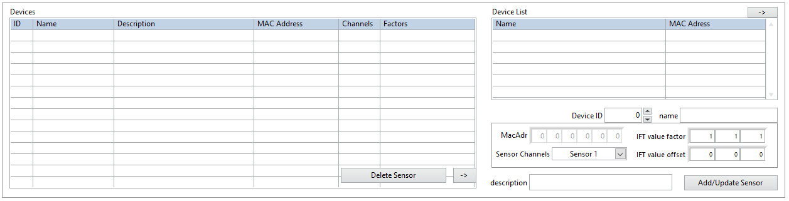
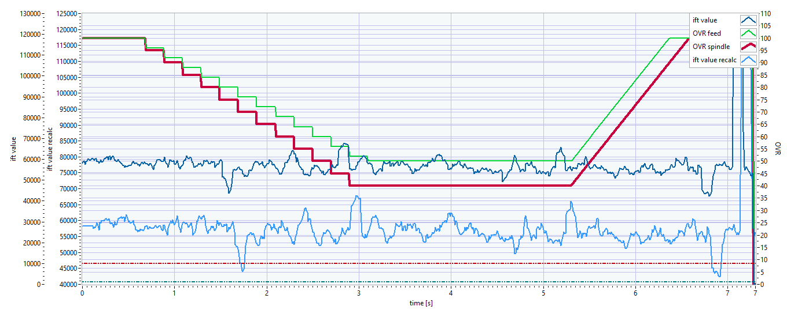
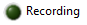

# (PART\*) [English] {-}

# Dashboard user manual {-}
User manual for the ICOtronic Dashboard.

# Version
This version of the documentation was written for the Dashboard version v5.3.0.4.
For older documentation look at the following link:

[older Version](https://github.com/MyTooliT/Dashboard/blob/7f87fe9a3be55a1fabbaa3e65d0878818b1d4ac3/C-RIO_Dashboard_en.md)

# ICOtronic System components 		  			

The graphic below provides an overview about the ICOtronic system components. It consists of the following main parts:

- Sensory Tool Holder (STH)
- Stationary Transceiver Unit (STU)
- Signal Processing Unit (SPU)

# Software and network Settings for your PC			  			
First, you need a Laptop running Windows and administrator privileges. You need the “LabView Runtime” installed on the Laptop, download link ->

http://www.ni.com/download/labview-run-time-engine-2018/7383/en/

CAUTION: it has to be the 2021 SP1 (32-bit) version !!!

You have to use the ICOtronicRemotePanel to connect to the Dashboard.

After connecting the Laptop via the Ethernet Cable to the SPU, the correct network settings have to be configured. Therefore, set the network configuration of the interface that is going to be used with the SPU as illustrated below.

 If required, please reboot your Laptop after changing the network settings.

# Real-Time-Dashboard 			  			

Use the "ICOtronicRemotePanel" then open the program. Now it will open the following window in which you have to input the IP-Address of the Dashboard. The input should be:
**192.168.1.115**

With a press on "connect to SPU" the program should connect to the Dashboard.

The Dashboard contains five tabs: **Stability**, **Raw data view**, **Replay**, **System** and **Database**. The header of the Dashboard, which is active on all the mentioned tabs, has a Connection identifier and the ICOtronic logo.

If the system is connected to a sensory tool holder, the identifier turns blue. After disconnection, it turns white again.

   <------->   

## System Tab 	

The system tab consists of 4 quarters. The lower right corner containing information about the signal quality and the CPU load.

### Connection sub part

In the upper left corner are the functions for the holder connection. On the top is a drop-down menu to choose the wanted connection type. With the "->" button it can be activated. On the right side of the "->" button is the momentary active connection type. The right most button "AutoConnect Off/On" can be used to deactivate and activate the need for putting a TRUE to the digital connection pin for connecting in the "Static DI" mode. If it is set to "AutoConnect On" the system will connect to a holder without a TRUE on the connection pin. **Attention: The holder ID pins have to be set within the time frame of 10ms starting with the first TRUE of a holder pin!!!**
The left list contains all the momentary defined "Static DI" sensor&rule configurations. Below this list you can see the momentary per Digital IN chosen ID.

With the "Delete Connect ID" button you can delete the momentary highlighted ID. In the right list all STHs are listed that are found by the system and are ready to connect. You can see the name and the Bluetooth address of the STHs. The "STOP" , "CONNECT" buttons are used to connect/disconnect the system in the "Dashboard" connection mode. The multiple green radio-buttons are used to select the chosen Sensors if the system is used in the "Dashboard" connection mode.

### Rule & Sensor config sub part

2 tabs can be found on the upper right side. These are the "Rule Engine configs" and "Sensor configs". In these 2 tabs you can see the momentary loaded configurations for "Static DI" on the system. Additionally in the "Sensor configs" tab you can highlight a holder by clicking on it and at the bottom below you can choose a rule from the drop-down menu and choose a connection ID you want to set. When pressing the "Load Sensor" button you can load the sensor&rule config into the list of loaded connection options on the top left. Beside the 2 tabs you can see the OPC server URL which is needed if you want to connect/control the system via OPCUA.

### Logging & Settings sub part

On the lower left side you can find the "Logging" tab. This tab is used for recording a process and shows the status of the digital inputs. If the "Record at connect" button is clicked, it will start the recording when connected to a holder. If not it can be started with the "Start Record" button. When the system is recording this button will become a button to stop the recording. The Identifier "Storage mounted" shows blue if a USB-device is connected. Below it shows the "Recording" identifier which is red if a record is being made at the moment. Below you can see the size of the momentary recording and the free space of the mounted USB. 

**Attention: the system only works with USB-devices formatted to FAT32-format!!!**

The one identifier to the right show if the digital input for recording is set by the hardware. (The digital input for recording can be used to start and stop recordings outside of the dashboard). The 3 rightmost status identifier show if the DI for the activation of the momentary used rule is set, the rule is allowed to change parameters (meaning the rule is set to active) and the last one shows if the system is momentary changing the overrides because of the defined rules.

The "Settings" tab is used to reboot the system and to change the system time. On the bottom you can see the "Reboot System" button. The SPU will initialise a reboot of the system when this button is pressed. On top you can 2 text-fields. The upper one is to define the new system time and the lower one is to set the format of the time, shown on the topmost right part of the dashboard. The button "Set Time" is used to set the time given in the text-field to the system time. The button with the calendar and clock can be used to open a new window with a calendar and the clock to set the time.

In this new window you can use the "Aktuelle Zeit verwenden" button to set the date and time to the momentary system time. With a press of the "OK" button will the selected time be written into the text-field.

### Connection types

On the left side you can choose a connection type with the drop down menu. On the right side you can see the momentary active connection type. By pressing the "->" button between these two you can update the active type to the chosen type.

You can chose which sensors of the chosen holder you want to use with the radio buttons below the list of found holders, with the exception of the "Static / DI" mode. Chosen sensors are green. Note that if you use more than one sensor with a holder which only has one sensor the other two channels will be useless signals from not connected PINs inside the holder. The system will connect in the 1-channel mode if only 1 sensor is selected. The system will connect in the 3-channel mode if more than 1 sensors are selected. If you select more than 3 sensors will the system only use the first 3 selected sensors. The channels are always from the lowest sensor number as channel 1 and the highest channel number as channel 3. 

#### Dashboard / OPC UA

In this mode you can select the STH of your choice from the "Device list" and press “Connect”. With “Stop”, you can disconnect from the STH. After disconnection the Dashboard needs a few seconds before it starts searching for STHs again.

#### Static / DI

In this connection mode you can use the predefined connection list (seen on the "System" tab) and the digital inputs of the system to control the connection and parameters of the system. (How to add a rule&sensor combination to the connection list see the chapter "Rule & Sensor config sub part" of the "System tab" chapter) The ID of the connection list corresponds to the digital holder inputs of the system in a binary format. (Example: ID 3 represents an input of 00000011 on the 8 input pins) To start a connection you need to set the digital input for connection to high. At this moment the system will connect to the element of the list chosen by the digital inputs. The momentary chosen input can be seen below the connection list. 

If the "AutoConnect Off/On" button is set to "ON" then the system will connect without the need to set the connection pin to high the moment the ID pins are set to TRUE. (Be careful that the connection ID pins have to be set in a time frame of 10ms)

**Attention: Never change the given ID while the system is connected to a holder. First disconnect the system, then change the ID and after that start a new connection!!!**

#### First available /DI

In this mode the system will connect to the first holder it finds within its range the moment the connection pin is set to high.

## Database

This tab is used to load and save the configuration of rules and sensors. It can be split into 4 parts. The first part is on the top and has the system controls. The middle part is used to configure the sensors. The bottom part on the bottom is used to configure the rules. The right most part of this sub part is the message screen. It shows the last few operations done in the "Database" tab. With a click on the "Clear Messagehistory" button the message history can be cleared.

### System sub part

The leftmost buttons are used to load the momentary detected sensor and rule lists into the running system or load the momentary used lists from the running system back to the lists below. The lists can also be saved to the local memory of the system or an USB-stick. The "Load/Save to local Config" buttons can be used to load/save a configuration on the local system. With "Load/Save from/to file" it will not use the local config file but the parameters on the right side of these 2 buttons. The "Speicherort" drop down can be used to change between local system and USB. The "file" text field can be used to give a name to the configuration or name the to be loaded file.

### Sensor sub part

In this subpart you can see the defined sensors of the sensor list and change them. The list on the left side shows the defined sensors. You can highlight a sensor by clicking on it. With the "Delete Sensor" button you can delete the chosen sensor from the list. If you press the "Sensor ->" button the values of the chosen sensor will be loaded from the left list into the configuration fields on the right side. The list on the right side shows all holders momentary found by the system in close proximity. By clicking one holder it will be highlighted. If you press the "->" button the values of the chosen holder will be loaded into the configuration fields below. In the fields below you can find the configurations of the holder for the sensor list. You can change the IFT value offsets/factors of the holder on the rightmost fields. The "Sensor ID" is the ID you want to give the holder configuration in the sensor list. If this ID is already defined will it be overwritten when saving. The "MacAdr" is the MAC-Address of the holder and defines which holder will be connected. The "name" is a name which can be given to the sensor which will be shown on the "Stability" tab when the sensor is connected and can be chosen freely. The "description" can be filled for example with information about this sensor. The "Channels" field is used to define how many channels the chosen holder uses in this sensor entry. All values except "1" will be seen as 3 channels whereas "1" activates 1 channel. With the "Add/Update Sensor" button the parameters can be written into the sensor list on the left. 

### Rule sub part

This sub part has a list of all defined rules on the left side. The rule "0" is always there, can not be deleted and is using the momentary parameters of the dashboard instead of predefined parameters. The "Parameters" box shows a list of all the parameters of the chosen rule. With the button "Delete Rule" the highlighted rule will be deleted. When pressing the "Rule ->" button the parameter of the chosen rule will be loaded into the configuration fields on the right side. In the fields on the right side you can chose a "Rule ID" and give it a name. In the fields below you can set the parameters for the "Stability" tab. A description of these parameters can be found in this manual in the chapter "Stability tab". Additionally you can chose a "Base Rule ID" here. If you choose a rule different from "0" then all parameters which are given as follows will load parameters of the chosen "Base Rule":

- mode: "from Baserule" option
- window length: 0
- upper/lower Threshold: <0
- ramp: 0
- stability Channel: "from Baserule" option
- minimum IFT level: <0
- deadtime: 0
- feed/spindle Override: >125
- feed/spindle Reduction Factor: >125
- low/high-pass filter: <0

This can be used if you want to use the same parameter from a predefined set and only have to change this rule to change more rules automatically. In the "description" field the rule can be given a description. With the "Add/Update Rule" button the configuration can be written into the list. If a rule with the chosen "Rule ID" already exists, it will be overwritten with the new values.

## Replay Tab

In this tab old recorded files from the USB are shown. Furthermore it allows you to recalculate the IFT value for the stored files.

You will see a list with all the recordings stored on the connected USB. Choose the recording you want to see, highlight it by pressing it and the press the "Load File" button to start the replay. Now the chosen file will be loaded.

You can see the information of the chosen recording (like the recording start time, filename, device name,...) on the top side. With the "Close File" button you can close the recording and go back to the list of recordings.
On the left side are the parameters which were active when the recording was taken.
Right below the recorded parameters is a box in which you can change the "IFT value factor", "IFT value offset", "Stability Channel" and the "WindowLength". When you change these parameters and press the "Recalculate" button the system will calculate a new IFT value recalc for the whole file and print it together with the original recording.

On the right side are two graphs. The top one shows the timeline. The red line can be moved via drag and drop and symbolises the starting point of the "Zoom" below. The lower graph shows the IFT value from the chosen starting point till 20 seconds thereafter. After changing the starting point you have to press the "Recalculate" button to reload this graph to the chosen timeframe.

## Stability Tab 						  			

In the Stability tab, you can change the mode of the system, the parameter of the in-process control and you can view the system’s live data.

CAUTION: The tabs System and Stability tab are not connected. Therefore, if you disconnect the STH, the mode and the parameter set up in the Stability tab stay the same, even if you connect a new STH (in "Dashboard Connection" Mode, in "Static DI" Mode the chosen rule parameters are loaded). These parameters only reset when the SPU got a reset.

On the top is a graph showing the Signal Quality. This percentage value shows how many packets are successfully received. If the connection is bad and it comes to packet loss then this value will fall below the 100% mark. There are 5 fields on the right side of this graph. "STH Name" shows the name of the connected holder. "STH Rule" shows the number and name of the rule which is chosen. "MO Number", "NC Program Number" and "Part Number" will be saved in the recording file, if filled in.

On the left, you can change the active mode (For detailed descriptions of the modes, see chapter “Modes”).

Below the mode selection are the configuration parameters (For detailed descriptions of the parameters, see chapter “Parameters”).

On the right-hand side you can see the live data of the system, change the shown time window length (in seconds). You can also choose to stop the data-print. There is also an indicator which shows, if the system is recording at the moment. If the system is recording the indicator will turn blue. 

 <-------> 

The newest data point is on the right-hand side. The oldest one to the left.

### IFT-Value 		  			

The IFT-Value is the system's criteria to find out if the process is stable or instable. If the value is above a chosen threshold and an in-process control mode is selected, the system generates new setpoints for the overrides feed rate and spindle speed in order to stabilize the process again.

### Overrides 		

The override graph shows the active override values of the system.

### Control indicators 				  			

This graph shows the Sens and the Active lines. These are digital information. If the values are 1 they are active and if the values are 0 they are inactive. Sens indicates that the M-command is set to activate the adaptive control loop. The Active signal shows if the IFT-Value is above the given threshold and the overrides are actively changed by the system. The Active value can only become 1 if the Sens value is 1 too.

### Controls for the rule
There are two buttons at the bottom of the screen. The "Update" Button loads the left side of the parameters into the running values on the right side. The "Rule Reset" button can be used when using the "Stop" Mode to reset the overrides back to 0% reduction.

### Stability-Parameters 					  			

Depending on which mode is set active, different parameters can be changed. To change these parameters to new values, press the "update" button on the bottom. An exception is the window length in watch mode. It can always be changed.

#### Window length 			  			

{ms} window length

This parameter changes the time window for the calculation of the IFT-Value. The larger the window, the more sluggish the system reacts to changes. For example, a single spike in the process is weighted less on the IFT-Value calculation in a larger window. In “Watch” mode this parameter can be adjusted live. In all other modes, this can only be done using the "update" button as mentioned before.

#### Minimum IFT Level

{-} ift value level

This parameter is the minimum used value for the rule. All values below this will be ignored. For example is this needed if you use the filter options and scale it to the unfiltered values. When you move quick with the tool inside the machine there could be high frequency parts in the signal and set the system to interfere. So you can use this value to get the system not interfering while it is only moving.

#### Stability_Channel 		  			

{-} channels

If you have a three channel holder you can change the channel which is used to calculate the IFT value with this drop down menu. You can use any of the three channels or multiple channels at once. If you use a one channel holder this parameter will be ignored and the IFT value calculated with the one available channel.

#### Upper threshold 		

{-} upper threshold

If the IFT value exceeds the threshold, the overrides are set to the defined values by the SPU. The bigger this value, the more “instable” the process is allowed to become, before override adaptions are activated.

#### Lower threshold 			  			

{-} lower threshold

If the IFT-value falls below the lower threshold, the override values will start rising up towards 100% again, following a defined ramp. The lower this value, the more “stable” the process has to become for the overrides to be reset.

#### Ramp 				

{%/ms} ramp

This parameter changes the speed of the override reset. The overrides are not reset instantly, as they follow a ramp to change back to 100%. The bigger this value, the steeper the ramp and the faster the system goes back to 100% spindle speed and feed rate.

A value of e.g. 0.01 %/ms would increase the feed rate and/or spindle speed to 10 % within 1 second.

#### Feed override 			

{0-100%} Setpoint for feed rate

This parameter is used in the modes "Stop", “Stability reduction”, “Stability 2 Level” and “Direct output”. In "Stop", “Stability 2 Level” and “Direct output” this value defines the override applied to the machine tool control system, the moment the ICOtronic system activates the feed rate adaption of the machine.
In "Stability reduction" this value defines the minimal feed rate override, which is sent to the machine by the ICOtronic system. The reduction cannot fall below this value.

#### Spindle override 		  			

{0-100%} Setpoint for spindle speed

This parameter is used in "Stop", “Stability reduction”, “Stability 2 Level” and “Direct output”. In “Stability 2 Level” and “Direct output” this value defines the override applied to the machine tool control system, the moment the ICOtronic system activates the spindle speed reduction of the machine.
In "Stability reduction" this value defines the minimal feed rate override, which is sent to the machine by the ICOtronic system. The reduction cannot fall below this value.

#### Feed reduction factor 					

{0-100%} Reduction factor

This parameter is used in the “Stability reduction” mode. This value controls the intensity of the reduction steps of the feed rate.

As an example: A value of 5 % for "Feed reduction factor" results in continuous reduction of 5% of the override as long as the IFT-Value is bigger than the upper threshold at each calculation interval.

Reduction step 1: Reduction from 100 % to 95 %
Reduction step 2: Reduction from 95 % to 90 %
…and so on.

#### Spindle reduction factor 				

{0-100%} Reduction factor

This parameter is used in the “Stability reduction” mode. This value controls the intensity of the reduction steps of the spindle speed.

As an example: A value of 5 % for "Spindle reduction factor" results in continuous reduction of 5% of the override as long as the IFT-Value is bigger than the upper threshold at each calculation interval.

Reduction step 1: Reduction from 100 % to 95 %
Reduction step 2: Reduction from 95 % to 90 %
…and so on.

#### Deadtime 					

{ms} deadtime

This parameter is only used in the “Stability reduction” mode. This value equals the time in ms the system pauses before checking if it should reduce the spindle speed and feed rate again. The smaller this value, the quicker the ICOtronic system reduces the speed. As a reference value for first tests 300 ms can be mentioned. This means, each 300 ms feed rate and/or spindle speed are adapted as long as the IFT value exceeds the threshold.
**<u>Note:</u>** if this value is to low it can happen that the machine needs longer to set the new parameters than the system waits to see if something changed. This would have the problem that even it the process stabilises the machine still changes values from the last instance and the process gets unstable again. 

**Examples**:

In the pictures below, there are 2 different Deadtimes set. The first picture has a shorter Deadtime than the second one. It can be seen that the minimal Overrides are reached quicker with a lower Deadtime.

Feed reduction factor: 5%; Feed override min: 40%; Spindle reduction factor: 7%; Spindle override min: 10%

Deadtime: 100ms

Deadtime: 300ms

#### Low-Pass Filter

{Hz} cutoff frequency
{-} active/inactive

This parameter is used as low pass filter cutoff frequency when calculating the IFT values. The text-field is used to give the cutoff frequency and the circle is a button to activate the low-pass filter. The button will turn blue if the filter is set to active.

#### High-Pass Filter

{Hz} cutoff frequency
{-} active/inactive

This parameter is used as high-pass filter cutoff frequency when calculating the IFT values. The text-field is used to give the cutoff frequency and the circle is a button to activate the high-pass filter. The button will turn blue if the filter is set to active.

#### Scale to unfiltered

{-} active/inactive

This circle shaped button shines blue if activated. The filtered (high-pass and low-pass filtered) signal will be set in relation to the unfiltered signal if the function is activated. Following the activation the IFT value can be at maximum a "1". **If the low-pass AND high-pass filters are deactivated the signal will always be a "1".**

#### IFT value factor 		  			

{-} IFT value factor

This is a multiplicative factor for the IFT-Value in the corresponding diagram and for the analogue port number 0 of the SPU (NI 9263). With it, the signal can be set to a desired value. The values for the different channels can be changed separately.

#### IFT value offset 					

{-} IFT value offset

This is an additive value, to the IFT-Value in the corresponding diagram and for the analogue port number 0 of the SPU (NI9263). With it, the signal can be set to a desired offset. The values for the different channels can be changed separately.

### Modes 					

The modes are:

#### WATCH 				

The STH and the STU are connected in this mode. Moreover, the IFT-Value will be evaluated in order to watch the signal generated in cutting processes. However, this mode is not a control mode and thus not taking any actions in the machine control system. This mode is also suitable for testing the connection between STH and STU. In this mode, the “IFT value factor” and “IFT value offset” can be changed. Furthermore, this is the only mode where you can instantly change the "Window length" without having to use the "update" button.

#### STABILITY 2 LEVEL 			  			

This is one of the two modes which can be used to control the machining process. In this mode, the parameters used are the “Upper threshold”, “Lower threshold”, “Ramp”, “Feed override” and “Spindle override”. If the IFT value exceeds the “Upper threshold”, the system will directly set the overrides to the values of “Feed override” and “Spindle override” defined in the Dashboard. If the IFT value reduces and falls below the “Lower threshold”, the system will start to increase Spindle speed and Feed rate back to 100% in form of a ramp. The speed of this increase is defined by the “Ramp” parameter.

#### STABILITY REDUCTION 				  			

This is one of the two modes which can be used to control the machining process. In this mode, the parameters used are the “Upper threshold”, “Lower threshold”, “Ramp”, “Feed override min”, “Feed reduction factor”, “Spindle override min”, “Spindle reduction factor” and “Deadtime”. If the IFT value exceeds the “Upper threshold”, the system will reduce spindle speed and feed rate. The factors of how much they are reduced are the two “override" factors. After a reduction step, the system waits the “Deadtime” to see if the IFT value is still above the “Upper threshold”. If it is still above, the system will reduce the overrides again. If the “override min” values are reached, the system will no longer reduce the spindle speed and feed rate. If the IFT-Value falls below the “Upper threshold”, the system holds the active overrides applied by the SPU. If the IFT-Value sinks below the “Lower threshold”, the system starts to increase spindle speed and feed rate. The speed of this increase is defined by the “Ramp” parameter.

#### DIRECT OUTPUT 					  			

This mode is primary used while installing the system. Beside the “IFT value factor” and the “IFT value offset”, the “Feed override” and “Spindle override” can be changed. The values given for the overrides will be directly sent to the output, independent from the IFT-Value. Therefore, a specific spindle speed or feed rate can be applied without any sensor-input or activation signal from the machine-control-system (M-command). This mode should be used to check if the connection between the SPU and the machine-control-system is working as designed. 

#### STOP 					  			

This mode works nearly identical to "stability 2 level" mode. The only difference is that the system doesn't use the "lower threshold". If the system changed the overrides these overrides will stay active until ether the digital input of rule enable is reset to "0" or the "Reset Regler" button was pressed.

## Example use-case 			  			

Open the Remote Control Panel and connect to the Dashboard. After the page is loaded, go to the “System” tab and wait for the holder inside the machine to be listed. Now press “Connect” and go to the “Stability” tab. The STH’s LED should start blinking and the STU’s LEDs in the corners should stop blinking and instead shine continuously. After a short moment, the IFT-Value graph should start to display values different from zero. Change the mode to “Watch” and choose a “Window length” with about 70 ms as a first orientation. Change the “Graph History” to a desired time window. Now, perform a cut in this watch mode with deactivated adaptive control and examine the IFT-Value. In order to take look at the whole process, press the “pause graph” button after the process. Remember that the seconds below the graphs show how many seconds in the past this point was. The following figure represents an example cut in the watch mode.

Now change to on of the two control modes and set the parameters of the “Upper threshold” and “Lower threshold” to plausible values, for the in-process parameter adaption. Repeat the cut, in which the override adaption is now activated.

Look if the parameters are chosen appropriately in order to control the process. If not, change them in an adequate way.

The time required to optimize the system for the use case varies. This depends on the intensity of chatter, the process time, the experience for configuring the Dashboard and the experience of the machine operator.

# How to use the OPC UA-Server of the SPU

## Connecting the OPC UA-Server

First, an OPC UA client is required on your PC. For example use the UaExpert client UaExpert v1.5.1. A user account is required.
Download link: https://www.unified-automation.com/downloads/opc-ua-clients.html  
Afterwards open the UaExpert client-program. When the program is open you have to click on “Server” at the top menu and then on “Add…”. This opens a window to search for and connect with the OPC UA-Server of the Signal Processing Unit (SPU) of the ICOtronic system.

 

In the new window you have to go to the menu entry “Custom Discovery” and double click the sub menu entry „< Double click to Add Server… >“. Now a new window will open. Here you have to input the address which you can find in the dashboard of the SPU:

Now the server should be found and you can open some sub menu entries. Double click the “None – None (uatcp-uasc-uabinary)”. Now the “OK” button should be usable and you can click it to exit this window.

After that, the server should be visible on the left side of the menu. Now you have to right-click the server and then click on “Connect”.

 

## Visualisation of the variables

After connecting to the OPC UA-Server you should be able to see variables on the left side of the menu.

 

The variables can be sorted into 3 groups: "command", "data" and "param".
In the "command" group you can find bool variables which activate a command if set to "true". An example would be that setting the variable "disconnectHolder" to "true" the system will disconnect the momentary connected holder.
The "data" group contains values which are calculated/set by the system. An example would be that you can find the momentary IFT-value in the variable "iftValue".
The "param" group can be split into 2 subgroups. The "active" subgroup contains the momentary set parameters of the rule engine. The "set" subgroup can be used to change the parameters of the rule engine.

With a double click, these variables can be opened and shown on the upper right-hand side of the menu.

 

In this window, it is possible to read the different value parameters of the chosen element. For example, the actual value of the element or the timestamp of the last time, this element was updated. The menu item “Value” shows the last read value of this element.
In order to show an element permanently in the middle tab of the screen, you can drag&drop it from the bottom left into the big tab in the middle. Alternatively you can right click in the big middle tab. Now a menu should open and you have to click on „Add custom node…“.

After that, you have to state the variable name of the element you want to show. Every element of the OPC UA-Server can be chosen via its identifier. If an element is selected, the identifier can be read out at the element parameters in the right upper tab. There, you can pick the entry “NodeId” and find the required information.

After inputting the NodeId you can press the “OK” button. Now the chosen element should be shown in the middle part of the program. It is possible to show more than one element in the middle of the screen by repeating this process.

## Changing of variables

To change variables, for example the "windowLength" you have to choose the corresponding variable in the "set" subgroup of the "param" group. Now you can change the "Value" of this variable. If you look at the "active" parameter of the variable you will notice that the value wasn't changed automatically.

The value will only be written into the active parameter after the "setStabilityParam" parameter of the "command" group has been written "true". Afterwards you can see that the active parameter was written with the set value.
Note that the "setStabilityParam" command changes all changed parameters at once.

## Recording of variables

With UaExpert you can also save the variables into a ".csv" file. To use this function you have to go to "Documents -> Add Document" and in the following window you have to choose "Data Logger View".

The "Data Logger View" will open.

Now you can add the variables just like you did in the "Data Access View" window before. On the right side you can edit various parameters for the recording of the variables.

Below the chosen variables you can find the parameters of the recorded files. There you can define the data path for the recording, the maximum number of lines written into the file and how many files from the past should be kept before overwriting the files.

**ATTENTION:** If a new recording is started the old recordings get a number at the end of the name and will get an increment of this number thereafter. Therefor you have to be careful when recording so that later you still know which file was which recording.

At the bottom of the Data Logger View you find the "Start" and "Stop" button and an information about how many values were written in the momentary recording.

