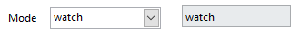
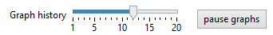
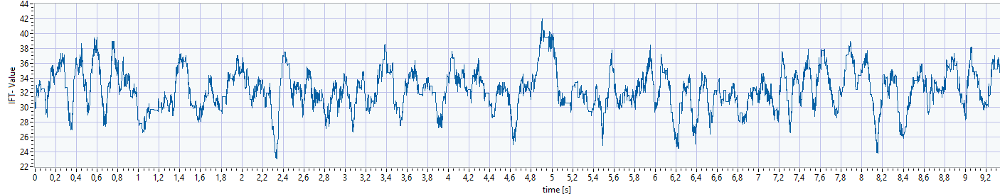
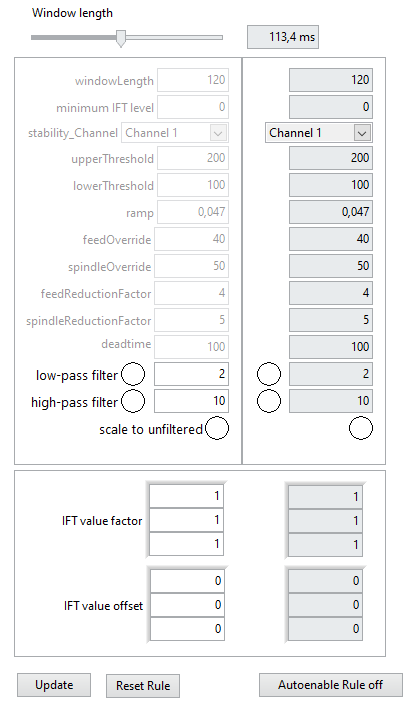
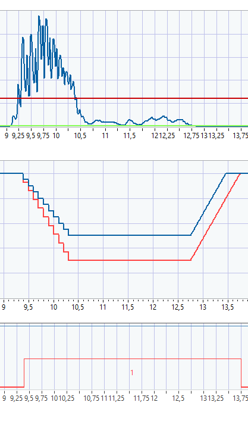

# (PART\*) [English] {-}

# Dashboard user manual {-}
User manual for the ICOtronic Dashboard.

# Version
This version of the documentation was written for the Dashboard version v4.0.1.4.
For older documentation look at the following link:

https://github.com/MyTooliT/Dashboard/blob/older_than_4_0_1_4/C-RIO%20Dashboard%20en.md

# ICOtronic System components 		  			

The graphic below provides an overview about the ICOtronic system components. It consists of the following main parts:

- Sensory Tool Holder (STH)
- Signal Processing Unit (SPU)
- Stationary Transceiver Unit (STU)
- Charging Cradle (CC)

# Software and network Settings for your PC			  			

First, you need a Laptop running Windows and administrator privileges. You need the “LabView Runtime” installed on the Laptop, download link ->

http://www.ni.com/download/labview-run-time-engine-2018/7383/en/

CAUTION: it has to be the 2020 SP1 (32-bit) version !!!

Not all browsers can use this plugin. Microsoft Edge works if you run the Dashboard tab in the "Internet Explorer Mode". 
Alternatively you can also use the ICOtronicRemotePanel. When using the panel you also need to have the "LabView Runtime" installed on your device.

Before connecting the Laptop via the Ethernet Cable to the SPU, the correct network settings have to be configured. Therefore, set the network configuration of the interface that is going to be used with the SPU as illustrated below.

 If required, please reboot your Laptop after changing the network settings.

# Real-Time-Dashboard 			  			

If you use Microsoft Edge open the explorer and go to:

http://192.168.1.115:8000/ICOtronicSPU.html

If the Dashboard doesn't open check if you are opening the side in the "Internet Explorer Mode".
This should open the real-time-Dashboard on your PC.

If you use the "ICOtronicRemotePanel" then open the program. Now it will open the following window in which you have to input the IP-Address of the Dashboard. The input should be:
**192.168.1.115**

With a press on "connect to SPU" the program should connect to the Dashboard.

The Dashboard contains four tabs: **Stability**, **Breakout detection**, **Raw data view** and **System**. The header of the Dashboard, which is active on all the mentioned tabs, has a Connection identifier, a field where you can see the name and MAC-Address of the connected holder and the ICOtronic-logo.

If the system is connected to a sensory tool holder, the identifier turns blue. After disconnection, it turns white again.

   <------->   

If no sensory tool holder is connected the fields for name and MAC-Address will be empty. When connected to a sensory tool holder the name and MAC-Address will show until disconnection.

   <------->   

## System Tab 	

In the section "Holder connection" of the system tab, all STHs are listed that are found by the system and are ready to connect. You can see the name and the Bluetooth address of the STHs. To establish a connection there are 3 different methods which can be used. The used method can be chosen with the "Connection type" drop-down menu and activated with the "->" button. On the right side are some system information. On the bottom left side are two tabs for using predefined rule and sensor configurations. On the bottom right side are a few tabs with additional functions.

### Logging

This tab is used for recording of a process. If the "Record at connect"-button is clicked it will turn green and show that the recording will start at connection to a holder. If not it can be started with the "Start Record" button. When the system is recording this button will become a button to stop the recording. The Identifier below shows green if a USB-device is connected. Below it shows the size of the momentary recording and the free space of the mounted USB. 

**Attention: the system only works with USB-devices formatted to FAT32-format!!!**

The two identifier below show if the digital inputs for recording and enabling of the rule are set by the hardware. (The digital input for recording can be used to start and stop recordings outside of the dashboard). The 3 status identifier at the bottom show if the system is recording at the moment, if the rule is allowed to change parameters and the last one shows if the system is momentary changing the overrides because of the defined rules.

### FOCAS

**Attention: This connection is only possible on specific machines!**

This tab is used if you want to control the system with the FOCAS connection. For this control you have to give the system the NC line number of the start and the end of the process which should be controlled. Additionally you can define the used IP-Address of the FOCAS connection. Then start the connection with the "FOCAS Start" button. If you want to stop the control via FOCAS you have to press the "FOCAS Stop" button which is there instead of the "FOCAS Start" if the connection is active. Note that if you are connected to a holder und you press "FOCAS Start" the system will disconnect the holder and you have to connect again to the holder.

### CAN Monitor

This tab shows information about the CAN messages send between the system and the dashboard. The "Reboot System" button below can be used to trigger a software side reboot of the SPU.

### Connection types

On the left side you can choose the connection type you want to use with the drop down menu. On the right side you can see the momentary active type. By pressing the "->" button between these two you can change the active type to the chosen type.

You can chose if you are using an one or 3 channel holder with the radio buttons below the list of found holders, with the exception of the "Static / DI" mode. Note that if you use the three channel option with a holder which only has one channel the other two channels will be useless signals from not connected PINs inside the holder. On the left side of the radio buttons you can see if a static connection request is set by the hardware connected digital inputs of the SPU.

#### Dashboard / OPC UA

With this mode you can select the STH of your choice from the "Device list" and press “Connect”. With “Stop”, you can disconnect from the STH. After disconnection the Dashboard needs a few seconds before it starts searching for STHs again.

#### Static / DI

In this connection mode you can define static MAC-Addresses. Every holder has his own unique address. This address is shown on the right side of the device list. If this mode is selected, the digital input on the hardware is set to "1" and the holder with the defined MAC-Address is in range the system will automatically connect to this holder.
Up to three holders can be defined and connected via there digital inputs. The fields for configuration of the static connection mode can be found below the connection-mode selection.

There are three tabs, one for each of the defined holders to configure. The upper part is used to change the parameters, the lower part (the one with the grey background) shows the momentary active state of the configuration. To write the changed configuration into the active part press the "Update" button on the top right. 
The "MacAdr" is the MAC-Address of the holder you want to chose. You can see the Address on the right column of the holder list. With "Channels" you can define how many channels the holder has. If there is anything beside "1" inside this box it will take it that the holder has thee channels. With a "1" the SPU will connect to it as a holder with one channel. The "Rule config ID" box can be used to set a predefined ruling configuration to be used when connecting to this holder. With a "0" it will use the parameters which are set in the "Stability" tab at the moment. With the "IFT value factor" and the "IFT value offset" you can adapt the calculated IFT-value.

#### First available /DI

In this mode the system will connect to the first holder it finds within its range. When the digital input to enable the ruling is set.

### Configuration of tools and processes

In the system tab you can see 2 additional tabs used to load preset configurations called "Rule Engine configs" and "Sensor configs". Pressing the "Load Rule" Button will load and apply the chosen configuration file. With this function you can define your parameters and load them via the press of a button. This has the advantage that you don't have to manually change all the parameters of the SPU and can use different defined configurations for different holders with different processes to be used in.

**<u>IN DEVELOPMENT!!!!</u>**
The rules and sensor configs can be edited via the following link:
http://192.168.1.115:8000/MainConfig.html
The configuration is working, but the design and user friendliness is **still in development!**

### OPC-UA Server Address

On the right side, beside the rule and sensor configs you can find the OPCUA-Server address of the SPU which you need if you want to connect via OPCUA with the SPU.

## Raw Data View Tab

If this tab is chosen it will show the raw data of the connected sensory tool holder, depending if 1 or 3 channels were chosen you can see 1 or 3 signals. This is used if you want to plot the raw not computed signals of the tool holder. If you right-click the y-axis you can change from auto scale mode to defined values. 

## Breakout detection Tab

**<u>IN DEVELOPMENT!!!!</u>**

This tab is used when you want to detect breakout of cutting edges. 

On the top left side are the parameters for the detection. On the top right side is the graph of the quality factor which indicates a breakout. On the bottom left side is a graph of the signal power. And on the bottom right is a graph of the frequency spectrum. In the frequency spectrum graph you can move the cursor to see the amplitude and frequency on this cursor position on the top left of the spectrum graph. If the parameters are set you can additionally see green vertical bars. These bars represent the areas used by the breakout detection algorithm based on the chosen parameters. When using a new cutting tool the multiples of the meshing frequency should be visible. On the right side you can change the zoom of the x-axis(frequency) and the y-axis(amplitude) of this graph.

### Breakout parameters

These parameters are used to configure the breakout detection. To activate the new parameters the "Update" button has to be clicked.

#### Spindle speed

This parameter is the spindle speed which is used in the cutting process.

#### Order limit

This parameter is the number of orders of the tooth passing frequency which should be used to detect the breakouts.

#### Comb width

This parameter defines the comb width which is used to analyze the frequency spectrum to detect the breakouts. This is needed since the frequencies are not a peak with only 1 value but more like a plateau because we are in a real and not ideal situation.

#### Number of teeth

This parameter is the number of teeth the cutting tool posses.

#### Signal power limit

This value defines a signal power. Everything below this signal power will be ignored. This is needed so that the detection only works when the tool is cutting. Without the quality factor could be signaling a breakout even if the tool is not cutting at the moment.

## Stability tab 						  			

In the Stability tab, you can change the mode of the system, the parameter of the in-process control and you can view the system’s live data.

CAUTION: The tabs System and Stability tab are not connected. Therefore, if you disconnect the STH, the mode and the parameter set up in the Stability tab stay the same, even if you connect a new STH. These parameters only reset when the SPU got a reset.

In the upper left, you can change the active mode (For detailed descriptions of the modes, see chapter “Modes”).

Below the mode selection are the configuration parameters (For detailed descriptions of the parameters, see chapter “Parameters”).

Beside the mode selection you can find an indicator which shows if the system is recording at the moment. If the system is recording the indicator will turn bright green. 

 <-------> 

On the right-hand side you can see the live data of the system, change the shown time window length (in seconds) and you can choose to stop the data-print.

The newest data point is on the right-hand side. The oldest one to the left.

### IFT-Value 		  			

The IFT-Value is the system's criteria to find out if the process is stable or instable. If the value is above a chosen threshold and an in-process control mode is selected, the system generates new setpoints for the overrides feed rate and spindle speed in order to stabilize the process again.

### Overrides 		

The override graph shows the active override values of the system.

### Control indicators 				  			

This graph shows the Sens and the Active lines. These are digital information. If the values are 1 they are active and if the values are 0 they are inactive. Sens indicates that the M-command is set to activate the adaptive control loop. The Active signal shows if the IFT-Value is above the given threshold and the overrides are actively changed by the system. The Active value can only become 1 if the Sens value is 1 too.

### Controls for the rule
There are two buttons at the bottom of the screen. The "freigabe Regler" button can be used like the digital input which activates the rule engine. If you press the button it will change the name to "Regler freigegeben" and the "Sens" graph will change to 1. If you press it again it will change it's name back and the "Sens" graph will go back to "0". The "Reset Regler" button is only needed if the system is used in the "stop" mode.

### Stability-Parameters 					  			

Depending on which mode is set active, different parameters can be changed. To change said parameters to new values, press the "update" button on the bottom (with "Window length" being the only exception in "Watch" mode).

#### Window length 			  			

{ms} window length

This parameter changes the time window for the calculation of the IFT-Value. The larger the window, the more sluggish the system reacts to changes. For example, a single spike in the process is weighted less on the IFT-Value calculation in a larger window. In “Watch” mode this parameter can be adjusted live. In all other modes, this can only be done using the "update" button as mentioned before.

#### Upper threshold 		

{-} upper threshold

If the IFT value exceeds the threshold, the overrides are set to the defined values by the SPU. The bigger this value, the more “instable” the process is allowed to become, before override adaptions are activated.

#### Lower threshold 			  			

{-} lower threshold

If the IFT-value falls below the lower threshold, the override values will start rising up towards 100% again, following a defined ramp. The lower this value, the more “stable” the process has to become for the overrides to be reset.

#### Ramp 				

{%/ms} ramp

This parameter changes the speed of the override reset. The overrides are not reset instantly, as they follow a ramp to change back to 100%. The bigger this value, the steeper the ramp and the faster the system goes back to 100% spindle speed and feed rate.

A value of e.g. 0.01 %/ms would increase the feed rate and/or spindle speed to 10 % within 1 second.

#### Feed override 			

{0-100%} Setpoint for feed rate

This parameter is used in the modes "Stop", “Stability reduction”, “Stability 2 Level” and “Direct output”. In "Stop", “Stability 2 Level” and “Direct output” this value defines the override applied to the machine tool control system, the moment the ICOtronic system activates the feed rate adaption of the machine.
In "Stability reduction" this value defines the minimal feed rate override, which is sent to the machine by the ICOtronic system. The reduction cannot fall below this value.

#### Spindle override 		  			

{0-100%} Setpoint for spindle speed

This parameter is used in "Stop", “Stability reduction”, “Stability 2 Level” and “Direct output”. In “Stability 2 Level” and “Direct output” this value defines the override applied to the machine tool control system, the moment the ICOtronic system activates the spindle speed reduction of the machine.
In "Stability reduction" this value defines the minimal feed rate override, which is sent to the machine by the ICOtronic system. The reduction cannot fall below this value.

#### Feed reduction factor 					

{0-100%} Reduction factor

This parameter is used in the “Stability reduction” mode. This value controls the intensity of the reduction steps of the feed rate.

As an example: A value of 5 % for "Feed reduction factor" results in continuous reduction of 5% of the override as long as the IFT-Value is bigger than the upper threshold at each calculation interval.

Reduction step 1: Reduction from 100 % to 95 %
Reduction step 2: Reduction from 95 % to 90 %
…and so on.

#### Spindle reduction factor 				

{0-100%} Reduction factor

This parameter is used in the “Stability reduction” mode. This value controls the intensity of the reduction steps of the spindle speed.

As an example: A value of 5 % for "Spindle reduction factor" results in continuous reduction of 5% of the override as long as the IFT-Value is bigger than the upper threshold at each calculation interval.

Reduction step 1: Reduction from 100 % to 95 %
Reduction step 2: Reduction from 95 % to 90 %
…and so on.

#### Deadtime 					

{ms} deadtime

This parameter is only used in the “Stability reduction” mode. This value equals the time in ms the system pauses before checking if it should reduce the spindle speed and feed rate again. The smaller this value, the quicker the ICOtronic system reduces the speed. As a reference value for first tests 300 ms can be mentioned. This means, each 300 ms feed rate and/or spindle speed are adapted as long as the IFT value exceeds the threshold.
**<u>Note:</u>** if this value is to low it can happen that the machine needs longer to set the new parameters than the system waits to see if something changed. This would have the problem that even it the process stabilises the machine still changes values from the last instance and the process gets unstable again. 

Examples:

In the pictures below, there are 2 different Deadtimes set. The first picture has a shorter Deadtime than the second one. It can be seen that the minimal Overrides are reached quicker with a lower Deadtime.

Feed reduction factor: 8%; Feed override min: 10%; Spindle reduction factor: 5%; Spindle override min: 20%

Deadtime: 100ms

Deadtime: 300ms

#### Channels 		  			

{-} channels

If you have a three channel holder you can change the channel which is used to calculate the IFT value with this drop down menu. You can use any of the three channels or multiple channels at once. If you use a one channel holder this parameter will be ignored and the IFT value calculated with the one available channel.

#### IFT value factor 		  			

{-} IFT value factor

This is a multiplicative factor for the IFT-Value in the corresponding diagram and for the analogue port number 0 of the SPU (NI 9263). With it, the signal can be set to a desired value. The values for the different channels can be changed separately.

#### IFT value offset 					

{-} IFT value offset

This is an additive value, to the IFT-Value in the corresponding diagram and for the analogue port number 0 of the SPU (NI9263). With it, the signal can be set to a desired offset. The values for the different channels can be changed separately.

### Modes 					

The modes are:

#### WATCH 				

The STH and the STU are connected in this mode. Moreover, the IFT-Value will be evaluated in order to watch the signal generated in cutting processes. However, this mode is not a control mode and thus not taking any actions in the machine control system. This mode is also suitable for testing the connection between STH and STU. In this mode, the “IFT value factor” and “IFT value offset” can be changed. Furthermore, this is the only mode where you can instantly change the "Window length" without having to use the "update" button.

#### STABILITY 2 LEVEL 			  			

This is one of the two modes which can be used to control the machining process. In this mode, the parameters used are the “Upper threshold”, “Lower threshold”, “Ramp”, “Feed override” and “Spindle override”. If the IFT value exceeds the “Upper threshold”, the system will directly set the overrides to the values of “Feed override” and “Spindle override” defined in the Dashboard. If the IFT value reduces and falls below the “Lower threshold”, the system will start to increase Spindle speed and Feed rate back to 100% in form of a ramp. The speed of this increase is defined by the “Ramp” parameter.

#### STABILITY REDUCTION 				  			

This is one of the two modes which can be used to control the machining process. In this mode, the parameters used are the “Upper threshold”, “Lower threshold”, “Ramp”, “Feed override min”, “Feed reduction factor”, “Spindle override min”, “Spindle reduction factor” and “Deadtime”. If the IFT value exceeds the “Upper threshold”, the system will reduce spindle speed and feed rate. The factors of how much they are reduced are the two “override" factors. After a reduction step, the system waits the “Deadtime” to see if the IFT value is still above the “Upper threshold”. If it is still above, the system will reduce the overrides again. If the “override min” values are reached, the system will no longer reduce the spindle speed and feed rate. If the IFT-Value falls below the “Upper threshold”, the system holds the active overrides applied by the SPU. If the IFT-Value sinks below the “Lower threshold”, the system starts to increase spindle speed and feed rate. The speed of this increase is defined by the “Ramp” parameter.

#### DIRECT OUTPUT 					  			

This mode is primary used while installing the system. Beside the “IFT value factor” and the “IFT value offset”, the “Feed override” and “Spindle override” can be changed. The values given for the overrides will be directly sent to the output, independent from the IFT-Value. Therefore, a specific spindle speed or feed rate can be applied without any sensor-input or activation signal from the machine-control-system (M-command). This mode should be used to check if the connection between the SPU and the machine-control-system is working as designed. 

#### STOP 					  			

This mode works nearly identical to "stability 2 level" mode. The only difference is that the system doesn't use the "lower threshold". If the system changed the overrides these overrides will stay active until ether the digital input of rule enable is reset to "0" or the "Reset Regler" button was pressed.

## Example use-case 			  			

Open the internet explorer and connect to the Dashboard. After the page is loaded, go to the “System” tab and wait for the holder inside the machine to be listed. Now press “Connect” and go to the “Stability” tab. The STH’s LED should start blinking and the STU’s LEDs in the corners should stop blinking and instead shine continuously. After a short moment, the IFT-Value graph should start to display values different from zero. Change the mode to “Watch” and choose a “Window length” with about 70 ms as a first orientation. Change the “Graph History” to a desired time window. Now, perform a cut in this watch mode with deactivated adaptive control and examine the IFT-Value. In order to take look at the whole process, press the “pause graph” button after the process. Remember that the seconds below the graphs show how many seconds in the past this point was. The following figure represents an example of cut in the watch mode.

Now change to on of the two control modes and set the parameters of the “Upper threshold” and “Lower threshold” to plausible values, for the in-process parameter adaption. Repeat the cut, in which the override adaption is now activated.

Look if the parameters are chosen appropriately in order to control the process. If not, change them in an adequate way.

The time required to optimize the system for the use case varies. This depends on the intensity of chatter, the process time, the experience for configuring the Dashboard and the experience of the machine operator. This optimization procedure can take between one hour and several hours.

# How to use the OPCUA-server of the SPU

## Connecting the OPCUA-Server

First, a OPC UA client is required on your PC. Please, find subsequently as a suggestion the download link of a UaExpert client (UaExpert v1.5.1). A user account is required.
Download link: https://www.unified-automation.com/downloads/opc-ua-clients.html  
Afterwards open the UaExpert client-program. When the program is open you have to click on “Server” at the top menu and then on “Add…”. This opens a window to search for and connect with the OPC UA-Server of the Signal Processing Unit (SPU) of the ICOtronic system.

 
 
In the new window you now have to go to the menu entry “Custom Discovery” and double click the sub menu entry „< Double click to Add Server… >“. Now a little new window will open. Here you have to input the address which you can find in the dashboard of the SPU:

Now the server should be found and you can open some sub menu entries. Double click the “None – None (uatcp-uasc-uabinary)”. Now the “OK” button should be usable and you can click it to exit this window.

After that, the server should be visible on the left side of the menu. Now you have to right-click the server and then click on “Connect”.

 

## Visualisation of the variables

After connecting to the OPCUA-Server you should now be able to see variables on the left side of the menu.

 

The variables can be sorted into 3 groups: "command", "data" and "param".
In the "command" group you can find bool variables which activate a command if set to "true". An example would be that setting the variable "disconnectHolder" to "true" the system will disconnect the momentary connected holder.
The "data" group contains values which are calculated/set by the system. An example would be that you can find the momentary IFT-value in the variable "iftValue".
The "param" group can be split into 2 subgroups. The "active" subgroup contains the momentary set parameters of the rule engine. The "set" subgroup can be used to change the parameters of the rule engine.

With a double click, these variables can be opened and shown on the upper right-hand side of the menu.

 

In this window, it is possible to read the different value parameters of the chosen element. For example, the actual value of the element or the timestamp of the last time, this element was updated. The menu entry “Value” shows the last read value of this element.
In order to show an element permanently in the middle tab of the screen, you can drag&drop it from the bottom left into the big tab in the middle. Alternativly you can right click in the big middle tab. Now a menu should open and you have to click on „Add custom node…“.

After that, you have to state the variable name of the element you want to show. Every element of the OPC UA-Server can be chosen via its identifier. If an element is selected, the identifier can be read out at the element parameters in the right upper tab. There, you can pick the entry “NodeId” and find the required information.

After inputting the NodeId you can press the “OK” button. Now the chosen element should be shown in the middle part of the program. It is possible to show more than one element in the middle of the screen by repeating this process.

## Changing of variables

To change variables, for example the "windowLength" you have to choose the corresponding variable in the "set" subgroup of the "param" group. Now you can change the "Value" of this variable. If you also look at the "active" parameter of the variable you can see that the value wasn't changed automatically.

The value will only be written into the active parameter after the "setStabilityParam" parameter of the "command" group was written "true". Afterwards you can see that the active parameter was written with the set value.
Note that the "setStabilityParam" command changes all changed parameters at once.

## Recording of variables

With UaExpert you can also save the variables into a ".csv" file. To use this function you have to go to "Documents -> Add Document" and in the following window you have to choose "Data Logger View".

The "Data Logger View" should now open itself.

Now you can add the variables just like you did in the "Data Access View" window before. On the right side you can edit various parameters for the recording of the variables.

Below the chosen variables you can find the parameters of the recorded files. There you can define the data path for the recording, the maximum number of lines written into the file and how many files into the past should be kept before overwriting the files.

**ATTENTION:** If a new recording is started the old recordings get a number at the end of the name and will get an increment of this number thereafter. Therefor you have to be careful when recording so that you can later still know which file was which recording.

Direct below you find the "Start" and "Stop" button and an information about how many values were written in the momentary recording.

