# Dashboard en

## Installation 			  			

Figure 1 shows an overview about the ICOtronic system components. It consists of its main parts:

- Sensory Tool Holder (STH),
- Signal Processing Unit (SPU),
- Stationary Transceiver Unit (STU), and
- Charging Cradle (CC).

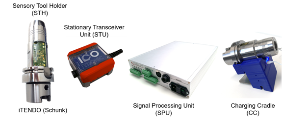

*Figure 1: ICOtronic System Overview*

First, you need a Laptop running Windows, which you have administrator privileges. A dedicated runtime environment is required.

In most cases, this will be the following: http://www.ni.com/download/labview-run-time-engine-2018/7383/en/
You need to complete a rather swift registration procedure in order to  download it. After installation you need to reboot your system.

Not all browsers can use this plugin, Microsoft Internet Explorer (NOT MICROSOFT EDGE) was tested and worked well.

## Network Settings for your PC 				  			

Before connecting the Laptop via the Ethernet Cable to the SPU, the  correct network settings have to be configured. Therefore, set the  network configuration of the interface that is going to be used with the SPU as illustrated in Figure 2.

*Figure 2 : IP configuration for your Laptop*

 If required, please reboot your Laptop after changing the network settings.

## Real-Time-Dashboard 		

Open your Microsoft Internet explorer and go to:

http://192.168.1.113:8000/CMSDT.html

This should open the real-time-dashboard on your PC.

Figure 3 shows the Dashboard, which contains four tabs: **Config**, **Signal**, **Longtime** and **Test**. The header of the Dashboard, which is active on all the mentioned tabs, has a text output box called ***Status\****, which* shows the current active application mode (chosen “Changestate”), a ***Batterylevel\*** gauge and a ***Signalquality\*** gauge.

*Figure 3: Dashboard Config tab*

## Signal Tab 			  			

The figure-of-merit used to gauge the cutting process is the  IFT-Value or IFT-Wert in German. This value indicates a preprocessed  measure derived from vibrations that are currently observed. The value  quantifies the instability of the current cutting process. The higher  the IFT-value, the more unstable is the current cut. It is important to  note that this value has no dedicated unit and tries to quantify the  resulting “damage” due to instability, somewhat similar to things like  the Richter scale or points gathered in behavioral assessment scheme.  This value is designed to compare different cutting parameters to each  other, not so much as an unambiguous measure for one given cutting  process alone. There are some parameters that go into calculating the  IFT value which are configured in the config tab.
In order to gauge the current cutting process, there are three graphs in this tab:

- **IFT-Wert** /IFT-Value, which allows to assess the current IFT readout over time

- Override Vorschub & Spindel, which depicts the countermeasures programmed by the SPU

- Status, which depicts important status flags over time,

  - Sense indicates that the M-command is set to activate the adaptive control loop

  - Active shows that countermeasures are actively applied to avoid chattering

    

The time-span in this view is 10 seconds and should help you with ad-hoc configuration of the system.

The *Reset* button clears the graphs.

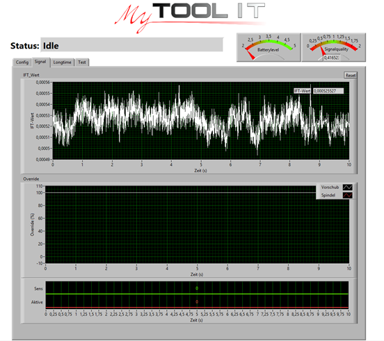

*Figure 4: Signal tab*

## Config Tab 			  			

The config tab allows to configure all settings that are relevant to  control the system. Most of these parameters are also exposed by OPC-UA  to allow for remote/automated configuration. On the left hand side of  the config tab you can enter new parameter values “Neue Werte”, on the  right hand side the current parameter values are displayed “Aktuelle  Werte”.
It is important to note that all parameters that are not  applicable for the current mode of operation are grayed out. In the  following these parameters are explained, however, in the context of the selected mode to provide the necessary context.

In every mode the following two parameters are active:
**IN Datenlänge**, which determines the time-window used to derive the IFT-value. Like all other time related parameters, it is denoted in milliseconds. 
**IN Neuberechnung** determines the time increments which trigger a new cycle of the real-time-system.  Any action of the system is bound to this sampling interval. Due to the  high computational demand of the calculations involved it is not advised to go below 5 ms.

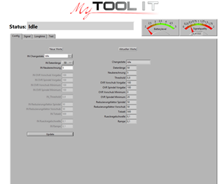

### IN Changestate 					  			

The ICOtronic system’s behavior is defined largely by its current mode of operation. The current mode is indicated by the **status** variable. The **IN Changestate** specifies the mode the system should transition to. To do that, a specific mode  is selected from a list of several available modes.

In the dashboard this can be accomplished by selecting the desired  mode in the drop-down menu and click the update button to confirm. **To ensure proper parameter handling, it is required to revert to “idle”  mode after each mode selection other than “idle”. The real-time-system  will enforce this strategy by not accepting any other mode change.** 

Example: The Mode ***Direct Output\*** has been selected by pushing the Update button and therefore is active. In order to change to another mode, e.g. ***Stability 2 Levels\***, the correct way is as follows: **Changestate** >> Select **Idle** >> press **Update** button >> Select **Stability 2 Levels** >> press **Update** button.

In the following subsections, the available modes are described. **The number format uses commas as decimal separator to conform to German keyboards.**

#### Idle 				  			

In this mode, the adaptive control and the Sensory Tool Holder (STH)  are deactivated. The Idle mode is a safety interim stage to change  between different application modes.

#### Direct Output 		  			

This is primarily a debug mode in which the STH is not active.  Different variables related to the adaptive control can be set without  any sensor-input or activation signal from the machine-control-system  (M-command). Therefore, with this mode, a specific spindle speed or feed rate can be applied. This mode should be used to check if the  connection between the SPU and the machine-control-system is working as  designed.

As an example, you may apply the following: Without a cutting process, set the SPU to "direct output" mode, and set the **IN OVR Vorschub Vorgabe** to 40% and **IN OVR Spindel Vorgabe** to 50%. The values at the machine control panel should change accordingly if the SPU is implemented correctly.

Variables to set spindle speed and feed rate:

**IN OVR Vorschub Vorgabe:** {0-100%} Setpoint for spindle speed

**IN OVR Spindel Vorgabe:** {0-100%} Setpoint for feed rate

These Input parameters in the Direct Output mode are independent of the Variables **“IN OVR Vorschub Minimum”** and **“IN OVR Spindel Minimum”** (description in chapter 4.1.4).

#### Stability 2 Levels 				  			

This mode activates the STH and calculates the **IFT-Wert**.

If the activation signal is set in the NC-program (M-command) and the **IFT-Wert** exceeds the “**IN Threshold**” value, the overrides are reduced to defined values. “**IN OVR Vorschub Vorgabe**” and “**IN OVR Spindel Vorgabe**” specify those values, as illustrated in Figure 4.

**IN Threshold** (red colored line in the IFT-Wert diagram)**: IFT-Wert** > **IN Threshold**: process is unstable → parameter reduction

*Figure 5: above: **IFT-Wert** (white signal) > **IN Threshold** (red signal): process is unstable; below: override reduces to the defined values **IN OVR Vorschub Vorgabe and/or IN OVR Spindel Vorgabe***

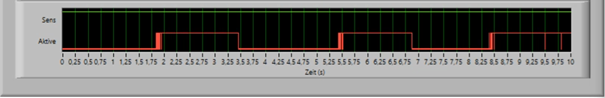

*Figure 6: Sens is high if the M-command is set and, therefore the adaptive control is activated; Active is high if the **IFT-Wert** > **IN Threshold** and the parameters Vorschub and/or Spindel are adapted*

#### Stability Reduction 					  			

If the **IFT-Wert** exceeds the red colored **IN Threshold**, spindle speed and feed rate is reduced in defined steps. The reduction steps can be defined with the following variables:

**IN OVR Vorschub Minimum:** {0-100%} Minimum value of feed rate

**IN OVR Spindel Minimum:** {0-100%} Minimum value of spindle speed

Example: By changing the **IN OVR Vorschub Minimum** to 20 %. the maximum reduction of feed rate is 80 %.

**IN Reduzierungsfaktor Spindel:** {0-100%} reduction factor for spindle speed in [%]

**IN Reduzierungsfaktor Vorschub:** {0-100%} reduction factor for feed rate in [%]

As an example: A value of 95 % for **IN Reduzierungsfaktor Spindel** results in continuous reduction of 5% of the current override as long as the **IFT-Wert** > **IN Threshold**, at each calculation interval.

Reduction Step 1: Reduction from 100 % to 95 %
Reduction Step 2: Reduction from 95 % to 90,25 %
…and so on

**IN Totzeit:** Time between reduction steps in [ms]

Figure 6 illustrates an Example for the continuous reduction with different **IN Reduzierungsfaktor Spindel** and **IN Totzeit.**

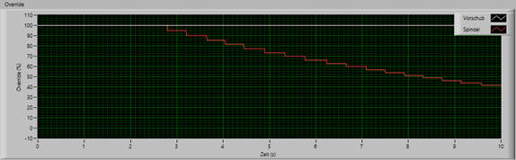

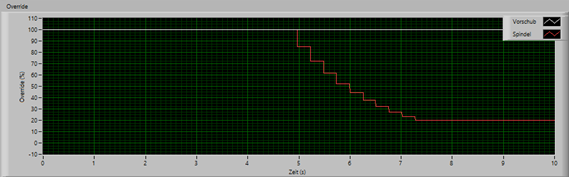

*Figure 7: above: **IN Totzeit** = 500 ms**, IN Reduzierungsfaktor Spindel** = 95 %; below: **IN Totzeit** = 300 ms**, IN Reduzierungsfaktor Spindel** = 85 %*

 

If the **IFT-Wert** decreases and deceeds the green colored **IN Rückregelschwelle**, the feed rate and the rotational speed increase again towards 100 % of the initial values.

**IN Rückregelschwelle:** (green colored line in the IFT-Wert diagram) **IFT-Wert** < **IN Rückregelschwelle** → parameters increase up to predefined values

**IN Rampe:** ramp in [%/ms] for the increase of the parameters if **IFT-Wert** deceeds **IN Rückregelschwelle**

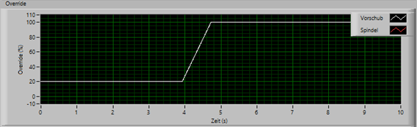

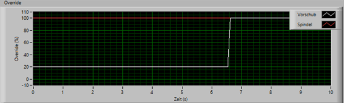

*Figure 8: above: **IN Rampe** = 0,1 [%/ms]; below: **IN Rampe** = 0,9 [%/ms]*

Independent from the chosen application mode (**IN Changestate**) the operator always has the opportunity to reduce the feed and spindle speed values with the potentiometer.

#### Watch 				  			

The Sensory-Tool-Holder and the STU is active in this mode. Moreover, the **IFT-Wert** will be evaluated but without taking any actions in the machine control system.

#### TestAuto 						  			

In this mode, random values and signals are generated and sent to the inputs of the SPU. This is a production test mode which should never be used in practical applications.

IMPORTANT! 
Do **NOT** turn this mode on if the SPU is connected to the machine or the STU is connected to the SPU.

#### TestMan 			  			

The manual test mode is used in order to test the SPU when it is  connected to the machine. Values that are close to the hardware real  values can be used here in order to test the system, as illustrated in  Figure 10. 

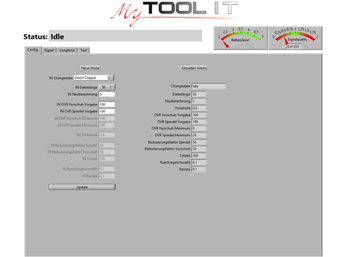

*Figure 10: Testing values*

## Longtime Tab 				  			

As shown in *Figure 4, **Longtime*** tab is the same as ***Signal\*** tab but with longer Time-span 
(100 seconds).

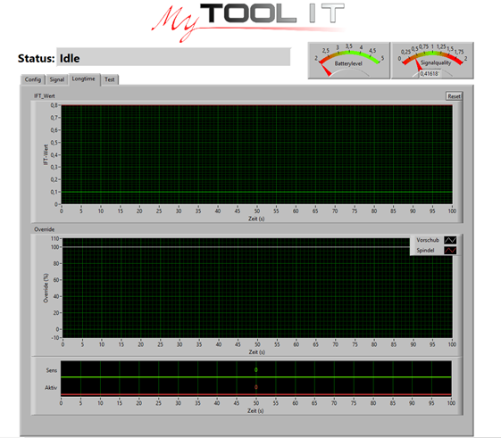

*Figure 9: Longterm tab*

## Test Tab 					

Figure 11 shows the test tab, which enables to test the different  LEDs and the "Digital Output" pins on the SPU. Furthermore, the input  values and the system's temperature can be checked.

CAUTION!

Manipulating these settings may damage other systems components, or  depending on the configuration, may destabilize the control loop.  Therefore, handle with care.

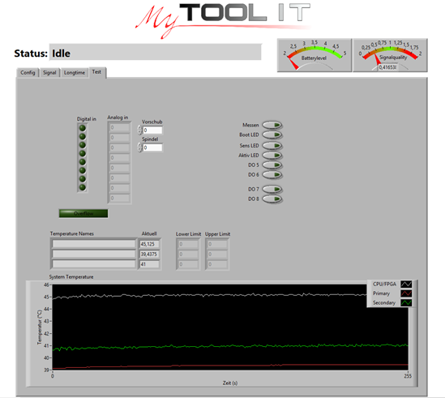

*Figure 11: Test tab*